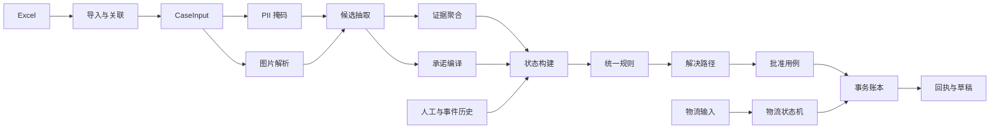
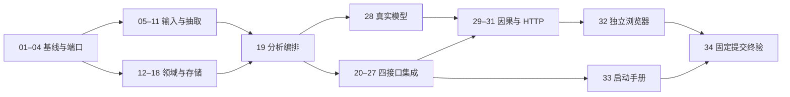

# Covenia B 线 MASTER PLAN

状态：PROPOSED / PLANNED，尚未执行开发。审查日期：2026-09-10（Asia/Shanghai）。
范围：B backend and AI。建议集成分支：integration/covenia-b。
本次仅交付本文件、batches.json、BATCH_PROMPT_TEMPLATE.md、VERIFICATION_PROMPT_TEMPLATE.md；没有修改仓库业务代码、依赖、配置、分支或远程状态。

## 1. 当前仓库真实状态

### 1.1 已核实的远程快照

| 项目 | 本次核实结果 |
|---|---|
| main | 4e83f3baeb5f4d6d9ee9b8bfc61c112abc1f55cb；2026-09-08；文档工程包 |
| feat/c-qianniu-plugin | fd52de8a8e3cb439acfb0ab28740fc8d9de15290；2026-09-10 12:58:41 +08:00；在 main 上领先 2 个提交、落后 0 个 |
| 未合入内容 | 50a5a99 前端实现；fd52de8 已批准修复。相对 main 修改/新增 33 文件，7039 行增加、10 行删除 |
| 远程分支 | 本次 API 返回上述 2 个分支，protected 均为 false；不能据此推断所有仓库权限或保护规则 |
| PR | 本次 GitHub pulls?state=all 返回空列表；没有发现已开/已关闭 PR，不等于功能分支已获独立验收 |
| Actions | 本次 GitHub actions/runs 返回 total_count=0；已审分支也没有工作流文件 |
| 可执行代码 | C 分支存在 frontend/；没有 backend/ 或后端应用、导入器、模型调用、服务端规则实现 |
| 契约 | main 有 10 个 Schema；C 分支有 12 个，新增 analyze-case-response 与 runtime-metrics |
| 测试 | C 只有 frontend/src/mockApi.test.ts 这一测试文件；实现报告声明 11 测试及 build 通过。本次未重装依赖、未重跑，不把声明当独立 PASS |
| 数据与资产 | data/tianchi-track1-mock-data.xlsx 已入仓库；fixtures 有输入/GT；frontend/public/evidence/ 仅 README，无五张实际证据图 |
| 本地工作区 | 当前输出目录不是此仓库 checkout；只读审查使用与远程 SHA 一致的临时 clone。现有 _pack/_scratch/checks 与 REQUIREMENTS_CHECK.md 不作为远程规范或修改目标 |

远程证据：[主分支提交](https://github.com/zackyao02/Covenia/commit/4e83f3baeb5f4d6d9ee9b8bfc61c112abc1f55cb)、[最新 C 提交](https://github.com/zackyao02/Covenia/commit/fd52de8a8e3cb439acfb0ab28740fc8d9de15290)、[未合并差异](https://github.com/zackyao02/Covenia/compare/4e83f3baeb5f4d6d9ee9b8bfc61c112abc1f55cb...fd52de8a8e3cb439acfb0ab28740fc8d9de15290)。
审查以当次 API 及 git ls-tree/show/diff/rev-list 交叉核实；后续执行必须刷新 refs，不能将此快照当永远最新。

### 1.2 能力盘点

| 能力 | 当前级别 | 对 B 的含义 |
|---|---|---|
| 产品冻结、四接口方向、领域结构、规则说明 | 已有文档；存在下列冲突 | 不是从零写 PRD，先收敛契约 |
| 千牛模拟外壳、右栏、HTTP client | C 已实现；大部分演示走 mock | 接入 C client，不重写 UI |
| 三类决策、批准、物流、指标 | C Mock 有对应演示 | 不可当成 B 后端能力或真实模型证据 |
| Excel 导入及关联 | 只有源文件/映射说明 | 138/998/113/29/80 是待代码实测的验收值，本次未运行导入器验证 |
| AI 图文抽取、PII、来源校验 | 只有规范/样例 | 无真实 provider、Prompt 流水线或调用证据 |
| 服务端承诺/证据/状态/规则 | 未实现 | 必须纯确定性模块化构建 |
| 事务幂等、审计、物流时序 | 有契约，未有服务端存储 | 不能复用 C 内存 Map 当正式后端 |
| 图片、标注和模型资源 | 五张图缺失；3 Demo GT 已有但不全一致；30 样本/服务资源未见交接证据 | 分别由 A/算力负责人交接，不推断机器有 GPU/密钥 |
| 独立验收与真实 HTTP | 实现报告明确未完成 | D 的独立证据仍缺失 |

证据：[IMPLEMENTATION-STATUS.md](https://github.com/zackyao02/Covenia/blob/fd52de8a8e3cb439acfb0ab28740fc8d9de15290/IMPLEMENTATION-STATUS.md)、[frontend/src/api/client.ts](https://github.com/zackyao02/Covenia/blob/fd52de8a8e3cb439acfb0ab28740fc8d9de15290/frontend/src/api/client.ts)、[frontend/src/mockApi.ts](https://github.com/zackyao02/Covenia/blob/fd52de8a8e3cb439acfb0ab28740fc8d9de15290/frontend/src/mockApi.ts)、[fixtures/README.md](https://github.com/zackyao02/Covenia/blob/fd52de8a8e3cb439acfb0ab28740fc8d9de15290/fixtures/README.md)、[docs/01-core-contracts.md](https://github.com/zackyao02/Covenia/blob/fd52de8a8e3cb439acfb0ab28740fc8d9de15290/docs/01-core-contracts.md)。

C Mock 只可参考 UI 传输和占位设计，不可复制成 B 实现：它从 JSON 示例拷贝响应，以 declared_view_type 模拟图像差异；P0 分支只显式检查 CLOSE_CASE；approve/shipment 未实现正式幂等仓储。App.tsx 的物流回调把通知草稿直接追加聊天，且事件时间固定为 10:10/11:35/次日送达。以上是本次静态阅读发现，交 C 的验收/修复输入，不授权 B 修改 C 产品代码。参见 [frontend/src/mockApi.ts](https://github.com/zackyao02/Covenia/blob/fd52de8a8e3cb439acfb0ab28740fc8d9de15290/frontend/src/mockApi.ts)、[frontend/src/App.tsx](https://github.com/zackyao02/Covenia/blob/fd52de8a8e3cb439acfb0ab28740fc8d9de15290/frontend/src/App.tsx)。

## 2. 规范基线与冲突

### 2.1 优先级及已确定事项

按用户指定顺序：最新且已批准 PRODUCT-FREEZE.md → docs/05-api-and-ui.md → schemas/ → docs/03-firewall-rules.md → docs/04-responsibility-loop.md → docs/08-idempotency-and-ordering.md → fixtures/ground-truth.json。其他 README/模型文档/旧评审用于辅助，不得覆盖此顺序。

本次最高基线是 C 分支内标记 APPROVED、批准人 Zack、日期 2026-09-10 的 [PRODUCT-FREEZE.md](https://github.com/zackyao02/Covenia/blob/fd52de8a8e3cb439acfb0ab28740fc8d9de15290/PRODUCT-FREEZE.md)，并有 [FIX-REQUESTS.md](https://github.com/zackyao02/Covenia/blob/fd52de8a8e3cb439acfb0ab28740fc8d9de15290/FIX-REQUESTS.md) 对应。main 的冻结内容较旧；旧 CLAUDE-REVIEW-1.md 的 H1=200 已被明确覆盖，不是仍待投票的选项。

已锁定：四个业务 POST；Qwen/Qwen2-VL-2B-Instruct（不自动切换更高版本）；H1=350；顺序 P0(400)→H1(350)→E1(300)→E2(100)→E0(0)；analyze/evaluate 有服务端 runtime_metrics；保留并忽略 evaluate 五个 deprecated/readOnly 字段；模型只能提供候选事实；未揽收不得送达；揽收不结案；图像/PII/缓存披露必测。

### 2.2 冲突与缺口登记（不是隐式批准）

下列建议仅是保守处理提案。BATCH-01 保存 PROPOSED；BATCH-03 必须取得 X-FREEZE 的明确裁决。已经被高优先级明确覆盖的项做同步记录即可；同级矛盾或语义缺口不得由实现者选择。

| ID | 证据与冲突 | 保守提案 / 必须冻结的选择 | 影响 |
|---|---|---|---|
| D01 | C 的已批准冻结、H1、指标和 Schema 未合 main | 从 C 的已核实 SHA 建本地集成基线，保留其两提交；不能从 main 直接开工遗漏契约。分支归并/是否发 PR 由负责人另行授权 | 01/03/全部 |
| D02 | A34 要求模式缺省/false 时忽略 overrides；evaluate Schema allOf 却要求出现 overrides 就必须 true | 同步 Schema 与解析顺序：关闭时不验证/应用覆盖内容，保持兼容字段；开启时严格验证允许覆盖。analyze 的 case_input 另按其契约，不能擅自类推 A34 | 03/21/22/30 |
| D03 | docs/03 把 ASK_SAME_EVIDENCE 映射 P0/400；Hero 状态含此禁止项，但 A20/A21 要 E1/300，A14 要 H1/350 | 建议重复索证专归 E1，ASK_SAME_EVIDENCE 为展示禁止项；P0 保留责任倒流/提前结案等强制禁令。必须批准这张映射，不能通过遗漏 state 字段偷偷绕过 P0 | 03/14/15 |
| D04 | docs/03 的重复说明/责任倒流动作、A29 没有 PreparedAction 的明确表达；Schema 仅四种 action_type | 需批准最小可审计动作编码或受限字段；不要让 Prompt、前端文案或 action_id 暗中决定动作。仅实现已有防线要求，不新增业务场景/接口 | 03/15/22/X-C |
| D05 | ExtractedJourney 要求 commitment_class/activation_recommendation/deadline 等，docs/02 有“由模型区分”；用户要求 AI 不负责激活或最终责任 | 建议内部 CandidateExtraction 仅原文/来源/时间表达/条件/观察；公开 ExtractedJourney 的必需派生字段由服务端富化，或保留建议但绝不采信。必须锁定两层 Schema/归属，不能模型输出直接入账 | 03/04/11/13/19 |
| D06 | docs/08 把 P0_PROHIBITED_ACTION 列 HTTP400 错误，而规则/DecisionResult 需要完整 INTERVENE；docs/05 又把 E0 列错误 | E0 已明确是成功。建议 P0 也为成功业务评估 200 + DecisionResult，传输/输入失败才 error；需批准并与 C 同步，不能丢失 resolution_path/fact_trace | 03/15/22/31 |
| D07 | 历史记录：根 fixtures/demo-cases.json 曾是二次进线10:45、evaluation11:00；冻结/C 示例是09:32/09:40，GT Hero action_impacts 曾含 RAISE_PRIORITY。2026-09-13 产品负责人澄清并接收 X-A-FIXTURES：三项交付 Git blob 已按回执核验，先前 GT SHA 登记漏写一个 0，交付物未变。 | 原始 D07 语义保留：fixture/GT 风险与优先级由 A 按冻结规则核对；B 不修改原始赛事时间或标签求通过。X-A-FIXTURES 已 ACCEPTED（产品负责人 2026-09-13 回执），仅满足 BATCH-06 的该外部门；不替代其他前置、集成、锁或调度检查。 | 03/X-A-FIXTURES/06/29 |
| D08 | 冻结 next_check_at=10:30 晚于发出截止10:27:37；docs/04 要截止前预警、回执例是10:27 | 10:30 是现有明确批准值，不能偷偷改早。需澄清其为到期后检查并同步描述，或由 Zack 修改冻结；下一次检查算法和完成态时间也要明确，不新增后台调度服务 | 03/13/17/25 |
| D09 | approved_at 用服务端时钟；历史 Demo 事件都在5月，真实机器现为9月；脚本“未揽收→送达”违反状态机，UI 后续揽收按钮10:10又早于11:35 | 采用可信注入 DemoClock 与真实 SystemClock；明确 evaluation_time 与持久事件高水位关系。两条分支隔离：09:42批准→10:10揽收→送达；09:42批准→11:35未揽收→更晚揽收→送达。风险路线不得倒退到10:10 | 03/13/25/27/X-C-UI |
| D10 | 人工批准“激活承诺”与 A9/A20 分析时承诺已 ACTIVE；揽收承诺完成但义务仍在途；PROMISE_FULFILLED 不在外部 shipment/audit 枚举 | 区分已存在且合法的客服承诺与新建履约义务；后者需本次批准。PROMISE_FULFILLED 建议是内部派生事实，不增加第四物流输入/第五接口；是否独立审计事件须按现有字段表达锁定 | 03/13/14/23/25 |
| D11 | A7 要通知未确认不入消费者回执；现 C App 物流后直接追加草稿；四接口没有专门通知确认操作 | 建议 P0 由 C 在本地模拟聊天中二次确认并导出确认留痕，B 只生成草稿；如负责人要求后端持久确认，必须在现有 approve 内批准最小扩展，禁止自行新增通知接口 | 03/17/23/X-C-UI/32 |
| D12 | docs/04 允许改分类/期限/业务动作；请求 Schema 仅 executor/next_check_at/recovery_if_missed。approve/shipment data 缺独立 Schema，approved_at 未有直接响应字段 | 以受限编辑为准，不开放高风险业务改写；补响应 Schema。approved_at 建议内部存储并以 audit.at 可查；锁定缺审批人400/VALIDATION_ERROR、未知案例、候选过期、未知字段处理 | 03/04/23/24/26 |
| D13 | docs/02 “重试仍失败→HUMAN_REVIEW”，docs/08 “MODEL_OUTPUT_INVALID/502”；无法解析的 JSON 不能拼装完整成功账本 | 建议来源冲突但结构可用时规则走 H1；无法形成合法抽取则502、UI显式提示人工接管，不伪造成功。必须确认人工接管表示与返回形状 | 03/11/19/21/X-C |
| D14 | 文档没有完整多图冲突/缺失/置信度门槛、experience_risk 和禁止项构建表；AI 卫生信号不得变成医疗诊断 | A 提供可辨识/覆盖标注，B 将已批准组合表编码；未知/冲突保守 H1，不编造统计阈值或把所有卫生信号升为法律责任 | 03/12/14/15 |
| D15 | 幂等按同 case 唯一但跨端点/重复event_id/等时事件不完整；analyze 重跑与已有人审/事件的保留规则缺口 | 建议 case 范围键+操作/规范化body摘要，保存首个 response/request_id；event_id 独立去重；持久事件单调、合法同时间排序需明确；analyze 绝不充当重置 | 03/18/19/23/26 |
| D16 | evaluate 没有明确模型缓存来源字段；真实 usage 缺失处理、规则替代次数口径不全。CaseInput 又要求订单/图片，无法代表所有导入会话；正式 G5 协议有既有验收记录流程 | 冻结四项指标口径及 evaluate 的缓存来源可见路径，不伪造 token。原始全量导入与可分析P0输入分层。Codex 本批验收报告不冒名改写既有 Claude/QA 记录，最终 G5 由 D/Zack 按协议确认 | 03/06/09/20/22/34 |

主要证据：[schemas/evaluate-action-request.schema.json](https://github.com/zackyao02/Covenia/blob/fd52de8a8e3cb439acfb0ab28740fc8d9de15290/schemas/evaluate-action-request.schema.json)、[schemas/prepared-action.schema.json](https://github.com/zackyao02/Covenia/blob/fd52de8a8e3cb439acfb0ab28740fc8d9de15290/schemas/prepared-action.schema.json)、[schemas/extracted-journey.schema.json](https://github.com/zackyao02/Covenia/blob/fd52de8a8e3cb439acfb0ab28740fc8d9de15290/schemas/extracted-journey.schema.json)、[schemas/approve-resolution-request.schema.json](https://github.com/zackyao02/Covenia/blob/fd52de8a8e3cb439acfb0ab28740fc8d9de15290/schemas/approve-resolution-request.schema.json)、[docs/03-firewall-rules.md](https://github.com/zackyao02/Covenia/blob/fd52de8a8e3cb439acfb0ab28740fc8d9de15290/docs/03-firewall-rules.md)、[docs/04-responsibility-loop.md](https://github.com/zackyao02/Covenia/blob/fd52de8a8e3cb439acfb0ab28740fc8d9de15290/docs/04-responsibility-loop.md)、[docs/05-api-and-ui.md](https://github.com/zackyao02/Covenia/blob/fd52de8a8e3cb439acfb0ab28740fc8d9de15290/docs/05-api-and-ui.md)、[docs/08-idempotency-and-ordering.md](https://github.com/zackyao02/Covenia/blob/fd52de8a8e3cb439acfb0ab28740fc8d9de15290/docs/08-idempotency-and-ordering.md)、[fixtures/demo-cases.json](https://github.com/zackyao02/Covenia/blob/fd52de8a8e3cb439acfb0ab28740fc8d9de15290/fixtures/demo-cases.json)、[fixtures/ground-truth.json](https://github.com/zackyao02/Covenia/blob/fd52de8a8e3cb439acfb0ab28740fc8d9de15290/fixtures/ground-truth.json)。

## 3. 架构边界与代码依赖

### 3.1 保守技术假设（规划建议，不是现有实现）

采用单进程 Python/FastAPI + 严格领域类型/JSON Schema + openpyxl + SQLite 的本地后端；HTTP ModelProvider 调团队控制的锁定 Qwen 服务。后端不内置 GPU 推理框架，不部署队列/微服务/生产鉴权。具体 Python 和依赖版本由 BATCH-02 核实兼容并锁定；现有 C 栈/锁文件保留。

AI 只读脱敏输入和实际图像，返回候选。事实加载/校验→证据聚合→承诺编译→状态构建→规则→解决路径是唯一责任链。系统事实、合法人工记录、确定性时间状态优先于 AI。所有纯核心模块不调用 HTTP、不直接读 GT、不按案例/文件名选结果。

只暴露：
- POST /api/cases/analyze
- POST /api/actions/evaluate
- POST /api/resolutions/approve
- POST /api/events/shipment

进度查询通过 evaluate 的 CHECK_REPLACEMENT_PROGRESS；回执读取响应字段。导入、预检、模型预热、备份/重置是本地 CLI，不是第五业务接口。暂不对接千牛/品牌/仓库/物流生产系统，不做自动退款赔偿补发、医疗诊断、复杂 BI 或新售后场景。单一 Hero；Challenge 仅检验同一链路边界。

### 3.2 当前代码依赖（已存在）

```text
frontend/src/App.tsx
  → frontend/src/api/client.ts
      → VITE_API_MODE=mock → frontend/src/mockApi.ts → api/examples/*.json
      → VITE_API_MODE=http → 四个约定 HTTP 地址（仓库无服务端实现）
  → frontend/src/demoData.ts / api/contracts.ts
frontend/src/mockApi.test.ts → mockApi（不证明真实图文推理或后端状态）
```

### 3.3 拟建模块的数据/调用依赖（不是部署微服务）



此图是单体内部函数/数据依赖概览，不把模块伪装成独立服务。规则调用链不反向依赖 API；storage 不判业务；metrics 与安全抽取缓存为旁路端口，不能覆盖核心事实。循环的业务时间演进通过“既有历史输入”与“本次事务输出”分开表示，防止把同次调用画成循环依赖。

拟建布局：

```text
backend/src/covenia_b/
  domain/ ports/             公共类型/接口：04 独占
  importing/                 Excel 05、案例 06（互相独立文件）
  privacy/ images/           07、08
  observability/             09
  model/provider.py adapters/   10
  model/prompts/ extraction.py source_validation.py   11
  evidence/ commitments/ state/ rules/   12、13、14、15
  resolutions/ receipts/      16、17
  storage/                   18
  services/analyze.py fact_loader.py     19
  cache/                     20
  api/analyze.py             21
  services/evaluate.py api/evaluate.py   22
  services/approve.py         23
  api/approve.py              24
  shipments/                 25
  services/shipment.py api/shipment.py   26
  main.py settings.py runtime.py preflight.py         27
backend/tests/               对应模块各写自己的测试
integration/tests/           29–32 与手册命令验证
tools/contracts/ tools/verification/    指定批次独占脚本
reports/batches/BATCH-xx/     各批报告与脱敏证据
```

## 4. A/B/C/D 输入输出与外部阻塞

| 交接 | 输入/接收方 | 输出/提供方 | 不能代替的工作 |
|---|---|---|---|
| A → B | 字段/关联/图片/CaseInput 来源/GT/开发样本 | B 给导入计数、关联诊断、图像缺失/来源冲突、真实预测 | B 不标注替代 A，不改 GT 为测试背书 |
| B ↔ C | C 给 TS/client/examples 与已验收 HTTP UI；B 给四接口 Schema/错误/时间/请求样例 | 以同一 contract_version 和双方 commit 配对 | B 不重写 App/样式，不复制 Mock 规则当后端 |
| A → D | 独立留出样本/图片注入对照与人工真值 | D 给独立对照、失误案例、证据完整性结论 | 不把保密标签送模型或写入服务端 |
| B → D | 固定 commit、启动方式、模型/数据版本、日志及回放向量 | D 独立跑 HTTP/UI/故障/终验，回最小修复清单 | B 的完成声明不能替代 D 的 PASS |
| Zack ↔ 各线 | 现有冻结与新增冲突提案 | 真实批准/拒绝记录、范围与发布裁决 | 执行器不得自己签 APPROVED |

外部门路径是拟议交付位置，目前不存在的明确标记 MISSING/UNVERIFIED/PARTIAL；不能把路径名字当资产已到位。它们需带 commit/hash、负责人、日期、验收方法与证据，由调度者接收后才置 ACCEPTED。详细清单见下表及 batches.json.external_gates。

| 门 | 负责人 | 当前状态 | 必须先于 | 必需产物与接收条件 |
|---|---|---|---|---|
| X-FREEZE | Zack；B/C 联签接口，A 联签事实 | MISSING | BATCH-03 | docs/approvals/b-decisions.json + 已批准 PRODUCT-FREEZE.md 的提交；覆盖 D01–D16 中影响实现的全部项，逐项有批准人、时间、原文/来源、最终选择和受影响文件。；只沿用已批准 H1=350/四接口等不需要重复裁决；新增缺口不能由执行者伪造批准。 |
| X-A-MAPPING | A | MISSING | BATCH-05 | handoff/a/data-mapping.json（约定的新交付路径）；工作簿 SHA256、8 表/7 业务表名称、列映射、主外键、ID 存储类型、时间与空值解释；五类工单及预期计数来源。 |
| X-A-FIXTURES | A；Zack 审批语义变化 | ACCEPTED | BATCH-06 | 产品负责人于 2026-09-13 接收；回执 `reports/batches/X-A-FIXTURES/GATE_ACCEPTANCE_RECEIPT.json`。三项 Git blob 已按原始字节核验；先前 ground-truth SHA 登记 `0E6E817FC7...` 漏写一个 0，正确值为 `0E6E8170FC7B113EE700087289B027FE93D412AA18C2F39D64D80D01C57C3311`，交付物未变。保留 D07 边界：B 不改 fixtures。 |
| X-A-IMAGES | 产品负责人 | ACCEPTED | BATCH-28、BATCH-29、BATCH-32 | handoff/a/images-manifest.json + frontend/public/evidence/ 中五个原始团队图；归档提交 e54ffa5fd74b50ca2cca6d4f28a31b88ce9ea842，交付/签认 Zack（产品负责人），2026-09-12。提交内 blob SHA256：s00001-product-overview.jpg=E2C6BBD230F906F113D75F2F582E778B6E79AEA37544C2383F1FFDA15A5295D5；s00001-pump-detail.jpg=4709D7529803846D4FF4E123BFCC034D420449AE23923CB54468BE573BD8CFC7；s00001-package-context.jpg=C734BFB5A70FFA39E10B2535DC8321EACE3C1FB358293FA22B590B9F7B5836BD；s00001-gift-evidence.jpg=E52DF258CDBC5761D175F31985639337F2274211FBEB3DDB82A0B773150AA7F5；s00001-blurred-pump.jpg=634D2B4B0665FAE49DEC286628B13D8116808B3FFF7A39A9DD7CDEA9E7DE3143；handoff/a/images-manifest.json=4D596C87F3483166915E25A0F250292FA9CCE1A654463C09DBFC0EF97310352E。injection_pairs=NOT_STARTED，仅 BATCH-32 后续需要，不阻塞 BATCH-28/BATCH-29。 |
| X-MODEL | B 与团队算力负责人；Zack 批准费用/换模型 | UNVERIFIED | BATCH-28 | handoff/model/service-manifest.redacted.json（密钥只在环境）；实际 Qwen/Qwen2-VL-2B-Instruct revision、服务地址与调用协议、usage、区域/设备/依赖/许可证登记、可用性与预热记录。；API 密钥、GPU/租用资源、权限、网络若需开通由团队提供；不购买、不换模型掩盖阻塞。 |
| X-A-TRUTH | A 编写，D 接收，Zack 批准政策含义 | PARTIAL | BATCH-29 | fixtures/ground-truth.json + handoff/a/evaluation-manifest.json；三个 Demo 真值完成冲突同步，20 开发样本的来源/输入/预期/评测口径与 hash 就绪。；10 留出样本另交 D；20/10 是评测样本划分，不等于新增 30 个产品场景。 |
| X-C-CONTRACT | C | MISSING | BATCH-31 | handoff/c/contract-sync.json + C 已验收 commit；TS 类型与四接口 examples 对齐 BATCH-03，包括 A34/错误映射/模型来源/有限 human_edits。；npm test 与 build 的实际输出、契约版本、请求样例 hash；B 只读接收，不代写 frontend。 |
| X-C-UI | C；D 独立复验 | MISSING | BATCH-32 | handoff/c/http-ui-ready.json + C UI 修复 commit；通知确认前不入消费者聊天；重试保持同一幂等键；网络失败不显示成功；仅用后端状态。；事件时间随已选择合法支路推进，不在 11:35 未揽收后提交更早 10:10 揽收；禁止前端 reset 状态代替恢复。；http 模式缓存/Challenge 角标与成本条读真实响应；模型来源变化时不残留错误标记；测试及构建通过。 |
| X-A-HOLDOUT | D 保管；A 提交 | MISSING | BATCH-34 | private-evaluation/holdout-manifest.json（不入仓库/运行服务）；10 个独立留出样本、hash、来源与人工标签、冻结评价口径；仅独立验收进程可读。；无未经批准的准确率目标；报告适用范围与错误分布，不根据留出标签改 Prompt。 |
| X-D-RELEASE | D；Zack 最终发布批准 | MISSING | BATCH-34 | handoff/d/release-review-ready.json；D 已受领独立验收，约定固定集成 SHA、环境、证据路径及真实模型可用窗口。；这是执行验收的就绪门，不是提前给最终 PASS；正式 G5/QA-ACCEPTANCE 仍在验收后按团队协议确认。 |

## 5. 集成与调度规则

### 5.1 分支策略

当前建议基于 fd52de8a8e3cb439acfb0ab28740fc8d9de15290 建 integration/covenia-b，不先丢弃 C 分支再“从 main 重做”。BATCH-01 重新核实：若 C 契约已被合入新的 main，或有更新批准版本，重新记录真实基线与差异。此处不授权 push、PR 或合并到团队 main。

每个执行对话使用独立 worktree / work/b/batch-xx，从包含所有已验收依赖的集成 SHA 开始；调度者给出绝对 REPO_ROOT、TARGET_BATCH_ID、INTEGRATION_SHA、CONTRACT_VERSION、依赖 PASS 报告、外部门 ACCEPTED 证据和 RUN_DIR。执行者不与他人共享正在修改的 checkout。

实现提交 → 独立对话验收 PASS → 调度者将确切提交集成 → 在集成 SHA 上重跑受影响测试 → 记录集成回执。下游只消费这一明确回执；不能依赖未提交文件、聊天记忆、悬空分支或实现者自报“做完”。

共享文件锁：
- BATCH-03 独占 schemas/ 与指定契约文档；批准后冻结。
- BATCH-04 独占 domain/、ports/；其他批只能调用，变更需回本批修复并重验消费者。
- BATCH-02 建骨架；BATCH-27 在所有路由之后才修改 main.py/settings.py。这是唯一跨批重复写核心文件，已由依赖强制串行。
- frontend/ 始终由 C 写；A 的 Excel、图片、fixtures/GT 由 A 写；运行批不得改它们。
- 每批 reports/batches/BATCH-xx/ 独占，不并发改根 IMPLEMENTATION-STATUS.md 或 QA-ACCEPTANCE.md。阶段汇总由协调者按团队协议进行。

资源锁同样重要：BATCH-28/29/31/32/34 共用 model:qwen-live 互斥锁；如果共享演示端口/设备，http-ui:demo 也独占。所有测试使用自己的 SQLite/缓存/RUN_DIR，禁止并行改同一案例 DB。纯模块测试可用替身并行；live、HTTP 和浏览器验收不能伪装为替身测试。

### 5.2 可并行与必须串行

01→02→03→04 为公共基线串行门；03 等真实契约裁决，02 只做无业务逻辑骨架。
04 后可并行启动 05、07、08、12、13、18；09 等07，10 等07/08/09，11 等10；06 等05与 A 案例交接。
12/13→14→15→16；13→17；06/11/14/18→19。
19 后 28 可提前做真实模型验收，同时按各依赖开发 API；21、22、24、26 写不同路由文件，可在就绪时并行。
27 只在四路由完成后集成；29/30/31 按数据/模型/契约门启动；32 独立浏览器验收；33 可并行整理已验证运行事实；34 最后固定提交做全局终验。

下图只显示阶段汇合，不取代 Batch 表/JSON 的精确 depends_on。编号不是串行时刻表，特别是 BATCH-28 应提前消除模型风险。



该图依图示技能约束拆分现状与拟建依赖，未创建 FigJam 或其他外部文件；精确边以 batches.json 为准。全图不暗示某未实现模块已运行。

### 5.3 所有 Batch 的共同执行协议（每个包均继承）

1. **目录与环境**：命令均从目标仓库根执行，PowerShell 为默认；python 必须是 BATCH-02 的隔离虚拟环境解释器，npm 使用 C 的锁定环境。01/02 启动前由调度者确认可用 Python/Git；不得使用本次临时审查 clone 作长期开发区。
2. **读取**：先本计划、batches.json 当前条目、冻结优先级文件、当前输入清单、所有直接依赖的 IMPLEMENTATION_REPORT.json / VERIFICATION_REPORT.json 及集成回执。外部门路径缺失或哈希不符即 BLOCKED；不可自行造一份成功交接。
3. **写权限**：allowed_paths 是唯一写入白名单；forbidden_paths 优先。未列路径均禁止。运行构建/临时 .venv/dist/缓存可写自己的忽略目录，但不能提交其原始内容、秘密或其他批的证据。
4. **提交**：只 add 本批明确路径，不用 git add .；先代码/测试提交，再报告提交。报告记录 code_commit(s)，不填无法自引用的“报告自身 SHA”。实现报告不是验收批准。
5. **交接文件**：本批交付 IMPLEMENTATION_REPORT.json、简短 IMPLEMENTATION_REPORT.md、commands.json、指定产物及脱敏日志。独立验收者另写 VERIFICATION_REPORT.json，实施者禁止写/覆盖它。协调者在外部调度状态中记录整合 SHA、复测结果和产物哈希。
6. **测试**：执行包列出的命令全部必跑，另跑 git diff --check 与 git status --short。命令是后续批要创建并运行的验收入口，不是当前仓库已存在或本次已运行的测试。命令不存在、缺关键输入或关键测试 skip 不算 PASS。
7. **负向测试**：正常代码测试套件应 exit 0；故意关闭 PII/移除缓存角标等 mutant 内层探针应失败，外层驱动器需断言该失败并恢复现场。报告同时记录 mutation 手段、预期失败、实际失败与还原校验。不能把任意错误/超时当“成功抓到漏洞”。
8. **失败恢复**：先保存最小复现/日志与输入 hash；重复同一失败不无限试。仅改当前白名单内根因，超出交回所属批。单批估计超过 6 小时或需要新契约时停止扩张，请主规划拆分，不能自行启动下一批。
9. **回滚**：使用本批精确提交的 git revert；先撤销受影响后继再撤销依赖。禁止 reset --hard、checkout --、force push、删源数据/共享 DB。恢复运行状态先验证绝对备份目标，使用版本匹配副本；人工/事件审计不被静默抹除。
10. **独立验收与状态**：PLANNED→READY→RUNNING→IMPLEMENTED→VERIFIED→INTEGRATED 由协调者维护运行台账；FAIL/BLOCKED 不能放行后继。batches.json 保留原计划，工作者不得改 status/依赖以自行解锁。关键输入版本更新时使受影响 PASS 失效并定向复验。

前置产物的最低接收格式：batch_id、verdict=PASS、reviewed_code_commits、verified_at、contract_version、artifact_hashes、tested_commands/exit_codes、integration_sha、集成后复测证据。外部门同理，但 verdict/状态为 ACCEPTED。所有哈希与文件须在新对话能实际读取。

### 5.4 将出现的验收命令由谁创建

| 命令/路径 | 创建责任 | 首次使用 |
|---|---|---|
| Python 锁环境、pytest markers、ruff、build、Playwright Python 依赖 | 02 | 02；浏览器下载只在32 |
| tools/contracts/check_contracts.py 与 backend/tests/contracts/ | 03 | 03 |
| covenia_b.importing.cli | 05 | 05 |
| covenia_b.storage.admin | 18 | 仓储测试/33手册 |
| covenia_b.preflight | 27 | 27 |
| tools/verification/live_smoke.py 与 backend/tests/live/ | 28 | 28 |
| tools/verification/evaluate_holdout.py（含 --self-test） | 29 | 29自测；34才读取 D 留出 |
| tools/verification/check_no_case_branches.py | 30 | 30 |
| integration/tests 下各验收文件 | 各自 29/30/31/32/33 | 同批 |
| npm test / npm run build | 已有 C 工程；C 负责修复 | C交接/31/34 |

live 命令默认需要已登记模型与图片；http/e2e 命令要启动真实服务，由各测试夹具在本批 RUN_DIR 管理生命周期，或按模板明确外部 BASE_URL。启动失败必须报错，不能切 Mock 自动通过。依赖安装不能临时采用未锁定新包弥补失败；若确需变更，回02并定向复验。

## 6. Batch 总表

全批均为 PLANNED，executor_model=gpt-5.6-terra，reasoning_effort=max。预计工时为单次专注实施加本批测试，不含审批/算力开通/其他线路交接等待；不是交付日期承诺。所有“允许并行”仍受依赖、路径与资源锁约束。

| Batch | 唯一结果 | 前置 Batch | 外部门 | 并行 | 复杂度 |
|---|---|---|---|---|---|
| BATCH-01 | 锁定远程基线与待裁决清单 | 无 | 无 | 否 | S，1–2 小时，不计负责人审批等待 |
| BATCH-02 | 可测试的后端工程骨架 | 01 | 无 | 否 | M，2–4 小时 |
| BATCH-03 | 把已裁决语义收敛为机器契约 | 01、02 | X-FREEZE | 否 | M，4–6 小时；审批不算执行时间；超出时回主规划拆批 |
| BATCH-04 | 领域类型、模块端口和时钟接口 | 03 | 无 | 否 | M，3–5 小时 |
| BATCH-05 | 赛事 Excel 无损导入 | 04 | X-A-MAPPING | 允许，受资源锁限制 | M，3–5 小时 |
| BATCH-06 | 关联真实数据并组装 CaseInput | 05 | X-A-FIXTURES（ACCEPTED；产品负责人 2026-09-13 回执，已满足该外部门） | 允许，受资源锁限制 | M，2–4 小时 |
| BATCH-07 | 模型输入前 PII 掩码 | 04 | 无 | 允许，受资源锁限制 | M，2–4 小时 |
| BATCH-08 | 图片清单校验与 ImageResolver | 04 | 无 | 允许，受资源锁限制 | M，2–4 小时 |
| BATCH-09 | runtime_metrics 与脱敏治理日志 | 04、07 | 无 | 允许，受资源锁限制 | M，2–3 小时 |
| BATCH-10 | Qwen ModelProvider 传输适配 | 04、07、08、09 | 无 | 允许，受资源锁限制 | M，3–4 小时 |
| BATCH-11 | 候选抽取 Prompt、Schema 重试与来源校验 | 10 | 无 | 允许，受资源锁限制 | M，3–5 小时 |
| BATCH-12 | 多图证据聚合与范围判断 | 04 | 无 | 允许，受资源锁限制 | M，3–4 小时 |
| BATCH-13 | 承诺编译与确定性时间计算 | 04 | 无 | 允许，受资源锁限制 | M，3–5 小时 |
| BATCH-14 | AccountabilityState 纯构建器 | 12、13 | 无 | 允许，受资源锁限制 | M，3–5 小时 |
| BATCH-15 | 统一确定性体验防线 | 14 | 无 | 允许，受资源锁限制 | M，3–4 小时 |
| BATCH-16 | 确定性解决路径规划 | 15、13 | 无 | 允许，受资源锁限制 | M，2–4 小时 |
| BATCH-17 | 责任账本的回执与通知投影 | 13 | 无 | 允许，受资源锁限制 | M，2–3 小时 |
| BATCH-18 | SQLite 事务、幂等与审计存储 | 04 | 无 | 允许，受资源锁限制 | M，3–5 小时 |
| BATCH-19 | 真实分析用例编排 | 06、11、14、18 | 无 | 允许，受资源锁限制 | M，3–5 小时 |
| BATCH-20 | 只缓存抽取结果的显式灾备 | 19 | 无 | 允许，受资源锁限制 | M，3–4 小时 |
| BATCH-21 | analyze HTTP 接口 | 20 | 无 | 允许，受资源锁限制 | M，2–3 小时 |
| BATCH-22 | evaluate HTTP 接口与可信覆盖 | 20、16 | 无 | 允许，受资源锁限制 | M，3–5 小时 |
| BATCH-23 | 人工批准事务用例 | 16、17、18、19 | 无 | 允许，受资源锁限制 | M，3–5 小时 |
| BATCH-24 | approve HTTP 接口 | 23 | 无 | 允许，受资源锁限制 | S，1–3 小时 |
| BATCH-25 | 物流事件纯状态机 | 14、17 | 无 | 允许，受资源锁限制 | M，3–4 小时 |
| BATCH-26 | shipment HTTP 事务接口 | 25、18、23 | 无 | 允许，受资源锁限制 | M，3–4 小时 |
| BATCH-27 | 四接口组合根与启动预检 | 21、22、24、26 | 无 | 否 | M，2–4 小时 |
| BATCH-28 | 单案例真实 Qwen 图文验收 | 19 | X-A-IMAGES、X-MODEL | 允许，受资源锁限制 | M，2–4 小时，不计模型开通/下载等待 |
| BATCH-29 | 三个 Demo 的真实因果与 Ground Truth 回归 | 27、28 | X-A-TRUTH、X-A-IMAGES | 允许，受资源锁限制 | M，3–5 小时 |
| BATCH-30 | 跨链反硬编码、注入与 PII 回归 | 27 | 无 | 允许，受资源锁限制 | M，3–5 小时 |
| BATCH-31 | C/B 四接口真实 HTTP 契约联调 | 27、28 | X-C-CONTRACT | 允许，受资源锁限制 | M，2–4 小时 |
| BATCH-32 | D 独立浏览器闭环与安全实证 | 29、30、31 | X-C-UI、X-A-IMAGES | 否 | M，3–5 小时 |
| BATCH-33 | 本地启动与演示灾备手册 | 27、28、31 | 无 | 允许，受资源锁限制 | M，2–4 小时 |
| BATCH-34 | 固定提交的全局发布候选验收 | 01–33 全部 | X-A-HOLDOUT、X-D-RELEASE | 否 | M，2–4 小时，以运行既有测试为主；超时定位失败门，不无限重试 |

## 7. 每个 Batch 的完整执行包

以下执行包与 batches.json 由同一批次数据生成；每个新对话同时读取本包与第5.3节共同协议。

### BATCH-01｜锁定远程基线与待裁决清单

- **目标**：形成可复核的基线锁和契约差异清单，并准备 integration/covenia-b；不实现功能。
- **为什么现在执行**：main 缺少已批准的 C 线补充令，必须先消除错误起点。
- **前置依赖**：无。必须读取直接依赖的实现报告、独立 PASS 和集成回执，不能只看状态字符串。
- **外部接收门**：无。
- **执行模型与归属**：gpt-5.6-terra / max；B 线执行。
- **预计复杂度**：S，1–2 小时，不计负责人审批等待。
- **是否允许并行**：否。资源锁：本批独立 RUN_DIR。
- **阻塞时需要谁决定**：Zack 决定基线与产品冲突；C 确认其分支交接。。

#### 输入资料

- 本次四份规划材料
- 远程 refs/heads/*、最近提交、全部 PR
- PRODUCT-FREEZE.md
- FIX-REQUESTS.md
- IMPLEMENTATION-STATUS.md
- AGENT-HANDOFF-PROTOCOL.md

另读本计划第5.3节、当前 JSON 条目、contract lock（01/02按基线冻结）以及本批所有依赖产物与外部门哈希。

#### 允许修改的文件或目录

- `MASTER_PLAN.md`
- `batches.json`
- `BATCH_PROMPT_TEMPLATE.md`
- `VERIFICATION_PROMPT_TEMPLATE.md`
- `docs/planning/b/baseline-lock.json`
- `docs/planning/b/decisions.json`
- `docs/planning/b/external-gates.json`
- `reports/batches/BATCH-01/**`

#### 禁止修改的范围

- `frontend/**`
- `data/tianchi-track1-mock-data.xlsx`
- `fixtures/ground-truth.json`
- `reference/**`
- `CLAUDE*.md`
- `AGENT-HANDOFF-PROTOCOL.md`
- `.github/**`
- `PRODUCT-FREEZE.md`
- `FIX-REQUESTS.md`
- `fixtures/demo-cases.json`
- `fixtures/synthetic-pattern-card.json`
- `private-evaluation/**`
- `QA-ACCEPTANCE.md`
- `IMPLEMENTATION-STATUS.md`
- `reports/batches/BATCH-01/VERIFICATION_REPORT.json`
- `reports/batches/BATCH-01/verification-evidence/**`
- `schemas/**`
- `docs/03-firewall-rules.md`
- `docs/04-responsibility-loop.md`
- `docs/05-api-and-ui.md`
- `docs/08-idempotency-and-ordering.md`
- `backend/src/covenia_b/domain/**`
- `backend/src/covenia_b/ports/**`

未在白名单内的其他路径同样禁止；本批独立验收者按角色例外仅能写自己的验收报告/证据。工作树/运行副产物规则见5.3。

#### 实施步骤

1. 检查工作树及全部远程 refs/PR，记录获取时间、SHA、工作树基线；如远程变化，先复核差异，不照搬本次 SHA。
2. 新工作区从确认后的 C 线提交建立本地 integration/covenia-b；已有分支只验证，不强制重置；不 push、不合并 main。
3. 导入本次计划，记录每个冲突的证据、建议、影响 Batch 和决策负责人；建议状态保持 PROPOSED。
4. 向 A/C/D 交付外部输入清单；汇总一次向 Zack 请求契约裁决，保存真实批准文本/来源，不自行填 APPROVED。

#### 必须执行的测试命令

从目标仓库根、已激活的锁定环境运行；所需测试/脚本必须在本批或明确前置中创建。

```powershell
git fetch origin --prune
git ls-remote --heads origin
git log --all --oneline --decorate -10
git rev-list --left-right --count origin/main...origin/feat/c-qianniu-plugin
python -m json.tool docs/planning/b/baseline-lock.json
python -m json.tool docs/planning/b/decisions.json
git diff --check
git status --short
```

#### 验收标准

- 基线可追到远程提交及已批准冻结内容；main 与功能分支差异没有遗漏。
- 所有冲突及外部输入均有编号/责任人/状态；允许尚待批准，但下游契约门不得假 PASS。
- 不修改业务代码、Schema 或既有批准记录；计划只描述后续工作。

另外必须满足白名单审查、无秘密/原始PII产物、完整报告与确切提交；不得把缺少真实资源的测试标为通过。

#### 预期产物

- `docs/planning/b/baseline-lock.json`
- `docs/planning/b/decisions.json`
- `docs/planning/b/external-gates.json`
- `reports/batches/BATCH-01/IMPLEMENTATION_REPORT.json`
- `reports/batches/BATCH-01/IMPLEMENTATION_REPORT.md`
- `reports/batches/BATCH-01/commands.json`
- `reports/batches/BATCH-01/VERIFICATION_REPORT.json`

VERIFICATION_REPORT.json 由独立验收对话生成，不是实现者的自评文件。实施方完成时可待独立验收，但调度不得放行后继。

#### 提交、回滚与下一批交接

- **提交信息建议**：docs(b-plan): pin reviewed baseline and decision gates
- **失败恢复/回滚方式**：仅 revert 本批计划提交；本地新分支保留供追溯，不删除或重置用户分支。 先保存失败证据；发现根因属于其他批则提交最小修复请求，不越界改。若存在已集成后继，按逆依赖顺序协调撤销并重验。
- **交接给下一 Batch**：传递 reviewed_base_sha、远程差异、全部决策 ID；BATCH-02 可做非业务骨架，BATCH-03 必须另验 X-FREEZE。 同时提供 code_commits、contract_version、输入/输出 SHA256、实际命令与退出码、剩余外部门。只有独立 PASS 加集成后复测回执才可作为下一批输入。


### BATCH-02｜可测试的后端工程骨架

- **目标**：建立可安装、可导入、可构建的 CPU 后端工程和测试运行环境。
- **为什么现在执行**：后续模块需要统一依赖锁、导入路径与测试约定。
- **前置依赖**：BATCH-01。必须读取直接依赖的实现报告、独立 PASS 和集成回执，不能只看状态字符串。
- **外部接收门**：无。
- **执行模型与归属**：gpt-5.6-terra / max；B 线执行。
- **预计复杂度**：M，2–4 小时。
- **是否允许并行**：否。资源锁：本批独立 RUN_DIR。
- **阻塞时需要谁决定**：B 决定兼容依赖；若改变单体架构或模型部署边界，交 Zack。。

#### 输入资料

- BATCH-01 基线锁
- MASTER_PLAN.md 架构与命令约定
- frontend/package.json
- frontend/src/api/client.ts

另读本计划第5.3节、当前 JSON 条目、contract lock（01/02按基线冻结）以及本批所有依赖产物与外部门哈希。

#### 允许修改的文件或目录

- `backend/pyproject.toml`
- `backend/requirements-dev.lock`
- `backend/.env.example`
- `backend/README.md`
- `.gitignore`
- `backend/src/covenia_b/__init__.py`
- `backend/src/covenia_b/main.py`
- `backend/src/covenia_b/settings.py`
- `backend/src/covenia_b/api/base.py`
- `backend/tests/conftest.py`
- `backend/tests/test_bootstrap.py`
- `reports/batches/BATCH-02/**`

#### 禁止修改的范围

- `frontend/**`
- `data/tianchi-track1-mock-data.xlsx`
- `fixtures/ground-truth.json`
- `reference/**`
- `CLAUDE*.md`
- `AGENT-HANDOFF-PROTOCOL.md`
- `.github/**`
- `PRODUCT-FREEZE.md`
- `FIX-REQUESTS.md`
- `fixtures/demo-cases.json`
- `fixtures/synthetic-pattern-card.json`
- `private-evaluation/**`
- `QA-ACCEPTANCE.md`
- `IMPLEMENTATION-STATUS.md`
- `reports/batches/BATCH-02/VERIFICATION_REPORT.json`
- `reports/batches/BATCH-02/verification-evidence/**`
- `schemas/**`
- `docs/03-firewall-rules.md`
- `docs/04-responsibility-loop.md`
- `docs/05-api-and-ui.md`
- `docs/08-idempotency-and-ordering.md`
- `backend/src/covenia_b/domain/**`
- `backend/src/covenia_b/ports/**`
- `MASTER_PLAN.md`
- `batches.json`
- `BATCH_PROMPT_TEMPLATE.md`
- `VERIFICATION_PROMPT_TEMPLATE.md`
- `docs/planning/b/**`

未在白名单内的其他路径同样禁止；本批独立验收者按角色例外仅能写自己的验收报告/证据。工作树/运行副产物规则见5.3。

#### 实施步骤

1. 采用本计划的 Python/FastAPI 保守实现建议，核实团队 Python 可用版本和依赖兼容后锁定；不改 frontend 锁文件。
2. 建立 src 布局、环境读取、统一异常/请求 ID 接缝及空 app；不新增 health/query 等业务路由。
3. 在 .env.example 仅列变量名与非秘密示例：模型地址、图片根目录、SQLite 路径、本地 Origin、演示时钟和缓存模式。PII 安全检查必须默认开启。
4. 配置 pytest、ruff、wheel 构建及 live/http/e2e/mutation 标记；安装编辑模式，不安装 GPU 栈。测试 conftest 只放通用临时目录，不预填案例结论。

#### 必须执行的测试命令

从目标仓库根、已激活的锁定环境运行；所需测试/脚本必须在本批或明确前置中创建。

```powershell
python -m pip install -r backend/requirements-dev.lock
python -m pip install --no-deps -e backend
python -m pytest backend/tests/test_bootstrap.py -q
python -m ruff check backend/src/covenia_b/main.py backend/src/covenia_b/settings.py backend/src/covenia_b/api/base.py
python -m build backend --outdir reports/batches/BATCH-02/build
git diff --check
git status --short
```

#### 验收标准

- 全新虚拟环境可按锁文件重建，包导入、基础测试和 wheel 构建通过。
- 启动骨架不连接真实业务系统，不读取密钥打印日志；四接口尚未声称实现。
- 所有后续命令与 pytest markers 已登记，生产 API 不暴露测试开关端点。

另外必须满足白名单审查、无秘密/原始PII产物、完整报告与确切提交；不得把缺少真实资源的测试标为通过。

#### 预期产物

- `backend/pyproject.toml`
- `backend/requirements-dev.lock`
- `backend/.env.example`
- `backend/README.md`
- `reports/batches/BATCH-02/environment.json`
- `reports/batches/BATCH-02/IMPLEMENTATION_REPORT.json`
- `reports/batches/BATCH-02/IMPLEMENTATION_REPORT.md`
- `reports/batches/BATCH-02/commands.json`
- `reports/batches/BATCH-02/VERIFICATION_REPORT.json`

VERIFICATION_REPORT.json 由独立验收对话生成，不是实现者的自评文件。实施方完成时可待独立验收，但调度不得放行后继。

#### 提交、回滚与下一批交接

- **提交信息建议**：build(backend): add reproducible service and test scaffold
- **失败恢复/回滚方式**：revert 本批提交；保留环境清单，弃用本批专属虚拟环境即可，不卸载系统 Python 包。 先保存失败证据；发现根因属于其他批则提交最小修复请求，不越界改。若存在已集成后继，按逆依赖顺序协调撤销并重验。
- **交接给下一 Batch**：Python/依赖版本、激活命令、包名 covenia_b、app 工厂/错误封装接缝、marker 清单。 同时提供 code_commits、contract_version、输入/输出 SHA256、实际命令与退出码、剩余外部门。只有独立 PASS 加集成后复测回执才可作为下一批输入。


### BATCH-03｜把已裁决语义收敛为机器契约

- **目标**：交付一套经批准且相互一致的四接口/领域 Schema 和可执行契约向量。
- **为什么现在执行**：Challenge、P0/E1、时间线及响应缺口不能留给实现者自行选择。
- **前置依赖**：BATCH-01、BATCH-02。必须读取直接依赖的实现报告、独立 PASS 和集成回执，不能只看状态字符串。
- **外部接收门**：X-FREEZE。
- **执行模型与归属**：gpt-5.6-terra / max；B 线执行。
- **预计复杂度**：M，4–6 小时；审批不算执行时间；超出时回主规划拆批。
- **是否允许并行**：否。资源锁：本批独立 RUN_DIR。
- **阻塞时需要谁决定**：Zack 批准语义；B/C 共同确认传输；A 确认事实与 GT。。

#### 输入资料

- docs/approvals/b-decisions.json（X-FREEZE 的逐条真实批准；BATCH-01 提案不算批准）
- PRODUCT-FREEZE.md
- docs/05-api-and-ui.md
- schemas/
- docs/03-firewall-rules.md
- docs/04-responsibility-loop.md
- docs/08-idempotency-and-ordering.md
- fixtures/ground-truth.json
- frontend/src/api/contracts.ts
- frontend/src/api/examples/

另读本计划第5.3节、当前 JSON 条目、contract lock（01/02按基线冻结）以及本批所有依赖产物与外部门哈希。

#### 允许修改的文件或目录

- `schemas/**`
- `docs/03-firewall-rules.md`
- `docs/04-responsibility-loop.md`
- `docs/05-api-and-ui.md`
- `docs/08-idempotency-and-ordering.md`
- `docs/contracts/b-contract-lock.json`
- `docs/contracts/b-transport.md`
- `tests/contract-vectors/**`
- `tools/contracts/check_contracts.py`
- `backend/tests/contracts/**`
- `reports/batches/BATCH-03/**`

#### 禁止修改的范围

- `frontend/**`
- `data/tianchi-track1-mock-data.xlsx`
- `fixtures/ground-truth.json`
- `reference/**`
- `CLAUDE*.md`
- `AGENT-HANDOFF-PROTOCOL.md`
- `.github/**`
- `PRODUCT-FREEZE.md`
- `FIX-REQUESTS.md`
- `fixtures/demo-cases.json`
- `fixtures/synthetic-pattern-card.json`
- `private-evaluation/**`
- `QA-ACCEPTANCE.md`
- `IMPLEMENTATION-STATUS.md`
- `reports/batches/BATCH-03/VERIFICATION_REPORT.json`
- `reports/batches/BATCH-03/verification-evidence/**`
- `backend/src/covenia_b/domain/**`
- `backend/src/covenia_b/ports/**`
- `MASTER_PLAN.md`
- `batches.json`
- `BATCH_PROMPT_TEMPLATE.md`
- `VERIFICATION_PROMPT_TEMPLATE.md`
- `docs/planning/b/**`

未在白名单内的其他路径同样禁止；本批独立验收者按角色例外仅能写自己的验收报告/证据。工作树/运行副产物规则见5.3。

#### 实施步骤

1. 只按 X-FREEZE 批准范围对照冲突表机械同步；需要新产品语义时暂停该项，不篡改 PRODUCT-FREEZE.md 或历史审查。
2. 修正 A34 关闭 Challenge 时的解析顺序及 Schema；保留五个兼容字段，明确错误映射、候选过期、未知案例、时钟、通知确认及事件去重语义。
3. 补 approve/shipment 成功 data Schema 与严格引用验证；把 AI 候选/服务端富化的边界、activation 与 approved_at 的表达写入契约锁。不得增加端点。
4. 输出全部四接口正负请求/响应向量、H1=350 及冲突决议对应关系；A 负责同步原 fixtures/GT，C 负责 TS/示例，提交签名交接，不由 B 代改。
5. 契约锁记录文件哈希和版本，后续改契约必须重新批准并使受影响 PASS 失效。

#### 必须执行的测试命令

从目标仓库根、已激活的锁定环境运行；所需测试/脚本必须在本批或明确前置中创建。

```powershell
python tools/contracts/check_contracts.py --strict
python -m pytest backend/tests/contracts -q
python -m json.tool docs/contracts/b-contract-lock.json
git diff --check
git status --short
```

#### 验收标准

- 全部 $ref 可离线解析，Draft 2020-12 与 date-time 格式实际校验；正例通过、负例拒绝。
- A34、P0/E1 冲突、A29 动作表达、服务端时间、通知确认、HTTP 错误与缓存可见性均无未裁决影响项。
- 模型不产生最终激活/证据/责任/决策；新增响应 Schema 不等于新增业务接口。
- C/A 待同步的准确文件/向量已交付；未同步的外部门继续阻塞集成。

另外必须满足白名单审查、无秘密/原始PII产物、完整报告与确切提交；不得把缺少真实资源的测试标为通过。

#### 预期产物

- `docs/contracts/b-contract-lock.json`
- `docs/contracts/b-transport.md`
- `tests/contract-vectors/`
- `tools/contracts/check_contracts.py`
- `reports/batches/BATCH-03/IMPLEMENTATION_REPORT.json`
- `reports/batches/BATCH-03/IMPLEMENTATION_REPORT.md`
- `reports/batches/BATCH-03/commands.json`
- `reports/batches/BATCH-03/VERIFICATION_REPORT.json`

VERIFICATION_REPORT.json 由独立验收对话生成，不是实现者的自评文件。实施方完成时可待独立验收，但调度不得放行后继。

#### 提交、回滚与下一批交接

- **提交信息建议**：docs(contracts): align approved B API and rule semantics
- **失败恢复/回滚方式**：整体 revert 本批契约及向量提交，恢复前一契约锁；撤销依赖此锁的验证状态，禁止半回滚 Schema。 先保存失败证据；发现根因属于其他批则提交最小修复请求，不越界改。若存在已集成后继，按逆依赖顺序协调撤销并重验。
- **交接给下一 Batch**：contract_version/hash、全部决策 ID、C/A 同步清单、四接口错误/数据向量、信任边界。 同时提供 code_commits、contract_version、输入/输出 SHA256、实际命令与退出码、剩余外部门。只有独立 PASS 加集成后复测回执才可作为下一批输入。


### BATCH-04｜领域类型、模块端口和时钟接口

- **目标**：生成/编写与已锁 Schema 对应的 Python 类型，并冻结后续模块端口。
- **为什么现在执行**：让并行批次只实现各自模块，不争改公共类型和接口。
- **前置依赖**：BATCH-03。必须读取直接依赖的实现报告、独立 PASS 和集成回执，不能只看状态字符串。
- **外部接收门**：无。
- **执行模型与归属**：gpt-5.6-terra / max；B 线执行。
- **预计复杂度**：M，3–5 小时。
- **是否允许并行**：否。资源锁：本批独立 RUN_DIR。
- **阻塞时需要谁决定**：B 处理纯类型；对外字段变化交 B/C 与 Zack。。

#### 输入资料

- docs/contracts/b-contract-lock.json
- schemas/
- MASTER_PLAN.md 模块依赖图

另读本计划第5.3节、当前 JSON 条目、contract lock（01/02按基线冻结）以及本批所有依赖产物与外部门哈希。

#### 允许修改的文件或目录

- `backend/src/covenia_b/domain/**`
- `backend/src/covenia_b/ports/**`
- `backend/tests/domain/**`
- `docs/contracts/b-module-ports.md`
- `reports/batches/BATCH-04/**`

#### 禁止修改的范围

- `frontend/**`
- `data/tianchi-track1-mock-data.xlsx`
- `fixtures/ground-truth.json`
- `reference/**`
- `CLAUDE*.md`
- `AGENT-HANDOFF-PROTOCOL.md`
- `.github/**`
- `PRODUCT-FREEZE.md`
- `FIX-REQUESTS.md`
- `fixtures/demo-cases.json`
- `fixtures/synthetic-pattern-card.json`
- `private-evaluation/**`
- `QA-ACCEPTANCE.md`
- `IMPLEMENTATION-STATUS.md`
- `reports/batches/BATCH-04/VERIFICATION_REPORT.json`
- `reports/batches/BATCH-04/verification-evidence/**`
- `schemas/**`
- `docs/03-firewall-rules.md`
- `docs/04-responsibility-loop.md`
- `docs/05-api-and-ui.md`
- `docs/08-idempotency-and-ordering.md`
- `MASTER_PLAN.md`
- `batches.json`
- `BATCH_PROMPT_TEMPLATE.md`
- `VERIFICATION_PROMPT_TEMPLATE.md`
- `docs/planning/b/**`

未在白名单内的其他路径同样禁止；本批独立验收者按角色例外仅能写自己的验收报告/证据。工作树/运行副产物规则见5.3。

#### 实施步骤

1. 对领域/请求/响应建立严格类型，长数字标识始终 string；测试序列化与 JSON Schema 双向一致。
2. 定义 ImportedDataset、RowProvenance、CandidateExtraction、EvidenceSummary、CompiledCommitments、LedgerSnapshot 等内部 DTO；不得把候选建议当最终事实。
3. 冻结 Workbook/CaseSource、ImageResolver、ModelProvider、ExtractionStore、LedgerRepository、MetricsSink、Clock 等端口及错误类型。
4. 定义有时区 SystemClock 与可信注入 DemoClock 的接口，version/high-watermark 保留内部，不随意新增对外字段。
5. 建立后续模块可独立组合的依赖注入接缝；不在本批实现业务规则或 provider。

#### 必须执行的测试命令

从目标仓库根、已激活的锁定环境运行；所需测试/脚本必须在本批或明确前置中创建。

```powershell
python -m pytest backend/tests/domain backend/tests/contracts -q
python -m ruff check backend/src/covenia_b/domain backend/src/covenia_b/ports
git diff --check
git status --short
```

#### 验收标准

- 12 个现有及新增契约均有一致类型与校验入口；所有 ID 精度测试通过。
- 公共端口输入/输出/异常/持久化责任明确；纯模块不依赖 FastAPI 或前端。
- 公共文件由本批独占；之后需变更端口时回本批修复并重新验收，不就地越界改。

另外必须满足白名单审查、无秘密/原始PII产物、完整报告与确切提交；不得把缺少真实资源的测试标为通过。

#### 预期产物

- `backend/src/covenia_b/domain/`
- `backend/src/covenia_b/ports/`
- `docs/contracts/b-module-ports.md`
- `reports/batches/BATCH-04/IMPLEMENTATION_REPORT.json`
- `reports/batches/BATCH-04/IMPLEMENTATION_REPORT.md`
- `reports/batches/BATCH-04/commands.json`
- `reports/batches/BATCH-04/VERIFICATION_REPORT.json`

VERIFICATION_REPORT.json 由独立验收对话生成，不是实现者的自评文件。实施方完成时可待独立验收，但调度不得放行后继。

#### 提交、回滚与下一批交接

- **提交信息建议**：feat(domain): add schema-backed types and module ports
- **失败恢复/回滚方式**：revert 本批提交并暂停所有依赖其端口版本的工作；不保留隐式兼容补丁。 先保存失败证据；发现根因属于其他批则提交最小修复请求，不越界改。若存在已集成后继，按逆依赖顺序协调撤销并重验。
- **交接给下一 Batch**：端口签名、校验入口、时区/Clock 用法、内部状态版本规则、对应 Schema 哈希。 同时提供 code_commits、contract_version、输入/输出 SHA256、实际命令与退出码、剩余外部门。只有独立 PASS 加集成后复测回执才可作为下一批输入。


### BATCH-05｜赛事 Excel 无损导入

- **目标**：把七个业务表导入带来源坐标的规范化数据集，输出五项计数。
- **为什么现在执行**：Case 组装和模型输入必须来自真实赛事数据。
- **前置依赖**：BATCH-04。必须读取直接依赖的实现报告、独立 PASS 和集成回执，不能只看状态字符串。
- **外部接收门**：X-A-MAPPING。
- **执行模型与归属**：gpt-5.6-terra / max；B 线执行。
- **预计复杂度**：M，3–5 小时。
- **是否允许并行**：是；只在依赖已集成、写锁与资源锁取得后。资源锁：本批独立 RUN_DIR。
- **阻塞时需要谁决定**：A 裁决字段含义与原始异常；B 裁决解析技术。。

#### 输入资料

- data/tianchi-track1-mock-data.xlsx
- docs/01-core-contracts.md
- A 的版本化字段映射与工作簿 SHA256
- backend/src/covenia_b/ports/

另读本计划第5.3节、当前 JSON 条目、contract lock（01/02按基线冻结）以及本批所有依赖产物与外部门哈希。

#### 允许修改的文件或目录

- `backend/src/covenia_b/importing/workbook.py`
- `backend/src/covenia_b/importing/normalization.py`
- `backend/src/covenia_b/importing/cli.py`
- `backend/tests/importing/test_workbook.py`
- `backend/tests/importing/test_normalization.py`
- `reports/batches/BATCH-05/**`

#### 禁止修改的范围

- `frontend/**`
- `data/tianchi-track1-mock-data.xlsx`
- `fixtures/ground-truth.json`
- `reference/**`
- `CLAUDE*.md`
- `AGENT-HANDOFF-PROTOCOL.md`
- `.github/**`
- `PRODUCT-FREEZE.md`
- `FIX-REQUESTS.md`
- `fixtures/demo-cases.json`
- `fixtures/synthetic-pattern-card.json`
- `private-evaluation/**`
- `QA-ACCEPTANCE.md`
- `IMPLEMENTATION-STATUS.md`
- `reports/batches/BATCH-05/VERIFICATION_REPORT.json`
- `reports/batches/BATCH-05/verification-evidence/**`
- `schemas/**`
- `docs/03-firewall-rules.md`
- `docs/04-responsibility-loop.md`
- `docs/05-api-and-ui.md`
- `docs/08-idempotency-and-ordering.md`
- `backend/src/covenia_b/domain/**`
- `backend/src/covenia_b/ports/**`
- `MASTER_PLAN.md`
- `batches.json`
- `BATCH_PROMPT_TEMPLATE.md`
- `VERIFICATION_PROMPT_TEMPLATE.md`
- `docs/planning/b/**`

未在白名单内的其他路径同样禁止；本批独立验收者按角色例外仅能写自己的验收报告/证据。工作树/运行副产物规则见5.3。

#### 实施步骤

1. 按 A 映射读取原始单元格与数据类型；数值型超长 ID 若来源已损坏必须报错，不用 float→str 伪装修复。
2. 七个业务表统一列名/空值/时区，五类工单保持类别和来源表；数据说明表不计入业务输入。
3. 保留 sheet/row/message_id/order_id/ticket_id 等来源索引，昵称不作为唯一关联键。
4. 实现 import CLI，只写指定运行目录；重复导入同一哈希确定性一致。

#### 必须执行的测试命令

从目标仓库根、已激活的锁定环境运行；所需测试/脚本必须在本批或明确前置中创建。

```powershell
python -m pytest backend/tests/importing/test_workbook.py backend/tests/importing/test_normalization.py -q
python -m covenia_b.importing.cli --workbook data/tianchi-track1-mock-data.xlsx --output reports/batches/BATCH-05/import
git diff --check
git status --short
```

#### 验收标准

- 从实际工作簿计算得 138 会话、998 消息、113 订单、29 图片消息、80 工单；24/13/15/10/18 分类计数相符。
- 订单 6920185815517983396 等长 ID 逐字符一致；人为数值损坏、空 ID、错关联可检测。
- 计数不是写死打印，行删除/新增测试确实改变计数；原始 Excel 字节未改变。

另外必须满足白名单审查、无秘密/原始PII产物、完整报告与确切提交；不得把缺少真实资源的测试标为通过。

#### 预期产物

- `reports/batches/BATCH-05/import/counts.json`
- `reports/batches/BATCH-05/import/provenance.json`
- `reports/batches/BATCH-05/import/input-hashes.json`
- `reports/batches/BATCH-05/IMPLEMENTATION_REPORT.json`
- `reports/batches/BATCH-05/IMPLEMENTATION_REPORT.md`
- `reports/batches/BATCH-05/commands.json`
- `reports/batches/BATCH-05/VERIFICATION_REPORT.json`

VERIFICATION_REPORT.json 由独立验收对话生成，不是实现者的自评文件。实施方完成时可待独立验收，但调度不得放行后继。

#### 提交、回滚与下一批交接

- **提交信息建议**：feat(import): normalize competition workbook without ID loss
- **失败恢复/回滚方式**：revert 本批模块提交；只弃用本批输出目录，不删除源工作簿或其他人的导入结果。 先保存失败证据；发现根因属于其他批则提交最小修复请求，不越界改。若存在已集成后继，按逆依赖顺序协调撤销并重验。
- **交接给下一 Batch**：规范化字段、七表名/行坐标、五项实测计数、异常处理规则、输入哈希。 同时提供 code_commits、contract_version、输入/输出 SHA256、实际命令与退出码、剩余外部门。只有独立 PASS 加集成后复测回执才可作为下一批输入。


### BATCH-06｜关联真实数据并组装 CaseInput

- **目标**：按 case_id 加载事实，组装可追溯的 S00001 与同源挑战输入。
- **为什么现在执行**：导入表需转换成稳定模型入口，不能直接读前端预填结果。
- **前置依赖**：BATCH-05。必须读取直接依赖的实现报告、独立 PASS 和集成回执，不能只看状态字符串。
- **外部接收门**：X-A-FIXTURES。
- **执行模型与归属**：gpt-5.6-terra / max；B 线执行。
- **预计复杂度**：M，2–4 小时。
- **是否允许并行**：是；只在依赖已集成、写锁与资源锁取得后。资源锁：本批独立 RUN_DIR。
- **阻塞时需要谁决定**：A 决定案例/扩充事实；B 决定关联实现。。

#### 输入资料

- BATCH-05 规范化数据及 provenance
- fixtures/demo-cases.json 的 A 已验收版本
- A 的案例映射/扩充清单
- schemas/case-input.schema.json

另读本计划第5.3节、当前 JSON 条目、contract lock（01/02按基线冻结）以及本批所有依赖产物与外部门哈希。

#### 允许修改的文件或目录

- `backend/src/covenia_b/importing/case_assembler.py`
- `backend/src/covenia_b/importing/case_catalog.py`
- `backend/tests/importing/test_case_assembler.py`
- `reports/batches/BATCH-06/**`

#### 禁止修改的范围

- `frontend/**`
- `data/tianchi-track1-mock-data.xlsx`
- `fixtures/ground-truth.json`
- `reference/**`
- `CLAUDE*.md`
- `AGENT-HANDOFF-PROTOCOL.md`
- `.github/**`
- `PRODUCT-FREEZE.md`
- `FIX-REQUESTS.md`
- `fixtures/demo-cases.json`
- `fixtures/synthetic-pattern-card.json`
- `private-evaluation/**`
- `QA-ACCEPTANCE.md`
- `IMPLEMENTATION-STATUS.md`
- `reports/batches/BATCH-06/VERIFICATION_REPORT.json`
- `reports/batches/BATCH-06/verification-evidence/**`
- `schemas/**`
- `docs/03-firewall-rules.md`
- `docs/04-responsibility-loop.md`
- `docs/05-api-and-ui.md`
- `docs/08-idempotency-and-ordering.md`
- `backend/src/covenia_b/domain/**`
- `backend/src/covenia_b/ports/**`
- `MASTER_PLAN.md`
- `batches.json`
- `BATCH_PROMPT_TEMPLATE.md`
- `VERIFICATION_PROMPT_TEMPLATE.md`
- `docs/planning/b/**`

未在白名单内的其他路径同样禁止；本批独立验收者按角色例外仅能写自己的验收报告/证据。工作树/运行副产物规则见5.3。

#### 实施步骤

1. 实现数据驱动的案例目录映射，展示别名和 source_session_id 可关联；ID 只用于查数据，不分配结论。
2. 先按会话关联聊天/订单/五类工单，再核对订单/工单 ID；过滤评估时点之后的事实，避免未来泄漏。
3. 将团队扩充二次进线/赠品/SKU/图片映射与赛事原文分开，保留 source_kind；输出禁止出现最终证据/规则/承诺有效结论。
4. 所有 138 会话可导入不等于都可形成 P0 CaseInput；缺订单/图片案件形成导入诊断，不虚构业务对象或新增场景。

#### 必须执行的测试命令

从目标仓库根、已激活的锁定环境运行；所需测试/脚本必须在本批或明确前置中创建。

```powershell
python -m pytest backend/tests/importing/test_case_assembler.py -q
git diff --check
git status --short
```

#### 验收标准

- S00001 关联订单 6920185815517983396、换货工单 BH919209358357 和真实聊天来源。
- 同内容换展示 ID 保持事实一致；反向篡改订单/工单关联失败。
- 输出通过已锁 CaseInput Schema；冻结 09:32/09:40 时间与 A 素材同步。

另外必须满足白名单审查、无秘密/原始PII产物、完整报告与确切提交；不得把缺少真实资源的测试标为通过。

#### 预期产物

- `reports/batches/BATCH-06/case-input.redacted.json`
- `reports/batches/BATCH-06/association-trace.json`
- `reports/batches/BATCH-06/IMPLEMENTATION_REPORT.json`
- `reports/batches/BATCH-06/IMPLEMENTATION_REPORT.md`
- `reports/batches/BATCH-06/commands.json`
- `reports/batches/BATCH-06/VERIFICATION_REPORT.json`

VERIFICATION_REPORT.json 由独立验收对话生成，不是实现者的自评文件。实施方完成时可待独立验收，但调度不得放行后继。

#### 提交、回滚与下一批交接

- **提交信息建议**：feat(import): assemble traceable case inputs from joined records
- **失败恢复/回滚方式**：revert 组装器提交；保留规范化导入数据，不修改 A fixtures 以掩盖问题。 先保存失败证据；发现根因属于其他批则提交最小修复请求，不越界改。若存在已集成后继，按逆依赖顺序协调撤销并重验。
- **交接给下一 Batch**：CaseSource 入口、别名映射、已关联来源、缺输入错误、评估时间过滤规则。 同时提供 code_commits、contract_version、输入/输出 SHA256、实际命令与退出码、剩余外部门。只有独立 PASS 加集成后复测回执才可作为下一批输入。


### BATCH-07｜模型输入前 PII 掩码

- **目标**：提供无法被正常调用路径绕过的脱敏入口与治理计数。
- **为什么现在执行**：真实模型/缓存/日志接入前就需要安全输入。
- **前置依赖**：BATCH-04。必须读取直接依赖的实现报告、独立 PASS 和集成回执，不能只看状态字符串。
- **外部接收门**：无。
- **执行模型与归属**：gpt-5.6-terra / max；B 线执行。
- **预计复杂度**：M，2–4 小时。
- **是否允许并行**：是；只在依赖已集成、写锁与资源锁取得后。资源锁：本批独立 RUN_DIR。
- **阻塞时需要谁决定**：B 处理机制；脱敏语义涉及医药边界由 Zack/A 确认。。

#### 输入资料

- MODEL_GOVERNANCE.md
- PRODUCT-FREEZE.md P0-9/A23/A24
- domain/ports 类型

另读本计划第5.3节、当前 JSON 条目、contract lock（01/02按基线冻结）以及本批所有依赖产物与外部门哈希。

#### 允许修改的文件或目录

- `backend/src/covenia_b/privacy/**`
- `backend/tests/privacy/**`
- `reports/batches/BATCH-07/**`

#### 禁止修改的范围

- `frontend/**`
- `data/tianchi-track1-mock-data.xlsx`
- `fixtures/ground-truth.json`
- `reference/**`
- `CLAUDE*.md`
- `AGENT-HANDOFF-PROTOCOL.md`
- `.github/**`
- `PRODUCT-FREEZE.md`
- `FIX-REQUESTS.md`
- `fixtures/demo-cases.json`
- `fixtures/synthetic-pattern-card.json`
- `private-evaluation/**`
- `QA-ACCEPTANCE.md`
- `IMPLEMENTATION-STATUS.md`
- `reports/batches/BATCH-07/VERIFICATION_REPORT.json`
- `reports/batches/BATCH-07/verification-evidence/**`
- `schemas/**`
- `docs/03-firewall-rules.md`
- `docs/04-responsibility-loop.md`
- `docs/05-api-and-ui.md`
- `docs/08-idempotency-and-ordering.md`
- `backend/src/covenia_b/domain/**`
- `backend/src/covenia_b/ports/**`
- `MASTER_PLAN.md`
- `batches.json`
- `BATCH_PROMPT_TEMPLATE.md`
- `VERIFICATION_PROMPT_TEMPLATE.md`
- `docs/planning/b/**`

未在白名单内的其他路径同样禁止；本批独立验收者按角色例外仅能写自己的验收报告/证据。工作树/运行副产物规则见5.3。

#### 实施步骤

1. 对手机号、收货地址、支付宝账号、就医和不良反应原文做字段级及聊天文本掩码，保留消息/订单关联 ID。
2. 用最小无身份语义占位保留 adverse_risk 候选，风险分类交规则，不让脱敏把 H1 安全信号抹掉。
3. 返回 SanitizedModelInput 与 pii_masked_count，不把原文写日志/缓存；图片由 A 无 PII 声明与入站限制共同控制。
4. 增加故意跳过掩码的 mutation 测试，在模型边界捕获原始敏感串时必须失败。

#### 必须执行的测试命令

从目标仓库根、已激活的锁定环境运行；所需测试/脚本必须在本批或明确前置中创建。

```powershell
python -m pytest backend/tests/privacy -q
python -m pytest backend/tests/privacy -q -m mutation
git diff --check
git status --short
```

#### 验收标准

- 所有指定敏感类型均有命中与误伤测试；安全 ID/时间/承诺语义保留。
- 有 PII 输入时 masked_count > 0；身份内容不出现在请求捕获、可提交样例或日志。
- 掩码关闭/旁路的负向探针必须失败，测试驱动器确认预期失败而非容忍跳过。

另外必须满足白名单审查、无秘密/原始PII产物、完整报告与确切提交；不得把缺少真实资源的测试标为通过。

#### 预期产物

- `reports/batches/BATCH-07/masking-samples.redacted.json`
- `reports/batches/BATCH-07/mutation-evidence.json`
- `reports/batches/BATCH-07/IMPLEMENTATION_REPORT.json`
- `reports/batches/BATCH-07/IMPLEMENTATION_REPORT.md`
- `reports/batches/BATCH-07/commands.json`
- `reports/batches/BATCH-07/VERIFICATION_REPORT.json`

VERIFICATION_REPORT.json 由独立验收对话生成，不是实现者的自评文件。实施方完成时可待独立验收，但调度不得放行后继。

#### 提交、回滚与下一批交接

- **提交信息建议**：feat(privacy): enforce redaction before model calls
- **失败恢复/回滚方式**：revert 本批后停用所有依赖它的 live 路径；不得以临时关脱敏继续 Demo。 先保存失败证据；发现根因属于其他批则提交最小修复请求，不越界改。若存在已集成后继，按逆依赖顺序协调撤销并重验。
- **交接给下一 Batch**：安全输入类型、命中计数语义、占位符约定、禁止记录的字段和 mutation 方法。 同时提供 code_commits、contract_version、输入/输出 SHA256、实际命令与退出码、剩余外部门。只有独立 PASS 加集成后复测回执才可作为下一批输入。


### BATCH-08｜图片清单校验与 ImageResolver

- **目标**：把已登记证据映射到可验证的真实图片字节和哈希。
- **为什么现在执行**：工作簿路径不是图片，模型观察不能由文件名或 declared_view_type 推断。
- **前置依赖**：BATCH-04。必须读取直接依赖的实现报告、独立 PASS 和集成回执，不能只看状态字符串。
- **外部接收门**：无。
- **执行模型与归属**：gpt-5.6-terra / max；B 线执行。
- **预计复杂度**：M，2–4 小时。
- **是否允许并行**：是；只在依赖已集成、写锁与资源锁取得后。资源锁：本批独立 RUN_DIR。
- **阻塞时需要谁决定**：A 决定资产来源/缺失；B 决定安全解析。。

#### 输入资料

- fixtures/README.md
- A 图片 manifest 格式（X-A-IMAGES 到位后复验）
- domain/ports 类型

另读本计划第5.3节、当前 JSON 条目、contract lock（01/02按基线冻结）以及本批所有依赖产物与外部门哈希。

#### 允许修改的文件或目录

- `backend/src/covenia_b/images/**`
- `backend/tests/images/**`
- `reports/batches/BATCH-08/**`

#### 禁止修改的范围

- `frontend/**`
- `data/tianchi-track1-mock-data.xlsx`
- `fixtures/ground-truth.json`
- `reference/**`
- `CLAUDE*.md`
- `AGENT-HANDOFF-PROTOCOL.md`
- `.github/**`
- `PRODUCT-FREEZE.md`
- `FIX-REQUESTS.md`
- `fixtures/demo-cases.json`
- `fixtures/synthetic-pattern-card.json`
- `private-evaluation/**`
- `QA-ACCEPTANCE.md`
- `IMPLEMENTATION-STATUS.md`
- `reports/batches/BATCH-08/VERIFICATION_REPORT.json`
- `reports/batches/BATCH-08/verification-evidence/**`
- `schemas/**`
- `docs/03-firewall-rules.md`
- `docs/04-responsibility-loop.md`
- `docs/05-api-and-ui.md`
- `docs/08-idempotency-and-ordering.md`
- `backend/src/covenia_b/domain/**`
- `backend/src/covenia_b/ports/**`
- `MASTER_PLAN.md`
- `batches.json`
- `BATCH_PROMPT_TEMPLATE.md`
- `VERIFICATION_PROMPT_TEMPLATE.md`
- `docs/planning/b/**`

未在白名单内的其他路径同样禁止；本批独立验收者按角色例外仅能写自己的验收报告/证据。工作树/运行副产物规则见5.3。

#### 实施步骤

1. 按 manifest 与安全根目录解析 evidence_id/file_name，保留真实来源消息和团队来源类型。
2. 校验存在性、MIME/可解码性、体积/像素限制、SHA256；拒绝路径穿越、任意 URL/SSRF、越界软链接。
3. 交付 provider 可用 bytes 与安全媒体描述，不信任文件名、SKU 标签或 declared_view_type 作为观察。
4. 模块测试用明确标注的最小测试图片；五张真实素材缺失不伪装通过 X-A-IMAGES。

#### 必须执行的测试命令

从目标仓库根、已激活的锁定环境运行；所需测试/脚本必须在本批或明确前置中创建。

```powershell
python -m pytest backend/tests/images -q
git diff --check
git status --short
```

#### 验收标准

- 同名文件字节变化产生新 hash，缺失/损坏/越界图片明确失败且不调用模型。
- 不同文件名同图片不改变像素观察输入；原始赛事 image_path 与团队文件分离。
- 没有文件名→VALID/MISMATCHED/NEED_HUMAN_REVIEW 的映射。

另外必须满足白名单审查、无秘密/原始PII产物、完整报告与确切提交；不得把缺少真实资源的测试标为通过。

#### 预期产物

- `reports/batches/BATCH-08/resolver-contract.json`
- `reports/batches/BATCH-08/security-cases.json`
- `reports/batches/BATCH-08/IMPLEMENTATION_REPORT.json`
- `reports/batches/BATCH-08/IMPLEMENTATION_REPORT.md`
- `reports/batches/BATCH-08/commands.json`
- `reports/batches/BATCH-08/VERIFICATION_REPORT.json`

VERIFICATION_REPORT.json 由独立验收对话生成，不是实现者的自评文件。实施方完成时可待独立验收，但调度不得放行后继。

#### 提交、回滚与下一批交接

- **提交信息建议**：feat(images): resolve allowlisted evidence bytes with provenance
- **失败恢复/回滚方式**：revert resolver；保留 A 资产原件，不删除或重命名证据图片。 先保存失败证据；发现根因属于其他批则提交最小修复请求，不越界改。若存在已集成后继，按逆依赖顺序协调撤销并重验。
- **交接给下一 Batch**：manifest 必填字段、安全根限制、错误类型、图片 hash 与 provider 输入结构。 同时提供 code_commits、contract_version、输入/输出 SHA256、实际命令与退出码、剩余外部门。只有独立 PASS 加集成后复测回执才可作为下一批输入。


### BATCH-09｜runtime_metrics 与脱敏治理日志

- **目标**：提供真实用量/时延/规则替代计数的统一采集器。
- **为什么现在执行**：模型和 API 接入时即记录，避免交付末期补造指标。
- **前置依赖**：BATCH-04、BATCH-07。必须读取直接依赖的实现报告、独立 PASS 和集成回执，不能只看状态字符串。
- **外部接收门**：无。
- **执行模型与归属**：gpt-5.6-terra / max；B 线执行。
- **预计复杂度**：M，2–3 小时。
- **是否允许并行**：是；只在依赖已集成、写锁与资源锁取得后。资源锁：本批独立 RUN_DIR。
- **阻塞时需要谁决定**：B 决定采集；无法取得真实 token 用量时交 B/Zack 决定计量披露。。

#### 输入资料

- schemas/runtime-metrics.schema.json
- MODEL_GOVERNANCE.md
- BATCH-04 MetricsSink
- BATCH-07 脱敏协议

另读本计划第5.3节、当前 JSON 条目、contract lock（01/02按基线冻结）以及本批所有依赖产物与外部门哈希。

#### 允许修改的文件或目录

- `backend/src/covenia_b/observability/**`
- `backend/tests/observability/**`
- `reports/batches/BATCH-09/**`

#### 禁止修改的范围

- `frontend/**`
- `data/tianchi-track1-mock-data.xlsx`
- `fixtures/ground-truth.json`
- `reference/**`
- `CLAUDE*.md`
- `AGENT-HANDOFF-PROTOCOL.md`
- `.github/**`
- `PRODUCT-FREEZE.md`
- `FIX-REQUESTS.md`
- `fixtures/demo-cases.json`
- `fixtures/synthetic-pattern-card.json`
- `private-evaluation/**`
- `QA-ACCEPTANCE.md`
- `IMPLEMENTATION-STATUS.md`
- `reports/batches/BATCH-09/VERIFICATION_REPORT.json`
- `reports/batches/BATCH-09/verification-evidence/**`
- `schemas/**`
- `docs/03-firewall-rules.md`
- `docs/04-responsibility-loop.md`
- `docs/05-api-and-ui.md`
- `docs/08-idempotency-and-ordering.md`
- `backend/src/covenia_b/domain/**`
- `backend/src/covenia_b/ports/**`
- `MASTER_PLAN.md`
- `batches.json`
- `BATCH_PROMPT_TEMPLATE.md`
- `VERIFICATION_PROMPT_TEMPLATE.md`
- `docs/planning/b/**`

未在白名单内的其他路径同样禁止；本批独立验收者按角色例外仅能写自己的验收报告/证据。工作树/运行副产物规则见5.3。

#### 实施步骤

1. 统一 request_id/run_id/模型版本/Prompt 版本/图片 hash/输入来源/PII 命中数的结构化记录。
2. token 取 provider usage 或同版本 tokenizer 的实际计数；缺失的处理按契约锁执行，记录计量来源，不估算正数。
3. 计时覆盖真实推理尝试；纯规则 evaluate 的模型 token/推理时延为 0，rule_substitution_count 按冻结口径计算。
4. 缓存命中/回退原因写治理日志，禁止记录密钥、原始 PII、原始图片和完整原始 Prompt。

#### 必须执行的测试命令

从目标仓库根、已激活的锁定环境运行；所需测试/脚本必须在本批或明确前置中创建。

```powershell
python -m pytest backend/tests/observability -q
git diff --check
git status --short
```

#### 验收标准

- 四指标都是非负整数，给定 provider usage 精确透传，重试/缓存不重复累计历史 token。
- 模拟日志故障不得静默把无审计写操作标成成功；PII 泄漏探针通过。
- 日志可从 request_id 追到模型与规则输入来源。

另外必须满足白名单审查、无秘密/原始PII产物、完整报告与确切提交；不得把缺少真实资源的测试标为通过。

#### 预期产物

- `reports/batches/BATCH-09/governance-sample.redacted.jsonl`
- `reports/batches/BATCH-09/metrics-semantics.json`
- `reports/batches/BATCH-09/IMPLEMENTATION_REPORT.json`
- `reports/batches/BATCH-09/IMPLEMENTATION_REPORT.md`
- `reports/batches/BATCH-09/commands.json`
- `reports/batches/BATCH-09/VERIFICATION_REPORT.json`

VERIFICATION_REPORT.json 由独立验收对话生成，不是实现者的自评文件。实施方完成时可待独立验收，但调度不得放行后继。

#### 提交、回滚与下一批交接

- **提交信息建议**：feat(observability): record runtime metrics and redacted governance
- **失败恢复/回滚方式**：revert 本模块；未恢复治理能力前禁止 live/缓存验收通过。 先保存失败证据；发现根因属于其他批则提交最小修复请求，不越界改。若存在已集成后继，按逆依赖顺序协调撤销并重验。
- **交接给下一 Batch**：计量口径、字段、缓存标记、日志失败策略及 request_id 关联方式。 同时提供 code_commits、contract_version、输入/输出 SHA256、实际命令与退出码、剩余外部门。只有独立 PASS 加集成后复测回执才可作为下一批输入。


### BATCH-10｜Qwen ModelProvider 传输适配

- **目标**：实现锁定模型的多模态调用适配器，并以本地协议替身验收。
- **为什么现在执行**：把模型服务差异隔离到单模块，GPU/密钥缺失不阻塞调用协议实现。
- **前置依赖**：BATCH-04、BATCH-07、BATCH-08、BATCH-09。必须读取直接依赖的实现报告、独立 PASS 和集成回执，不能只看状态字符串。
- **外部接收门**：无。
- **执行模型与归属**：gpt-5.6-terra / max；B 线执行。
- **预计复杂度**：M，3–4 小时。
- **是否允许并行**：是；只在依赖已集成、写锁与资源锁取得后。资源锁：本批独立 RUN_DIR。
- **阻塞时需要谁决定**：B 与算力负责人决定提供方式；更换锁定模型必须 Zack 批准。。

#### 输入资料

- MODEL_GOVERNANCE.md
- BATCH-04 ModelProvider/ResolvedImage/SanitizedModelInput
- 团队拟提供服务的协议样例（不得含密钥）

另读本计划第5.3节、当前 JSON 条目、contract lock（01/02按基线冻结）以及本批所有依赖产物与外部门哈希。

#### 允许修改的文件或目录

- `backend/src/covenia_b/model/provider.py`
- `backend/src/covenia_b/model/adapters/qwen_http.py`
- `backend/tests/model/test_qwen_provider.py`
- `reports/batches/BATCH-10/**`

#### 禁止修改的范围

- `frontend/**`
- `data/tianchi-track1-mock-data.xlsx`
- `fixtures/ground-truth.json`
- `reference/**`
- `CLAUDE*.md`
- `AGENT-HANDOFF-PROTOCOL.md`
- `.github/**`
- `PRODUCT-FREEZE.md`
- `FIX-REQUESTS.md`
- `fixtures/demo-cases.json`
- `fixtures/synthetic-pattern-card.json`
- `private-evaluation/**`
- `QA-ACCEPTANCE.md`
- `IMPLEMENTATION-STATUS.md`
- `reports/batches/BATCH-10/VERIFICATION_REPORT.json`
- `reports/batches/BATCH-10/verification-evidence/**`
- `schemas/**`
- `docs/03-firewall-rules.md`
- `docs/04-responsibility-loop.md`
- `docs/05-api-and-ui.md`
- `docs/08-idempotency-and-ordering.md`
- `backend/src/covenia_b/domain/**`
- `backend/src/covenia_b/ports/**`
- `MASTER_PLAN.md`
- `batches.json`
- `BATCH_PROMPT_TEMPLATE.md`
- `VERIFICATION_PROMPT_TEMPLATE.md`
- `docs/planning/b/**`

未在白名单内的其他路径同样禁止；本批独立验收者按角色例外仅能写自己的验收报告/证据。工作树/运行副产物规则见5.3。

#### 实施步骤

1. 通过已批准部署方式调用 Qwen/Qwen2-VL-2B-Instruct；实际服务的 model_id/revision 必须可核对，不能用另一模型冒名。
2. 序列化文本与真实图片字节，设置请求截止时间、取消、尺寸限制、并发上限；不依赖浏览器图片 URL。
3. 解析原始输出、usage、耗时、提供方异常，保留可验证运行元数据；不在适配器写证据或规则结论。
4. 用协议替身检查真正收到图片，覆盖 401/限流/超时/断线/缺 usage；真实服务由 BATCH-28 单独验收。

#### 必须执行的测试命令

从目标仓库根、已激活的锁定环境运行；所需测试/脚本必须在本批或明确前置中创建。

```powershell
python -m pytest backend/tests/model/test_qwen_provider.py -q
git diff --check
git status --short
```

#### 验收标准

- 传输层支持多图+聊天，错误可区分且不泄密；假服务测试不宣称真实推理。
- 总超时预算可传入分析/评估用例；Provider 无业务案例 ID 判断。
- 模型服务参数要求与验证命令已写交接。

另外必须满足白名单审查、无秘密/原始PII产物、完整报告与确切提交；不得把缺少真实资源的测试标为通过。

#### 预期产物

- `reports/batches/BATCH-10/provider-protocol.json`
- `reports/batches/BATCH-10/required-model-environment.md`
- `reports/batches/BATCH-10/IMPLEMENTATION_REPORT.json`
- `reports/batches/BATCH-10/IMPLEMENTATION_REPORT.md`
- `reports/batches/BATCH-10/commands.json`
- `reports/batches/BATCH-10/VERIFICATION_REPORT.json`

VERIFICATION_REPORT.json 由独立验收对话生成，不是实现者的自评文件。实施方完成时可待独立验收，但调度不得放行后继。

#### 提交、回滚与下一批交接

- **提交信息建议**：feat(model): add bounded Qwen multimodal provider adapter
- **失败恢复/回滚方式**：revert 适配器；不卸载或替换团队既有 GPU/服务环境。 先保存失败证据；发现根因属于其他批则提交最小修复请求，不越界改。若存在已集成后继，按逆依赖顺序协调撤销并重验。
- **交接给下一 Batch**：地址/鉴别版本方法/超时/usage 要求、服务错误映射、live 所需变量名。 同时提供 code_commits、contract_version、输入/输出 SHA256、实际命令与退出码、剩余外部门。只有独立 PASS 加集成后复测回执才可作为下一批输入。


### BATCH-11｜候选抽取 Prompt、Schema 重试与来源校验

- **目标**：从安全图文输入生成受限候选结果，最多一次结构修复重试。
- **为什么现在执行**：Provider 已隔离，可以独立验证模型输出信任边界。
- **前置依赖**：BATCH-10。必须读取直接依赖的实现报告、独立 PASS 和集成回执，不能只看状态字符串。
- **外部接收门**：无。
- **执行模型与归属**：gpt-5.6-terra / max；B 线执行。
- **预计复杂度**：M，3–5 小时。
- **是否允许并行**：是；只在依赖已集成、写锁与资源锁取得后。资源锁：本批独立 RUN_DIR。
- **阻塞时需要谁决定**：B 处理工程；来源政策由 A/Zack 判定。。

#### 输入资料

- docs/02-ai-extraction.md
- BATCH-03 候选与 ExtractedJourney 富化边界
- BATCH-04 候选 Schema
- MODEL_GOVERNANCE.md

另读本计划第5.3节、当前 JSON 条目、contract lock（01/02按基线冻结）以及本批所有依赖产物与外部门哈希。

#### 允许修改的文件或目录

- `backend/src/covenia_b/model/prompts/**`
- `backend/src/covenia_b/model/extraction.py`
- `backend/src/covenia_b/model/source_validation.py`
- `backend/tests/model/test_extraction.py`
- `backend/tests/model/test_sources.py`
- `reports/batches/BATCH-11/**`

#### 禁止修改的范围

- `frontend/**`
- `data/tianchi-track1-mock-data.xlsx`
- `fixtures/ground-truth.json`
- `reference/**`
- `CLAUDE*.md`
- `AGENT-HANDOFF-PROTOCOL.md`
- `.github/**`
- `PRODUCT-FREEZE.md`
- `FIX-REQUESTS.md`
- `fixtures/demo-cases.json`
- `fixtures/synthetic-pattern-card.json`
- `private-evaluation/**`
- `QA-ACCEPTANCE.md`
- `IMPLEMENTATION-STATUS.md`
- `reports/batches/BATCH-11/VERIFICATION_REPORT.json`
- `reports/batches/BATCH-11/verification-evidence/**`
- `schemas/**`
- `docs/03-firewall-rules.md`
- `docs/04-responsibility-loop.md`
- `docs/05-api-and-ui.md`
- `docs/08-idempotency-and-ordering.md`
- `backend/src/covenia_b/domain/**`
- `backend/src/covenia_b/ports/**`
- `MASTER_PLAN.md`
- `batches.json`
- `BATCH_PROMPT_TEMPLATE.md`
- `VERIFICATION_PROMPT_TEMPLATE.md`
- `docs/planning/b/**`

未在白名单内的其他路径同样禁止；本批独立验收者按角色例外仅能写自己的验收报告/证据。工作树/运行副产物规则见5.3。

#### 实施步骤

1. Prompt 仅含掩码原文、可信来源标识及实际图片；不给 GT、最终证据、责任、承诺激活或防线结果。
2. 要求原文引用/消息来源/时间表达/条件及受限图片观察；服务端绑定 case_id/model_metadata，AI 不决定运行字段。
3. 严格解析候选 Schema，结构不合法只重试一次且总预算不增加；重试提示也脱敏。
4. 交叉核验 source_ids 存在、引用文本与 speaker 一致；消费者伪造客服承诺、虚构来源和图片中的指令文本不能变成可信事实。
5. 无效输出/来源冲突按契约锁返回隔离结果或 MODEL_OUTPUT_INVALID，不填入伪造成功样例。

#### 必须执行的测试命令

从目标仓库根、已激活的锁定环境运行；所需测试/脚本必须在本批或明确前置中创建。

```powershell
python -m pytest backend/tests/model/test_extraction.py backend/tests/model/test_sources.py -q
git diff --check
git status --short
```

#### 验收标准

- 合法/非法/一次修复/两次失败/来源冲突都有测试；最多两次 provider 调用。
- 消费者假承诺不会进入有效 promise 候选；AI 输出 activation/deadline 建议不能直接激活。
- Prompt 目录不含四个禁止的案例 ID 字面量，且不读取 ground-truth.json。

另外必须满足白名单审查、无秘密/原始PII产物、完整报告与确切提交；不得把缺少真实资源的测试标为通过。

#### 预期产物

- `reports/batches/BATCH-11/prompt-manifest.json`
- `reports/batches/BATCH-11/candidate-output.redacted.json`
- `reports/batches/BATCH-11/retry-and-source-evidence.json`
- `reports/batches/BATCH-11/IMPLEMENTATION_REPORT.json`
- `reports/batches/BATCH-11/IMPLEMENTATION_REPORT.md`
- `reports/batches/BATCH-11/commands.json`
- `reports/batches/BATCH-11/VERIFICATION_REPORT.json`

VERIFICATION_REPORT.json 由独立验收对话生成，不是实现者的自评文件。实施方完成时可待独立验收，但调度不得放行后继。

#### 提交、回滚与下一批交接

- **提交信息建议**：feat(extraction): validate candidate facts and bounded schema repair
- **失败恢复/回滚方式**：revert Prompt/抽取器为同一版本；使新 Prompt 版本缓存失效，不能把旧缓存标作新推理。 先保存失败证据；发现根因属于其他批则提交最小修复请求，不越界改。若存在已集成后继，按逆依赖顺序协调撤销并重验。
- **交接给下一 Batch**：Prompt/schema 版本、候选安全类型、来源冲突语义、最大调用次数和安全输出样例。 同时提供 code_commits、contract_version、输入/输出 SHA256、实际命令与退出码、剩余外部门。只有独立 PASS 加集成后复测回执才可作为下一批输入。


### BATCH-12｜多图证据聚合与范围判断

- **目标**：用同一个纯函数把候选观察转换成三种证据状态及解释。
- **为什么现在执行**：状态与防线必须依赖确定性事实而非模型最终判断。
- **前置依赖**：BATCH-04。必须读取直接依赖的实现报告、独立 PASS 和集成回执，不能只看状态字符串。
- **外部接收门**：无。
- **执行模型与归属**：gpt-5.6-terra / max；B 线执行。
- **预计复杂度**：M，3–4 小时。
- **是否允许并行**：是；只在依赖已集成、写锁与资源锁取得后。资源锁：本批独立 RUN_DIR。
- **阻塞时需要谁决定**：B 实现；证据充分性政策歧义由 A/Zack 决定。。

#### 输入资料

- BATCH-03 批准的证据决策表
- docs/03-firewall-rules.md
- CaseInput/ImageObservation Schema

另读本计划第5.3节、当前 JSON 条目、contract lock（01/02按基线冻结）以及本批所有依赖产物与外部门哈希。

#### 允许修改的文件或目录

- `backend/src/covenia_b/evidence/**`
- `backend/tests/evidence/**`
- `reports/batches/BATCH-12/**`

#### 禁止修改的范围

- `frontend/**`
- `data/tianchi-track1-mock-data.xlsx`
- `fixtures/ground-truth.json`
- `reference/**`
- `CLAUDE*.md`
- `AGENT-HANDOFF-PROTOCOL.md`
- `.github/**`
- `PRODUCT-FREEZE.md`
- `FIX-REQUESTS.md`
- `fixtures/demo-cases.json`
- `fixtures/synthetic-pattern-card.json`
- `private-evaluation/**`
- `QA-ACCEPTANCE.md`
- `IMPLEMENTATION-STATUS.md`
- `reports/batches/BATCH-12/VERIFICATION_REPORT.json`
- `reports/batches/BATCH-12/verification-evidence/**`
- `schemas/**`
- `docs/03-firewall-rules.md`
- `docs/04-responsibility-loop.md`
- `docs/05-api-and-ui.md`
- `docs/08-idempotency-and-ordering.md`
- `backend/src/covenia_b/domain/**`
- `backend/src/covenia_b/ports/**`
- `MASTER_PLAN.md`
- `batches.json`
- `BATCH_PROMPT_TEMPLATE.md`
- `VERIFICATION_PROMPT_TEMPLATE.md`
- `docs/planning/b/**`

未在白名单内的其他路径同样禁止；本批独立验收者按角色例外仅能写自己的验收报告/证据。工作树/运行副产物规则见5.3。

#### 实施步骤

1. 按 order_id→sku_id→fulfillment_item_id→issue_type 比较范围，并单独校验当前组件/证据覆盖。
2. 按批准的可读性、识别、范围与覆盖组合表聚合多图；缺失/冲突信息走人工复核，不从文件名或自述断言补事实。
3. 输出 VALID/MISMATCHED/NEED_HUMAN_REVIEW 及匹配/缺失/冲突来源，理由说明哪一级范围变化。
4. 覆盖多张好坏混合、赠品/正装、不良反应安全边界和图中文字断言的结构化负例。

#### 必须执行的测试命令

从目标仓库根、已激活的锁定环境运行；所需测试/脚本必须在本批或明确前置中创建。

```powershell
python -m pytest backend/tests/evidence -q
git diff --check
git status --short
```

#### 验收标准

- 同输入重复调用一致；范围/观察真实变化可分别得到三种状态。
- 添加“证据有效”声明不直接改变状态；候选 ID 改名无影响。
- 没有未经批准的置信度阈值、case_id 映射或诊断结论。

另外必须满足白名单审查、无秘密/原始PII产物、完整报告与确切提交；不得把缺少真实资源的测试标为通过。

#### 预期产物

- `reports/batches/BATCH-12/evidence-truth-table.json`
- `reports/batches/BATCH-12/scope-traces.json`
- `reports/batches/BATCH-12/IMPLEMENTATION_REPORT.json`
- `reports/batches/BATCH-12/IMPLEMENTATION_REPORT.md`
- `reports/batches/BATCH-12/commands.json`
- `reports/batches/BATCH-12/VERIFICATION_REPORT.json`

VERIFICATION_REPORT.json 由独立验收对话生成，不是实现者的自评文件。实施方完成时可待独立验收，但调度不得放行后继。

#### 提交、回滚与下一批交接

- **提交信息建议**：feat(evidence): derive evidence status from scoped observations
- **失败恢复/回滚方式**：revert 本模块；向状态/规则使用者标记本证据版本不可用。 先保存失败证据；发现根因属于其他批则提交最小修复请求，不越界改。若存在已集成后继，按逆依赖顺序协调撤销并重验。
- **交接给下一 Batch**：函数签名、证据组合表版本、范围顺序、未知/冲突语义和解释结构。 同时提供 code_commits、contract_version、输入/输出 SHA256、实际命令与退出码、剩余外部门。只有独立 PASS 加集成后复测回执才可作为下一批输入。


### BATCH-13｜承诺编译与确定性时间计算

- **目标**：从可信客服原文及工单/政策事实编译承诺，生成可追踪时限。
- **为什么现在执行**：责任账本依赖权限与时限，不能直接使用 AI activation_recommendation。
- **前置依赖**：BATCH-04。必须读取直接依赖的实现报告、独立 PASS 和集成回执，不能只看状态字符串。
- **外部接收门**：无。
- **执行模型与归属**：gpt-5.6-terra / max；B 线执行。
- **预计复杂度**：M，3–5 小时。
- **是否允许并行**：是；只在依赖已集成、写锁与资源锁取得后。资源锁：本批独立 RUN_DIR。
- **阻塞时需要谁决定**：B 处理时间算法；权限/预警政策必须 Zack 裁决。。

#### 输入资料

- docs/02-ai-extraction.md
- BATCH-03 承诺/时间/下一检查决议
- PRODUCT-FREEZE.md A9/A17/A25/A28

另读本计划第5.3节、当前 JSON 条目、contract lock（01/02按基线冻结）以及本批所有依赖产物与外部门哈希。

#### 允许修改的文件或目录

- `backend/src/covenia_b/commitments/**`
- `backend/tests/commitments/**`
- `reports/batches/BATCH-13/**`

#### 禁止修改的范围

- `frontend/**`
- `data/tianchi-track1-mock-data.xlsx`
- `fixtures/ground-truth.json`
- `reference/**`
- `CLAUDE*.md`
- `AGENT-HANDOFF-PROTOCOL.md`
- `.github/**`
- `PRODUCT-FREEZE.md`
- `FIX-REQUESTS.md`
- `fixtures/demo-cases.json`
- `fixtures/synthetic-pattern-card.json`
- `private-evaluation/**`
- `QA-ACCEPTANCE.md`
- `IMPLEMENTATION-STATUS.md`
- `reports/batches/BATCH-13/VERIFICATION_REPORT.json`
- `reports/batches/BATCH-13/verification-evidence/**`
- `schemas/**`
- `docs/03-firewall-rules.md`
- `docs/04-responsibility-loop.md`
- `docs/05-api-and-ui.md`
- `docs/08-idempotency-and-ordering.md`
- `backend/src/covenia_b/domain/**`
- `backend/src/covenia_b/ports/**`
- `MASTER_PLAN.md`
- `batches.json`
- `BATCH_PROMPT_TEMPLATE.md`
- `VERIFICATION_PROMPT_TEMPLATE.md`
- `docs/planning/b/**`

未在白名单内的其他路径同样禁止；本批独立验收者按角色例外仅能写自己的验收报告/证据。工作树/运行副产物规则见5.3。

#### 实施步骤

1. 校验 AGENT 引用及现有工单/模拟政策支撑，再决定五类承诺与激活；高风险退款/赔偿始终不进入自动执行。
2. 由原始消息时间和时长重新算 deadline；“尽快”等无确定时间表达保持 AMBIGUOUS/null。
3. 实现临界点、时区、未来消息拒绝、固定 Clock 测试；原文 48 小时得到 2026-05-07T10:27:37+08:00。
4. 把“发出承诺已完成”与“服务责任待送达”分开；下一检查时点策略严格使用已批准决议，不硬编码某日钟点。

#### 必须执行的测试命令

从目标仓库根、已激活的锁定环境运行；所需测试/脚本必须在本批或明确前置中创建。

```powershell
python -m pytest backend/tests/commitments -q
git diff --check
git status --short
```

#### 验收标准

- 模型把消费者或高风险文本标为 ACTIVE 也不能生效。
- 标准且有支撑的承诺才可 ACTIVE；其他类别无批准时没有 ACTIVE 或确定期限。
- 改文本为尽快/改起始时间/改时长会改变编译结果；运行机器日期不影响固定测试。

另外必须满足白名单审查、无秘密/原始PII产物、完整报告与确切提交；不得把缺少真实资源的测试标为通过。

#### 预期产物

- `reports/batches/BATCH-13/compiled-promises.json`
- `reports/batches/BATCH-13/time-boundaries.json`
- `reports/batches/BATCH-13/IMPLEMENTATION_REPORT.json`
- `reports/batches/BATCH-13/IMPLEMENTATION_REPORT.md`
- `reports/batches/BATCH-13/commands.json`
- `reports/batches/BATCH-13/VERIFICATION_REPORT.json`

VERIFICATION_REPORT.json 由独立验收对话生成，不是实现者的自评文件。实施方完成时可待独立验收，但调度不得放行后继。

#### 提交、回滚与下一批交接

- **提交信息建议**：feat(commitments): compile authorized promises and deadlines
- **失败恢复/回滚方式**：revert 编译模块；清除受影响的派生快照缓存，不改原始聊天/批准历史。 先保存失败证据；发现根因属于其他批则提交最小修复请求，不越界改。若存在已集成后继，按逆依赖顺序协调撤销并重验。
- **交接给下一 Batch**：三种激活字段对照、时间策略版本、权限支撑判断、dispatch 与 delivery 区分。 同时提供 code_commits、contract_version、输入/输出 SHA256、实际命令与退出码、剩余外部门。只有独立 PASS 加集成后复测回执才可作为下一批输入。


### BATCH-14｜AccountabilityState 纯构建器

- **目标**：由系统事实、证据、编译承诺和已持久化变更构建责任快照。
- **为什么现在执行**：防线与四接口需要同一服务端权威状态入口。
- **前置依赖**：BATCH-12、BATCH-13。必须读取直接依赖的实现报告、独立 PASS 和集成回执，不能只看状态字符串。
- **外部接收门**：无。
- **执行模型与归属**：gpt-5.6-terra / max；B 线执行。
- **预计复杂度**：M，3–5 小时。
- **是否允许并行**：是；只在依赖已集成、写锁与资源锁取得后。资源锁：本批独立 RUN_DIR。
- **阻塞时需要谁决定**：B；新状态/责任语义由 Zack 审批。。

#### 输入资料

- schemas/accountability-state.schema.json
- docs/01-core-contracts.md
- BATCH-03 状态/风险/禁止项决议

另读本计划第5.3节、当前 JSON 条目、contract lock（01/02按基线冻结）以及本批所有依赖产物与外部门哈希。

#### 允许修改的文件或目录

- `backend/src/covenia_b/state/**`
- `backend/tests/state/**`
- `reports/batches/BATCH-14/**`

#### 禁止修改的范围

- `frontend/**`
- `data/tianchi-track1-mock-data.xlsx`
- `fixtures/ground-truth.json`
- `reference/**`
- `CLAUDE*.md`
- `AGENT-HANDOFF-PROTOCOL.md`
- `.github/**`
- `PRODUCT-FREEZE.md`
- `FIX-REQUESTS.md`
- `fixtures/demo-cases.json`
- `fixtures/synthetic-pattern-card.json`
- `private-evaluation/**`
- `QA-ACCEPTANCE.md`
- `IMPLEMENTATION-STATUS.md`
- `reports/batches/BATCH-14/VERIFICATION_REPORT.json`
- `reports/batches/BATCH-14/verification-evidence/**`
- `schemas/**`
- `docs/03-firewall-rules.md`
- `docs/04-responsibility-loop.md`
- `docs/05-api-and-ui.md`
- `docs/08-idempotency-and-ordering.md`
- `backend/src/covenia_b/domain/**`
- `backend/src/covenia_b/ports/**`
- `MASTER_PLAN.md`
- `batches.json`
- `BATCH_PROMPT_TEMPLATE.md`
- `VERIFICATION_PROMPT_TEMPLATE.md`
- `docs/planning/b/**`

未在白名单内的其他路径同样禁止；本批独立验收者按角色例外仅能写自己的验收报告/证据。工作树/运行副产物规则见5.3。

#### 实施步骤

1. 确定性推导 consumer_input_required、accountable_side、six case_status、experience_risk、prohibited_actions。
2. 使用系统事实与人工/事件历史优先级，AI 体验语言只作为可追溯表达，不决定义务或风险等级。
3. 保留已批准义务、回执、完成承诺及审计，重新分析不得清空履约进展；Challenge 使用隔离快照。
4. 严格区分初始化账本与纯重建，不写 DB、不调用模型、不按案例编号赋值。

#### 必须执行的测试命令

从目标仓库根、已激活的锁定环境运行；所需测试/脚本必须在本批或明确前置中创建。

```powershell
python -m pytest backend/tests/state -q
git diff --check
git status --short
```

#### 验收标准

- 同事实同时间同历史得到相同快照，并通过 Schema。
- 仅揽收快照不 RESOLVED；完成物流不可被新 analyze 的旧聊天状态覆盖。
- 正常 Hero 的禁止项与 P0/E1 已批准映射一致；风险不复制模型建议。

另外必须满足白名单审查、无秘密/原始PII产物、完整报告与确切提交；不得把缺少真实资源的测试标为通过。

#### 预期产物

- `reports/batches/BATCH-14/state-vectors.json`
- `reports/batches/BATCH-14/precedence-evidence.json`
- `reports/batches/BATCH-14/IMPLEMENTATION_REPORT.json`
- `reports/batches/BATCH-14/IMPLEMENTATION_REPORT.md`
- `reports/batches/BATCH-14/commands.json`
- `reports/batches/BATCH-14/VERIFICATION_REPORT.json`

VERIFICATION_REPORT.json 由独立验收对话生成，不是实现者的自评文件。实施方完成时可待独立验收，但调度不得放行后继。

#### 提交、回滚与下一批交接

- **提交信息建议**：feat(state): build authoritative accountability snapshots
- **失败恢复/回滚方式**：revert 构建器；暂停使用该版本生成新快照，保留原始事件/人工记录供重建。 先保存失败证据；发现根因属于其他批则提交最小修复请求，不越界改。若存在已集成后继，按逆依赖顺序协调撤销并重验。
- **交接给下一 Batch**：状态推导表、初始化/重建区别、规则输入字段来源、历史覆盖优先级。 同时提供 code_commits、contract_version、输入/输出 SHA256、实际命令与退出码、剩余外部门。只有独立 PASS 加集成后复测回执才可作为下一批输入。


### BATCH-15｜统一确定性体验防线

- **目标**：同一规则链产生所有决策、优先级和抑制规则追踪。
- **为什么现在执行**：权威状态已存在，可独立证明三种决策不是演员脚本。
- **前置依赖**：BATCH-14。必须读取直接依赖的实现报告、独立 PASS 和集成回执，不能只看状态字符串。
- **外部接收门**：无。
- **执行模型与归属**：gpt-5.6-terra / max；B 线执行。
- **预计复杂度**：M，3–4 小时。
- **是否允许并行**：是；只在依赖已集成、写锁与资源锁取得后。资源锁：本批独立 RUN_DIR。
- **阻塞时需要谁决定**：B 实现；规则语义变化交 Zack。。

#### 输入资料

- docs/03-firewall-rules.md
- BATCH-03 规则冲突裁决及向量
- schemas/decision-result.schema.json

另读本计划第5.3节、当前 JSON 条目、contract lock（01/02按基线冻结）以及本批所有依赖产物与外部门哈希。

#### 允许修改的文件或目录

- `backend/src/covenia_b/rules/**`
- `backend/tests/rules/**`
- `reports/batches/BATCH-15/**`

#### 禁止修改的范围

- `frontend/**`
- `data/tianchi-track1-mock-data.xlsx`
- `fixtures/ground-truth.json`
- `reference/**`
- `CLAUDE*.md`
- `AGENT-HANDOFF-PROTOCOL.md`
- `.github/**`
- `PRODUCT-FREEZE.md`
- `FIX-REQUESTS.md`
- `fixtures/demo-cases.json`
- `fixtures/synthetic-pattern-card.json`
- `private-evaluation/**`
- `QA-ACCEPTANCE.md`
- `IMPLEMENTATION-STATUS.md`
- `reports/batches/BATCH-15/VERIFICATION_REPORT.json`
- `reports/batches/BATCH-15/verification-evidence/**`
- `schemas/**`
- `docs/03-firewall-rules.md`
- `docs/04-responsibility-loop.md`
- `docs/05-api-and-ui.md`
- `docs/08-idempotency-and-ordering.md`
- `backend/src/covenia_b/domain/**`
- `backend/src/covenia_b/ports/**`
- `MASTER_PLAN.md`
- `batches.json`
- `BATCH_PROMPT_TEMPLATE.md`
- `VERIFICATION_PROMPT_TEMPLATE.md`
- `docs/planning/b/**`

未在白名单内的其他路径同样禁止；本批独立验收者按角色例外仅能写自己的验收报告/证据。工作树/运行副产物规则见5.3。

#### 实施步骤

1. 实现候选规则求值与统一优先级选择：P0(400)→H1(350)→E1(300)→E2(100)→E0(0)。
2. 记录真实命中的 suppressed_rule_ids；无命中是 ALLOW/E0 成功结果。
3. 根据已批准动作表达拦截关闭、责任倒流和重复说明，禁止 NLP/前端隐式造不可审计动作。
4. 写参数化表、随机 ID 重命名及同内容复算测试；规则模块不读取 GT、模型或 fixtures。

#### 必须执行的测试命令

从目标仓库根、已激活的锁定环境运行；所需测试/脚本必须在本批或明确前置中创建。

```powershell
python -m pytest backend/tests/rules -q
git diff --check
git status --short
```

#### 验收标准

- 三种决策与 A13/A14/A15/A20/A21/A29/A30 全覆盖；A14 抑制 E1，A30 抑制 H1。
- 修改 case_id/会话 ID 无影响；改变事实/动作可改变结果。
- 规则、优先级与 rule_id 不在 API/前端另写一份。

另外必须满足白名单审查、无秘密/原始PII产物、完整报告与确切提交；不得把缺少真实资源的测试标为通过。

#### 预期产物

- `reports/batches/BATCH-15/rule-matrix.json`
- `reports/batches/BATCH-15/metamorphic-evidence.json`
- `reports/batches/BATCH-15/IMPLEMENTATION_REPORT.json`
- `reports/batches/BATCH-15/IMPLEMENTATION_REPORT.md`
- `reports/batches/BATCH-15/commands.json`
- `reports/batches/BATCH-15/VERIFICATION_REPORT.json`

VERIFICATION_REPORT.json 由独立验收对话生成，不是实现者的自评文件。实施方完成时可待独立验收，但调度不得放行后继。

#### 提交、回滚与下一批交接

- **提交信息建议**：feat(rules): evaluate one deterministic firewall chain
- **失败恢复/回滚方式**：revert 规则版本；所有依赖它的结果重新求值并重验，不保留固定 Demo 兜底。 先保存失败证据；发现根因属于其他批则提交最小修复请求，不越界改。若存在已集成后继，按逆依赖顺序协调撤销并重验。
- **交接给下一 Batch**：规则版本、所有命中向量、抑制列表和接口层应使用的统一函数。 同时提供 code_commits、contract_version、输入/输出 SHA256、实际命令与退出码、剩余外部门。只有独立 PASS 加集成后复测回执才可作为下一批输入。


### BATCH-16｜确定性解决路径规划

- **目标**：把规则结果转换成现有工单查询、最小索证或人工复核候选。
- **为什么现在执行**：evaluate 与 approve 需要共享同一候选生成逻辑。
- **前置依赖**：BATCH-15、BATCH-13。必须读取直接依赖的实现报告、独立 PASS 和集成回执，不能只看状态字符串。
- **外部接收门**：无。
- **执行模型与归属**：gpt-5.6-terra / max；B 线执行。
- **预计复杂度**：M，2–4 小时。
- **是否允许并行**：是；只在依赖已集成、写锁与资源锁取得后。资源锁：本批独立 RUN_DIR。
- **阻塞时需要谁决定**：B；C 确认展示契约，Zack 决定业务路径变化。。

#### 输入资料

- schemas/decision-result.schema.json
- BATCH-03 候选合法性决议
- 已有工单事实与承诺编译输出

另读本计划第5.3节、当前 JSON 条目、contract lock（01/02按基线冻结）以及本批所有依赖产物与外部门哈希。

#### 允许修改的文件或目录

- `backend/src/covenia_b/resolutions/planner.py`
- `backend/src/covenia_b/resolutions/reply_templates.py`
- `backend/tests/resolutions/test_planner.py`
- `reports/batches/BATCH-16/**`

#### 禁止修改的范围

- `frontend/**`
- `data/tianchi-track1-mock-data.xlsx`
- `fixtures/ground-truth.json`
- `reference/**`
- `CLAUDE*.md`
- `AGENT-HANDOFF-PROTOCOL.md`
- `.github/**`
- `PRODUCT-FREEZE.md`
- `FIX-REQUESTS.md`
- `fixtures/demo-cases.json`
- `fixtures/synthetic-pattern-card.json`
- `private-evaluation/**`
- `QA-ACCEPTANCE.md`
- `IMPLEMENTATION-STATUS.md`
- `reports/batches/BATCH-16/VERIFICATION_REPORT.json`
- `reports/batches/BATCH-16/verification-evidence/**`
- `schemas/**`
- `docs/03-firewall-rules.md`
- `docs/04-responsibility-loop.md`
- `docs/05-api-and-ui.md`
- `docs/08-idempotency-and-ordering.md`
- `backend/src/covenia_b/domain/**`
- `backend/src/covenia_b/ports/**`
- `MASTER_PLAN.md`
- `batches.json`
- `BATCH_PROMPT_TEMPLATE.md`
- `VERIFICATION_PROMPT_TEMPLATE.md`
- `docs/planning/b/**`

未在白名单内的其他路径同样禁止；本批独立验收者按角色例外仅能写自己的验收报告/证据。工作树/运行副产物规则见5.3。

#### 实施步骤

1. 生成三种 candidate_type、evidence_basis/policy_basis/task_prefill/编译责任。
2. Hero 优先查询已存在换货进度，不重新创建换货、退款、赔偿或补发。
3. 范围不匹配只索取当前缺失材料，模糊/来源冲突生成复核候选；requires_human_approval/creates_obligation 按规则。
4. 消费者回复由受限字段模板组成；不把内部姓名/分数/任意模型时间承诺带出。

#### 必须执行的测试命令

从目标仓库根、已激活的锁定环境运行；所需测试/脚本必须在本批或明确前置中创建。

```powershell
python -m pytest backend/tests/resolutions/test_planner.py -q
git diff --check
git status --short
```

#### 验收标准

- 每种决策有对应合法路径；不存在候选类型强制绕过规则。
- 截止/下一检查都引用同一编译值，既有工单号保持可追溯。
- 查询进度仍是 evaluate 的 PreparedAction，不新增接口。

另外必须满足白名单审查、无秘密/原始PII产物、完整报告与确切提交；不得把缺少真实资源的测试标为通过。

#### 预期产物

- `reports/batches/BATCH-16/resolution-paths.json`
- `reports/batches/BATCH-16/IMPLEMENTATION_REPORT.json`
- `reports/batches/BATCH-16/IMPLEMENTATION_REPORT.md`
- `reports/batches/BATCH-16/commands.json`
- `reports/batches/BATCH-16/VERIFICATION_REPORT.json`

VERIFICATION_REPORT.json 由独立验收对话生成，不是实现者的自评文件。实施方完成时可待独立验收，但调度不得放行后继。

#### 提交、回滚与下一批交接

- **提交信息建议**：feat(resolutions): plan scoped human-approved service paths
- **失败恢复/回滚方式**：revert 本模块，不删除已有工单或创建补偿业务。 先保存失败证据；发现根因属于其他批则提交最小修复请求，不越界改。若存在已集成后继，按逆依赖顺序协调撤销并重验。
- **交接给下一 Batch**：候选合法性校验、回复模板字段、task_prefill、何时 creates_obligation。 同时提供 code_commits、contract_version、输入/输出 SHA256、实际命令与退出码、剩余外部门。只有独立 PASS 加集成后复测回执才可作为下一批输入。


### BATCH-17｜责任账本的回执与通知投影

- **目标**：从同一个下一更新时间生成服务回执和待确认主动通知。
- **为什么现在执行**：批准和物流模块将共享消费者可见输出，需先消除重复时间来源。
- **前置依赖**：BATCH-13。必须读取直接依赖的实现报告、独立 PASS 和集成回执，不能只看状态字符串。
- **外部接收门**：无。
- **执行模型与归属**：gpt-5.6-terra / max；B 线执行。
- **预计复杂度**：M，2–3 小时。
- **是否允许并行**：是；只在依赖已集成、写锁与资源锁取得后。资源锁：本批独立 RUN_DIR。
- **阻塞时需要谁决定**：B/C 确认展示/通知；外发确认与留痕语义交 Zack。。

#### 输入资料

- docs/04-responsibility-loop.md
- PRODUCT-FREEZE.md A6/A7/A32
- BATCH-03 通知确认/终态时间决议

另读本计划第5.3节、当前 JSON 条目、contract lock（01/02按基线冻结）以及本批所有依赖产物与外部门哈希。

#### 允许修改的文件或目录

- `backend/src/covenia_b/receipts/**`
- `backend/tests/receipts/**`
- `reports/batches/BATCH-17/**`

#### 禁止修改的范围

- `frontend/**`
- `data/tianchi-track1-mock-data.xlsx`
- `fixtures/ground-truth.json`
- `reference/**`
- `CLAUDE*.md`
- `AGENT-HANDOFF-PROTOCOL.md`
- `.github/**`
- `PRODUCT-FREEZE.md`
- `FIX-REQUESTS.md`
- `fixtures/demo-cases.json`
- `fixtures/synthetic-pattern-card.json`
- `private-evaluation/**`
- `QA-ACCEPTANCE.md`
- `IMPLEMENTATION-STATUS.md`
- `reports/batches/BATCH-17/VERIFICATION_REPORT.json`
- `reports/batches/BATCH-17/verification-evidence/**`
- `schemas/**`
- `docs/03-firewall-rules.md`
- `docs/04-responsibility-loop.md`
- `docs/05-api-and-ui.md`
- `docs/08-idempotency-and-ordering.md`
- `backend/src/covenia_b/domain/**`
- `backend/src/covenia_b/ports/**`
- `MASTER_PLAN.md`
- `batches.json`
- `BATCH_PROMPT_TEMPLATE.md`
- `VERIFICATION_PROMPT_TEMPLATE.md`
- `docs/planning/b/**`

未在白名单内的其他路径同样禁止；本批独立验收者按角色例外仅能写自己的验收报告/证据。工作树/运行副产物规则见5.3。

#### 实施步骤

1. 实现回执与通知模板，next_check_at/next_update_by/commits_next_update_at 取同一个时点。
2. 通知始终 requires_human_approval:true；未确认内容仅为内部草稿，不能伪装为已发送。
3. 明确 ACTIVE/AT_RISK/COMPLETED 的 next_update 终态表示与 consumer_action_required；不得把 latest_update_at 误等同未来更新时间。
4. 按已批准通知确认约定提供投影，不自行新增通知发送端点或外发动作。

#### 必须执行的测试命令

从目标仓库根、已激活的锁定环境运行；所需测试/脚本必须在本批或明确前置中创建。

```powershell
python -m pytest backend/tests/receipts -q
git diff --check
git status --short
```

#### 验收标准

- 通知文字时间与字段完全一致，人工编辑下次时间后三处同步。
- 未确认草稿不进入消费者已接收回执；敏感内部字段不对消费者展示。
- 故意移除时间替换时负向测试失败。

另外必须满足白名单审查、无秘密/原始PII产物、完整报告与确切提交；不得把缺少真实资源的测试标为通过。

#### 预期产物

- `reports/batches/BATCH-17/receipt-and-notification-vectors.json`
- `reports/batches/BATCH-17/IMPLEMENTATION_REPORT.json`
- `reports/batches/BATCH-17/IMPLEMENTATION_REPORT.md`
- `reports/batches/BATCH-17/commands.json`
- `reports/batches/BATCH-17/VERIFICATION_REPORT.json`

VERIFICATION_REPORT.json 由独立验收对话生成，不是实现者的自评文件。实施方完成时可待独立验收，但调度不得放行后继。

#### 提交、回滚与下一批交接

- **提交信息建议**：feat(receipts): project consistent progress receipts and drafts
- **失败恢复/回滚方式**：revert 投影；保留责任历史，不撤回或伪造已确认的模拟通知记录。 先保存失败证据；发现根因属于其他批则提交最小修复请求，不越界改。若存在已集成后继，按逆依赖顺序协调撤销并重验。
- **交接给下一 Batch**：模板入口、时间格式/时区、确认状态接口、终态输出规则。 同时提供 code_commits、contract_version、输入/输出 SHA256、实际命令与退出码、剩余外部门。只有独立 PASS 加集成后复测回执才可作为下一批输入。


### BATCH-18｜SQLite 事务、幂等与审计存储

- **目标**：提供可重放且原子提交的本地账本仓储。
- **为什么现在执行**：四接口都需要一致持久状态；内存 Map 不能作为运行保障。
- **前置依赖**：BATCH-04。必须读取直接依赖的实现报告、独立 PASS 和集成回执，不能只看状态字符串。
- **外部接收门**：无。
- **执行模型与归属**：gpt-5.6-terra / max；B 线执行。
- **预计复杂度**：M，3–5 小时。
- **是否允许并行**：是；只在依赖已集成、写锁与资源锁取得后。资源锁：本批独立 RUN_DIR。
- **阻塞时需要谁决定**：B 决定本地存储；需要分布式设施或多货件时由 Zack 拒绝扩围/重新裁决。。

#### 输入资料

- docs/08-idempotency-and-ordering.md
- BATCH-03 幂等键/event_id/并发语义
- BATCH-04 LedgerRepository

另读本计划第5.3节、当前 JSON 条目、contract lock（01/02按基线冻结）以及本批所有依赖产物与外部门哈希。

#### 允许修改的文件或目录

- `backend/src/covenia_b/storage/**`
- `backend/tests/storage/**`
- `reports/batches/BATCH-18/**`

#### 禁止修改的范围

- `frontend/**`
- `data/tianchi-track1-mock-data.xlsx`
- `fixtures/ground-truth.json`
- `reference/**`
- `CLAUDE*.md`
- `AGENT-HANDOFF-PROTOCOL.md`
- `.github/**`
- `PRODUCT-FREEZE.md`
- `FIX-REQUESTS.md`
- `fixtures/demo-cases.json`
- `fixtures/synthetic-pattern-card.json`
- `private-evaluation/**`
- `QA-ACCEPTANCE.md`
- `IMPLEMENTATION-STATUS.md`
- `reports/batches/BATCH-18/VERIFICATION_REPORT.json`
- `reports/batches/BATCH-18/verification-evidence/**`
- `schemas/**`
- `docs/03-firewall-rules.md`
- `docs/04-responsibility-loop.md`
- `docs/05-api-and-ui.md`
- `docs/08-idempotency-and-ordering.md`
- `backend/src/covenia_b/domain/**`
- `backend/src/covenia_b/ports/**`
- `MASTER_PLAN.md`
- `batches.json`
- `BATCH_PROMPT_TEMPLATE.md`
- `VERIFICATION_PROMPT_TEMPLATE.md`
- `docs/planning/b/**`

未在白名单内的其他路径同样禁止；本批独立验收者按角色例外仅能写自己的验收报告/证据。工作树/运行副产物规则见5.3。

#### 实施步骤

1. 建立 SQLite 版本化表：案例快照、审计、事件、幂等请求摘要与首个完整响应；事务统一处理。
2. 幂等键按已锁 case 范围唯一，摘要包括操作与规范化请求体，不含传输 request_id；同键异体冲突。
3. 原子写状态+审计+响应；重复键返回原 response/request_id，不再次产生义务或审计。
4. 保存事件去重与时间高水位，测试并发双击、跨端点同键、写失败回滚和进程重启恢复。
5. 提供仅本地使用的 storage.admin 备份/恢复 CLI，要求明确 DB 与备份路径、事务安全，禁止增加重置 HTTP 端点。

#### 必须执行的测试命令

从目标仓库根、已激活的锁定环境运行；所需测试/脚本必须在本批或明确前置中创建。

```powershell
python -m pytest backend/tests/storage -q
git diff --check
git status --short
```

#### 验收标准

- 相同请求十次/并发重放只有一次变更；不同请求冲突且状态不动。
- 异常注入不会留下“状态改了但审计/响应没写”的半成品。
- 仓储不决定规则或物流合法性，保留事件历史便于重新构建。

另外必须满足白名单审查、无秘密/原始PII产物、完整报告与确切提交；不得把缺少真实资源的测试标为通过。

#### 预期产物

- `reports/batches/BATCH-18/transaction-replay-evidence.json`
- `reports/batches/BATCH-18/storage-layout.md`
- `reports/batches/BATCH-18/IMPLEMENTATION_REPORT.json`
- `reports/batches/BATCH-18/IMPLEMENTATION_REPORT.md`
- `reports/batches/BATCH-18/commands.json`
- `reports/batches/BATCH-18/VERIFICATION_REPORT.json`

VERIFICATION_REPORT.json 由独立验收对话生成，不是实现者的自评文件。实施方完成时可待独立验收，但调度不得放行后继。

#### 提交、回滚与下一批交接

- **提交信息建议**：feat(storage): persist atomic ledger changes and idempotent replies
- **失败恢复/回滚方式**：revert 代码；仅对本批一次性测试 DB 还原快照。真实运行 DB 先备份再迁移，禁止删库解决冲突。 先保存失败证据；发现根因属于其他批则提交最小修复请求，不越界改。若存在已集成后继，按逆依赖顺序协调撤销并重验。
- **交接给下一 Batch**：事务入口、版本/高水位、幂等规范化算法、备份恢复步骤。 同时提供 code_commits、contract_version、输入/输出 SHA256、实际命令与退出码、剩余外部门。只有独立 PASS 加集成后复测回执才可作为下一批输入。


### BATCH-19｜真实分析用例编排

- **目标**：串联 CaseSource→安全抽取→证据/承诺→责任快照，形成不含 HTTP 的分析服务。
- **为什么现在执行**：各领域模块已独立通过，开始验证唯一事实链。
- **前置依赖**：BATCH-06、BATCH-11、BATCH-14、BATCH-18。必须读取直接依赖的实现报告、独立 PASS 和集成回执，不能只看状态字符串。
- **外部接收门**：无。
- **执行模型与归属**：gpt-5.6-terra / max；B 线执行。
- **预计复杂度**：M，3–5 小时。
- **是否允许并行**：是；只在依赖已集成、写锁与资源锁取得后。资源锁：本批独立 RUN_DIR。
- **阻塞时需要谁决定**：B；无法按契约表达人工复核失败态时退回 Zack/BATCH-03。。

#### 输入资料

- BATCH-04 模块端口
- BATCH-06/11/14/18 PASS 产物
- BATCH-03 模型失败与分析读写语义

另读本计划第5.3节、当前 JSON 条目、contract lock（01/02按基线冻结）以及本批所有依赖产物与外部门哈希。

#### 允许修改的文件或目录

- `backend/src/covenia_b/services/analyze.py`
- `backend/src/covenia_b/services/fact_loader.py`
- `backend/tests/services/test_analyze.py`
- `reports/batches/BATCH-19/**`

#### 禁止修改的范围

- `frontend/**`
- `data/tianchi-track1-mock-data.xlsx`
- `fixtures/ground-truth.json`
- `reference/**`
- `CLAUDE*.md`
- `AGENT-HANDOFF-PROTOCOL.md`
- `.github/**`
- `PRODUCT-FREEZE.md`
- `FIX-REQUESTS.md`
- `fixtures/demo-cases.json`
- `fixtures/synthetic-pattern-card.json`
- `private-evaluation/**`
- `QA-ACCEPTANCE.md`
- `IMPLEMENTATION-STATUS.md`
- `reports/batches/BATCH-19/VERIFICATION_REPORT.json`
- `reports/batches/BATCH-19/verification-evidence/**`
- `schemas/**`
- `docs/03-firewall-rules.md`
- `docs/04-responsibility-loop.md`
- `docs/05-api-and-ui.md`
- `docs/08-idempotency-and-ordering.md`
- `backend/src/covenia_b/domain/**`
- `backend/src/covenia_b/ports/**`
- `MASTER_PLAN.md`
- `batches.json`
- `BATCH_PROMPT_TEMPLATE.md`
- `VERIFICATION_PROMPT_TEMPLATE.md`
- `docs/planning/b/**`

未在白名单内的其他路径同样禁止；本批独立验收者按角色例外仅能写自己的验收报告/证据。工作树/运行副产物规则见5.3。

#### 实施步骤

1. 装载原始事实，进行 PII 掩码、真实图片解析、provider 抽取和来源校验，再调用同一证据/承诺/状态函数。
2. 按已冻结边界将候选富化为 ExtractedJourney；规则时间、activation 及 model_metadata 由服务端绑定。
3. 先取既有人工/事件状态再重建；同案例重跑不得重置责任、里程碑或审计历史。
4. 传播 request_id/runtime_metrics，处理未知/缺输入/模型失败；测试用 Provider 替身不冒充 live。

#### 必须执行的测试命令

从目标仓库根、已激活的锁定环境运行；所需测试/脚本必须在本批或明确前置中创建。

```powershell
python -m pytest backend/tests/services/test_analyze.py -q
git diff --check
git status --short
```

#### 验收标准

- 输入无最终结论也可完成编排；state 与 extracted 来源对应且通过 Schema。
- 重跑相同输入与改变输入的行为明确；完成态、人工修订不被模型覆盖。
- 挑战副本与正常案件持久状态隔离。

另外必须满足白名单审查、无秘密/原始PII产物、完整报告与确切提交；不得把缺少真实资源的测试标为通过。

#### 预期产物

- `reports/batches/BATCH-19/analysis-trace.redacted.json`
- `reports/batches/BATCH-19/state-preservation.json`
- `reports/batches/BATCH-19/IMPLEMENTATION_REPORT.json`
- `reports/batches/BATCH-19/IMPLEMENTATION_REPORT.md`
- `reports/batches/BATCH-19/commands.json`
- `reports/batches/BATCH-19/VERIFICATION_REPORT.json`

VERIFICATION_REPORT.json 由独立验收对话生成，不是实现者的自评文件。实施方完成时可待独立验收，但调度不得放行后继。

#### 提交、回滚与下一批交接

- **提交信息建议**：feat(analysis): compose the authoritative extraction and state flow
- **失败恢复/回滚方式**：revert 本服务；保留源事实/事件 DB，派生状态可按已验收版本重建。 先保存失败证据；发现根因属于其他批则提交最小修复请求，不越界改。若存在已集成后继，按逆依赖顺序协调撤销并重验。
- **交接给下一 Batch**：分析入口与截止预算、缺输入/模型失败语义、持久状态合并顺序。 同时提供 code_commits、contract_version、输入/输出 SHA256、实际命令与退出码、剩余外部门。只有独立 PASS 加集成后复测回执才可作为下一批输入。


### BATCH-20｜只缓存抽取结果的显式灾备

- **目标**：在模型失败时安全复用匹配输入的抽取，仍实时执行状态和规则。
- **为什么现在执行**：API 暴露前先验证缓存不会掩盖真实输入变化或伪造实时推理。
- **前置依赖**：BATCH-19。必须读取直接依赖的实现报告、独立 PASS 和集成回执，不能只看状态字符串。
- **外部接收门**：无。
- **执行模型与归属**：gpt-5.6-terra / max；B 线执行。
- **预计复杂度**：M，3–4 小时。
- **是否允许并行**：是；只在依赖已集成、写锁与资源锁取得后。资源锁：本批独立 RUN_DIR。
- **阻塞时需要谁决定**：B；放宽缓存匹配或披露要求必须 Zack 批准。。

#### 输入资料

- MODEL_GOVERNANCE.md
- BATCH-04 ExtractionStore
- BATCH-19 分析服务
- BATCH-03 缓存来源与响应契约

另读本计划第5.3节、当前 JSON 条目、contract lock（01/02按基线冻结）以及本批所有依赖产物与外部门哈希。

#### 允许修改的文件或目录

- `backend/src/covenia_b/cache/**`
- `backend/tests/cache/**`
- `reports/batches/BATCH-20/**`

#### 禁止修改的范围

- `frontend/**`
- `data/tianchi-track1-mock-data.xlsx`
- `fixtures/ground-truth.json`
- `reference/**`
- `CLAUDE*.md`
- `AGENT-HANDOFF-PROTOCOL.md`
- `.github/**`
- `PRODUCT-FREEZE.md`
- `FIX-REQUESTS.md`
- `fixtures/demo-cases.json`
- `fixtures/synthetic-pattern-card.json`
- `private-evaluation/**`
- `QA-ACCEPTANCE.md`
- `IMPLEMENTATION-STATUS.md`
- `reports/batches/BATCH-20/VERIFICATION_REPORT.json`
- `reports/batches/BATCH-20/verification-evidence/**`
- `schemas/**`
- `docs/03-firewall-rules.md`
- `docs/04-responsibility-loop.md`
- `docs/05-api-and-ui.md`
- `docs/08-idempotency-and-ordering.md`
- `backend/src/covenia_b/domain/**`
- `backend/src/covenia_b/ports/**`
- `MASTER_PLAN.md`
- `batches.json`
- `BATCH_PROMPT_TEMPLATE.md`
- `VERIFICATION_PROMPT_TEMPLATE.md`
- `docs/planning/b/**`

未在白名单内的其他路径同样禁止；本批独立验收者按角色例外仅能写自己的验收报告/证据。工作树/运行副产物规则见5.3。

#### 实施步骤

1. 实现抽取缓存装饰器，不改分析模块；键覆盖规范化安全文本、实际图像 hash、范围/来源、模型 revision、Prompt/schema/相关政策版本。
2. 只保存通过 Schema/来源校验的安全候选，不缓存最终 DecisionResult、责任快照或敏感原文。
3. 失败回退显式 cached_result:true，保留原抽取 run_id 与本次请求关联；时间/人审/事件状态每次重算。
4. 输入变化/版本变化/损坏缓存不得命中；冷缓存且模型失败明确报错；live 验收提供强制禁用缓存的调用配置。

#### 必须执行的测试命令

从目标仓库根、已激活的锁定环境运行；所需测试/脚本必须在本批或明确前置中创建。

```powershell
python -m pytest backend/tests/cache -q
git diff --check
git status --short
```

#### 验收标准

- 改图片字节、范围、承诺文字均失效；相同内容也不能把旧截止状态直接返回。
- 响应来源与治理日志一致；无缓存不能拿 Hero 示例充数。
- 缓存 mutation/版本失效测试通过，日志无 PII。

另外必须满足白名单审查、无秘密/原始PII产物、完整报告与确切提交；不得把缺少真实资源的测试标为通过。

#### 预期产物

- `reports/batches/BATCH-20/cache-invalidation-matrix.json`
- `reports/batches/BATCH-20/fallback-governance.redacted.jsonl`
- `reports/batches/BATCH-20/IMPLEMENTATION_REPORT.json`
- `reports/batches/BATCH-20/IMPLEMENTATION_REPORT.md`
- `reports/batches/BATCH-20/commands.json`
- `reports/batches/BATCH-20/VERIFICATION_REPORT.json`

VERIFICATION_REPORT.json 由独立验收对话生成，不是实现者的自评文件。实施方完成时可待独立验收，但调度不得放行后继。

#### 提交、回滚与下一批交接

- **提交信息建议**：feat(cache): add explicit provenance-safe extraction fallback
- **失败恢复/回滚方式**：revert 缓存模块并停用缓存读；保留审计，隔离该版本缓存文件，不整库删除。 先保存失败证据；发现根因属于其他批则提交最小修复请求，不越界改。若存在已集成后继，按逆依赖顺序协调撤销并重验。
- **交接给下一 Batch**：指纹规则、缓存版本、回退标记/计量口径、强制 live 与损坏缓存行为。 同时提供 code_commits、contract_version、输入/输出 SHA256、实际命令与退出码、剩余外部门。只有独立 PASS 加集成后复测回执才可作为下一批输入。


### BATCH-21｜analyze HTTP 接口

- **目标**：交付按正式契约调用分析服务的第一个真实 HTTP 路由。
- **为什么现在执行**：分析链和灾备已验收，可以冻结边界处理。
- **前置依赖**：BATCH-20。必须读取直接依赖的实现报告、独立 PASS 和集成回执，不能只看状态字符串。
- **外部接收门**：无。
- **执行模型与归属**：gpt-5.6-terra / max；B 线执行。
- **预计复杂度**：M，2–3 小时。
- **是否允许并行**：是；只在依赖已集成、写锁与资源锁取得后。资源锁：本批独立 RUN_DIR。
- **阻塞时需要谁决定**：B；对外请求/响应差异交 C/BATCH-03。。

#### 输入资料

- schemas/analyze-case-request.schema.json
- schemas/analyze-case-response.schema.json
- BATCH-03 错误/Challenge 约定
- BATCH-02 API base

另读本计划第5.3节、当前 JSON 条目、contract lock（01/02按基线冻结）以及本批所有依赖产物与外部门哈希。

#### 允许修改的文件或目录

- `backend/src/covenia_b/api/analyze.py`
- `backend/tests/api/test_analyze.py`
- `reports/batches/BATCH-21/**`

#### 禁止修改的范围

- `frontend/**`
- `data/tianchi-track1-mock-data.xlsx`
- `fixtures/ground-truth.json`
- `reference/**`
- `CLAUDE*.md`
- `AGENT-HANDOFF-PROTOCOL.md`
- `.github/**`
- `PRODUCT-FREEZE.md`
- `FIX-REQUESTS.md`
- `fixtures/demo-cases.json`
- `fixtures/synthetic-pattern-card.json`
- `private-evaluation/**`
- `QA-ACCEPTANCE.md`
- `IMPLEMENTATION-STATUS.md`
- `reports/batches/BATCH-21/VERIFICATION_REPORT.json`
- `reports/batches/BATCH-21/verification-evidence/**`
- `schemas/**`
- `docs/03-firewall-rules.md`
- `docs/04-responsibility-loop.md`
- `docs/05-api-and-ui.md`
- `docs/08-idempotency-and-ordering.md`
- `backend/src/covenia_b/domain/**`
- `backend/src/covenia_b/ports/**`
- `MASTER_PLAN.md`
- `batches.json`
- `BATCH_PROMPT_TEMPLATE.md`
- `VERIFICATION_PROMPT_TEMPLATE.md`
- `docs/planning/b/**`

未在白名单内的其他路径同样禁止；本批独立验收者按角色例外仅能写自己的验收报告/证据。工作树/运行副产物规则见5.3。

#### 实施步骤

1. 仅实现 POST /api/cases/analyze 的 router 工厂，使用依赖注入；不改 main 注册文件。
2. 处理 case_id/evaluation_time/challenge_mode/case_input；普通模式不采信客户提交内部状态。
3. 统一成功/失败 envelope、request_id、runtime_metrics、缓存 provenance；预算受 20 秒边界控制。
4. 以 ASGI/TestClient 覆盖 Schema 正负例、缺输入、模型不可用/无效输出及重复分析保持历史。

#### 必须执行的测试命令

从目标仓库根、已激活的锁定环境运行；所需测试/脚本必须在本批或明确前置中创建。

```powershell
python -m pytest backend/tests/api/test_analyze.py -q
python tools/contracts/check_contracts.py --strict
git diff --check
git status --short
```

#### 验收标准

- 仅 case_id 即可装载数据；所有输出符合正式 Schema，返回中不含秘密。
- 绕过 Challenge 提交原始覆盖不会偷偷生效，行为精确符合契约。
- 测试明确区分传输替身测试与尚未运行的真实模型。

另外必须满足白名单审查、无秘密/原始PII产物、完整报告与确切提交；不得把缺少真实资源的测试标为通过。

#### 预期产物

- `reports/batches/BATCH-21/analyze-http-examples.redacted.json`
- `reports/batches/BATCH-21/IMPLEMENTATION_REPORT.json`
- `reports/batches/BATCH-21/IMPLEMENTATION_REPORT.md`
- `reports/batches/BATCH-21/commands.json`
- `reports/batches/BATCH-21/VERIFICATION_REPORT.json`

VERIFICATION_REPORT.json 由独立验收对话生成，不是实现者的自评文件。实施方完成时可待独立验收，但调度不得放行后继。

#### 提交、回滚与下一批交接

- **提交信息建议**：feat(api): expose schema-validated case analysis
- **失败恢复/回滚方式**：revert 路由提交；无共享路由注册改动，其他模块不受影响。 先保存失败证据；发现根因属于其他批则提交最小修复请求，不越界改。若存在已集成后继，按逆依赖顺序协调撤销并重验。
- **交接给下一 Batch**：router 入口/依赖、成功与失败样例、timeout/cached_result 的真实位置。 同时提供 code_commits、contract_version、输入/输出 SHA256、实际命令与退出码、剩余外部门。只有独立 PASS 加集成后复测回执才可作为下一批输入。


### BATCH-22｜evaluate HTTP 接口与可信覆盖

- **目标**：只接受动作和受限挑战输入，从服务端事实调用统一防线。
- **为什么现在执行**：分析服务、规则与解决路径均已明确。
- **前置依赖**：BATCH-20、BATCH-16。必须读取直接依赖的实现报告、独立 PASS 和集成回执，不能只看状态字符串。
- **外部接收门**：无。
- **执行模型与归属**：gpt-5.6-terra / max；B 线执行。
- **预计复杂度**：M，3–5 小时。
- **是否允许并行**：是；只在依赖已集成、写锁与资源锁取得后。资源锁：本批独立 RUN_DIR。
- **阻塞时需要谁决定**：B/C；额外覆盖字段或新动作需 Zack 批准。。

#### 输入资料

- schemas/evaluate-action-request.schema.json
- schemas/decision-result.schema.json
- BATCH-03 A21/A34、HTTP 结果决议

另读本计划第5.3节、当前 JSON 条目、contract lock（01/02按基线冻结）以及本批所有依赖产物与外部门哈希。

#### 允许修改的文件或目录

- `backend/src/covenia_b/services/evaluate.py`
- `backend/src/covenia_b/api/evaluate.py`
- `backend/tests/api/test_evaluate.py`
- `reports/batches/BATCH-22/**`

#### 禁止修改的范围

- `frontend/**`
- `data/tianchi-track1-mock-data.xlsx`
- `fixtures/ground-truth.json`
- `reference/**`
- `CLAUDE*.md`
- `AGENT-HANDOFF-PROTOCOL.md`
- `.github/**`
- `PRODUCT-FREEZE.md`
- `FIX-REQUESTS.md`
- `fixtures/demo-cases.json`
- `fixtures/synthetic-pattern-card.json`
- `private-evaluation/**`
- `QA-ACCEPTANCE.md`
- `IMPLEMENTATION-STATUS.md`
- `reports/batches/BATCH-22/VERIFICATION_REPORT.json`
- `reports/batches/BATCH-22/verification-evidence/**`
- `schemas/**`
- `docs/03-firewall-rules.md`
- `docs/04-responsibility-loop.md`
- `docs/05-api-and-ui.md`
- `docs/08-idempotency-and-ordering.md`
- `backend/src/covenia_b/domain/**`
- `backend/src/covenia_b/ports/**`
- `MASTER_PLAN.md`
- `batches.json`
- `BATCH_PROMPT_TEMPLATE.md`
- `VERIFICATION_PROMPT_TEMPLATE.md`
- `docs/planning/b/**`

未在白名单内的其他路径同样禁止；本批独立验收者按角色例外仅能写自己的验收报告/证据。工作树/运行副产物规则见5.3。

#### 实施步骤

1. 从 CaseSource/已校验抽取/当前账本加载并重算事实，不使用请求内五个兼容状态字段。
2. 严格执行 A34：未显式 challenge_mode:true 时在冻结的规范化阶段忽略 overrides 并回显 false；已开启时只施加允许字段。
3. 挑战范围/观察变化必须重新经过证据与状态构建，fact_trace 与返回状态保持一致，不污染正常持久账本。
4. 调用同一防线和解决路径模块；CHECK_REPLACEMENT_PROGRESS 查询已有工单事实并复用该路由。
5. 处理未先 analyze 的请求、10 秒预算、非规则 HTTP 错误、缓存来源和真实指标。

#### 必须执行的测试命令

从目标仓库根、已激活的锁定环境运行；所需测试/脚本必须在本批或明确前置中创建。

```powershell
python -m pytest backend/tests/api/test_evaluate.py -q
python tools/contracts/check_contracts.py --strict
git diff --check
git status --short
```

#### 验收标准

- 最小可信请求、伪造状态与 Challenge 关/开得到冻结预期。
- 三种决策都能从此接口执行，E0 是成功 ALLOW；P0 按批准传输语义返回完整可解释结果。
- 任意不同案例 ID 同事实得到同决策；状态与 fact_trace 不矛盾。

另外必须满足白名单审查、无秘密/原始PII产物、完整报告与确切提交；不得把缺少真实资源的测试标为通过。

#### 预期产物

- `reports/batches/BATCH-22/evaluate-http-matrix.json`
- `reports/batches/BATCH-22/IMPLEMENTATION_REPORT.json`
- `reports/batches/BATCH-22/IMPLEMENTATION_REPORT.md`
- `reports/batches/BATCH-22/commands.json`
- `reports/batches/BATCH-22/VERIFICATION_REPORT.json`

VERIFICATION_REPORT.json 由独立验收对话生成，不是实现者的自评文件。实施方完成时可待独立验收，但调度不得放行后继。

#### 提交、回滚与下一批交接

- **提交信息建议**：feat(api): evaluate actions from authoritative server facts
- **失败恢复/回滚方式**：revert evaluate 用例与路由；不修改共享规则以兼容错误请求。 先保存失败证据；发现根因属于其他批则提交最小修复请求，不越界改。若存在已集成后继，按逆依赖顺序协调撤销并重验。
- **交接给下一 Batch**：五字段忽略证据、A34 正负请求、事实重算链与 router 依赖。 同时提供 code_commits、contract_version、输入/输出 SHA256、实际命令与退出码、剩余外部门。只有独立 PASS 加集成后复测回执才可作为下一批输入。


### BATCH-23｜人工批准事务用例

- **目标**：合法人审创建/更新义务、回执和审计，且可幂等重放。
- **为什么现在执行**：候选、回执和事务仓储已验收，能独立实现写操作。
- **前置依赖**：BATCH-16、BATCH-17、BATCH-18、BATCH-19。必须读取直接依赖的实现报告、独立 PASS 和集成回执，不能只看状态字符串。
- **外部接收门**：无。
- **执行模型与归属**：gpt-5.6-terra / max；B 线执行。
- **预计复杂度**：M，3–5 小时。
- **是否允许并行**：是；只在依赖已集成、写锁与资源锁取得后。资源锁：本批独立 RUN_DIR。
- **阻塞时需要谁决定**：B；人审权限/编辑范围由 Zack/BATCH-03 裁决。。

#### 输入资料

- schemas/approve-resolution-request.schema.json
- BATCH-03 批准/过期候选/通知确认决议
- BATCH-18 事务契约

另读本计划第5.3节、当前 JSON 条目、contract lock（01/02按基线冻结）以及本批所有依赖产物与外部门哈希。

#### 允许修改的文件或目录

- `backend/src/covenia_b/services/approve.py`
- `backend/tests/services/test_approve.py`
- `reports/batches/BATCH-23/**`

#### 禁止修改的范围

- `frontend/**`
- `data/tianchi-track1-mock-data.xlsx`
- `fixtures/ground-truth.json`
- `reference/**`
- `CLAUDE*.md`
- `AGENT-HANDOFF-PROTOCOL.md`
- `.github/**`
- `PRODUCT-FREEZE.md`
- `FIX-REQUESTS.md`
- `fixtures/demo-cases.json`
- `fixtures/synthetic-pattern-card.json`
- `private-evaluation/**`
- `QA-ACCEPTANCE.md`
- `IMPLEMENTATION-STATUS.md`
- `reports/batches/BATCH-23/VERIFICATION_REPORT.json`
- `reports/batches/BATCH-23/verification-evidence/**`
- `schemas/**`
- `docs/03-firewall-rules.md`
- `docs/04-responsibility-loop.md`
- `docs/05-api-and-ui.md`
- `docs/08-idempotency-and-ordering.md`
- `backend/src/covenia_b/domain/**`
- `backend/src/covenia_b/ports/**`
- `MASTER_PLAN.md`
- `batches.json`
- `BATCH_PROMPT_TEMPLATE.md`
- `VERIFICATION_PROMPT_TEMPLATE.md`
- `docs/planning/b/**`

未在白名单内的其他路径同样禁止；本批独立验收者按角色例外仅能写自己的验收报告/证据。工作树/运行副产物规则见5.3。

#### 实施步骤

1. 校验非空 approver_id，基于当前服务端事实重新核实 candidate_type 合法性，不直接执行客户端计划。
2. 仅合并 executor/next_check_at/recovery_if_missed 及已经批准的有限字段；拒绝改责任方/越权退款/任意状态。
3. 服务端 Clock 产生 approved_at；合并值同步 obligation/compiled responsibility/receipt/通知投影。
4. 单事务保存 approved_resolution、义务、审计与首次完整响应；changed_fields 按冻结口径反映提交键，真实值变更另留诊断。

#### 必须执行的测试命令

从目标仓库根、已激活的锁定环境运行；所需测试/脚本必须在本批或明确前置中创建。

```powershell
python -m pytest backend/tests/services/test_approve.py -q
git diff --check
git status --short
```

#### 验收标准

- 缺/空 approver_id 失败；人审不能绕过高风险限制或承诺权限。
- 同键重放响应及 request_id 一致，无重复义务或审计；同键异体冲突。
- 人工修改在全部投影一致，新分析不覆盖；不存在客户端 approved_at。

另外必须满足白名单审查、无秘密/原始PII产物、完整报告与确切提交；不得把缺少真实资源的测试标为通过。

#### 预期产物

- `reports/batches/BATCH-23/approval-audit-examples.json`
- `reports/batches/BATCH-23/idempotency-evidence.json`
- `reports/batches/BATCH-23/IMPLEMENTATION_REPORT.json`
- `reports/batches/BATCH-23/IMPLEMENTATION_REPORT.md`
- `reports/batches/BATCH-23/commands.json`
- `reports/batches/BATCH-23/VERIFICATION_REPORT.json`

VERIFICATION_REPORT.json 由独立验收对话生成，不是实现者的自评文件。实施方完成时可待独立验收，但调度不得放行后继。

#### 提交、回滚与下一批交接

- **提交信息建议**：feat(approval): atomically activate approved service obligations
- **失败恢复/回滚方式**：revert 用例；运行 DB 从明确备份恢复或用原事件重建，不静默回退已有人审事实。 先保存失败证据；发现根因属于其他批则提交最小修复请求，不越界改。若存在已集成后继，按逆依赖顺序协调撤销并重验。
- **交接给下一 Batch**：批准输入校验、服务端时间、更新字段、事务/幂等重放样例。 同时提供 code_commits、contract_version、输入/输出 SHA256、实际命令与退出码、剩余外部门。只有独立 PASS 加集成后复测回执才可作为下一批输入。


### BATCH-24｜approve HTTP 接口

- **目标**：让正式批准路由完整落实业务校验与重放契约。
- **为什么现在执行**：批准用例已验收，接口层只做边界映射。
- **前置依赖**：BATCH-23。必须读取直接依赖的实现报告、独立 PASS 和集成回执，不能只看状态字符串。
- **外部接收门**：无。
- **执行模型与归属**：gpt-5.6-terra / max；B 线执行。
- **预计复杂度**：S，1–3 小时。
- **是否允许并行**：是；只在依赖已集成、写锁与资源锁取得后。资源锁：本批独立 RUN_DIR。
- **阻塞时需要谁决定**：B/C 处理传输契约。。

#### 输入资料

- BATCH-03 approve 请求/响应/error 向量
- BATCH-23 PASS 报告
- BATCH-02 API base

另读本计划第5.3节、当前 JSON 条目、contract lock（01/02按基线冻结）以及本批所有依赖产物与外部门哈希。

#### 允许修改的文件或目录

- `backend/src/covenia_b/api/approve.py`
- `backend/tests/api/test_approve.py`
- `reports/batches/BATCH-24/**`

#### 禁止修改的范围

- `frontend/**`
- `data/tianchi-track1-mock-data.xlsx`
- `fixtures/ground-truth.json`
- `reference/**`
- `CLAUDE*.md`
- `AGENT-HANDOFF-PROTOCOL.md`
- `.github/**`
- `PRODUCT-FREEZE.md`
- `FIX-REQUESTS.md`
- `fixtures/demo-cases.json`
- `fixtures/synthetic-pattern-card.json`
- `private-evaluation/**`
- `QA-ACCEPTANCE.md`
- `IMPLEMENTATION-STATUS.md`
- `reports/batches/BATCH-24/VERIFICATION_REPORT.json`
- `reports/batches/BATCH-24/verification-evidence/**`
- `schemas/**`
- `docs/03-firewall-rules.md`
- `docs/04-responsibility-loop.md`
- `docs/05-api-and-ui.md`
- `docs/08-idempotency-and-ordering.md`
- `backend/src/covenia_b/domain/**`
- `backend/src/covenia_b/ports/**`
- `MASTER_PLAN.md`
- `batches.json`
- `BATCH_PROMPT_TEMPLATE.md`
- `VERIFICATION_PROMPT_TEMPLATE.md`
- `docs/planning/b/**`

未在白名单内的其他路径同样禁止；本批独立验收者按角色例外仅能写自己的验收报告/证据。工作树/运行副产物规则见5.3。

#### 实施步骤

1. 实现 POST /api/resolutions/approve 并注入唯一批准服务。
2. 缺 approver_id 映射 VALIDATION_ERROR，避免默认框架 422 覆盖冻结约定。
3. 验证额外字段/非法 human_edits、过期候选、重复键与更换 X-Request-Id 后重放。
4. 不把一次网络失败当批准成功，也不在客户端生成新的责任结论。

#### 必须执行的测试命令

从目标仓库根、已激活的锁定环境运行；所需测试/脚本必须在本批或明确前置中创建。

```powershell
python -m pytest backend/tests/api/test_approve.py -q
python tools/contracts/check_contracts.py --strict
git diff --check
git status --short
```

#### 验收标准

- 成功 data 和全部失败 envelope 通过 Schema；HTTP 状态符合批准契约。
- 相同幂等请求跨连接/重启仍原样返回；审计 request_id 可追到首次操作。

另外必须满足白名单审查、无秘密/原始PII产物、完整报告与确切提交；不得把缺少真实资源的测试标为通过。

#### 预期产物

- `reports/batches/BATCH-24/approve-http-examples.json`
- `reports/batches/BATCH-24/IMPLEMENTATION_REPORT.json`
- `reports/batches/BATCH-24/IMPLEMENTATION_REPORT.md`
- `reports/batches/BATCH-24/commands.json`
- `reports/batches/BATCH-24/VERIFICATION_REPORT.json`

VERIFICATION_REPORT.json 由独立验收对话生成，不是实现者的自评文件。实施方完成时可待独立验收，但调度不得放行后继。

#### 提交、回滚与下一批交接

- **提交信息建议**：feat(api): expose auditable idempotent approval
- **失败恢复/回滚方式**：revert 路由，无需修改批准逻辑或重置 DB。 先保存失败证据；发现根因属于其他批则提交最小修复请求，不越界改。若存在已集成后继，按逆依赖顺序协调撤销并重验。
- **交接给下一 Batch**：router 注册方式、异常映射、网络重试说明和可用于 C 联调的请求。 同时提供 code_commits、contract_version、输入/输出 SHA256、实际命令与退出码、剩余外部门。只有独立 PASS 加集成后复测回执才可作为下一批输入。


### BATCH-25｜物流事件纯状态机

- **目标**：确定性处理未揽收、揽收、送达与责任/回执变化。
- **为什么现在执行**：将状态转移单独验收，避免 HTTP 和事件排序混在一起。
- **前置依赖**：BATCH-14、BATCH-17。必须读取直接依赖的实现报告、独立 PASS 和集成回执，不能只看状态字符串。
- **外部接收门**：无。
- **执行模型与归属**：gpt-5.6-terra / max；B 线执行。
- **预计复杂度**：M，3–4 小时。
- **是否允许并行**：是；只在依赖已集成、写锁与资源锁取得后。资源锁：本批独立 RUN_DIR。
- **阻塞时需要谁决定**：B；状态/时间矛盾退 Zack，不放宽直接送达限制。。

#### 输入资料

- docs/04-responsibility-loop.md
- docs/08-idempotency-and-ordering.md
- BATCH-03 状态机/时间决议

另读本计划第5.3节、当前 JSON 条目、contract lock（01/02按基线冻结）以及本批所有依赖产物与外部门哈希。

#### 允许修改的文件或目录

- `backend/src/covenia_b/shipments/**`
- `backend/tests/shipments/**`
- `reports/batches/BATCH-25/**`

#### 禁止修改的范围

- `frontend/**`
- `data/tianchi-track1-mock-data.xlsx`
- `fixtures/ground-truth.json`
- `reference/**`
- `CLAUDE*.md`
- `AGENT-HANDOFF-PROTOCOL.md`
- `.github/**`
- `PRODUCT-FREEZE.md`
- `FIX-REQUESTS.md`
- `fixtures/demo-cases.json`
- `fixtures/synthetic-pattern-card.json`
- `private-evaluation/**`
- `QA-ACCEPTANCE.md`
- `IMPLEMENTATION-STATUS.md`
- `reports/batches/BATCH-25/VERIFICATION_REPORT.json`
- `reports/batches/BATCH-25/verification-evidence/**`
- `schemas/**`
- `docs/03-firewall-rules.md`
- `docs/04-responsibility-loop.md`
- `docs/05-api-and-ui.md`
- `docs/08-idempotency-and-ordering.md`
- `backend/src/covenia_b/domain/**`
- `backend/src/covenia_b/ports/**`
- `MASTER_PLAN.md`
- `batches.json`
- `BATCH_PROMPT_TEMPLATE.md`
- `VERIFICATION_PROMPT_TEMPLATE.md`
- `docs/planning/b/**`

未在白名单内的其他路径同样禁止；本批独立验收者按角色例外仅能写自己的验收报告/证据。工作树/运行副产物规则见5.3。

#### 实施步骤

1. 按允许表处理三种 SHIPMENT_* 事件；未列转移拒绝，未建义务不能处理物流。
2. 未到期 NOT_PICKED_UP 维持 ON_TRACK，到期/逾期才风险升级并生成催办/升级候选。
3. PICKED_UP 完成发出承诺、里程碑 IN_TRANSIT，不 RESOLVED；DELIVERED 只由 IN_TRANSIT 到完成。
4. 执行 event_time 高水位/等时规则及已完成后重放保护；下一更新时间三投影同步，不能返回已经过去的未来承诺。

#### 必须执行的测试命令

从目标仓库根、已激活的锁定环境运行；所需测试/脚本必须在本批或明确前置中创建。

```powershell
python -m pytest backend/tests/shipments -q
git diff --check
git status --short
```

#### 验收标准

- 直接送达、倒序、IN_TRANSIT 后未揽收、无义务事件全部不改状态。
- 揽收不会变 RESOLVED；合法送达才完成，旧发出截止不让在途误判逾期。
- 正常与风险两条支路可独立重放，拒绝请求不产生审计变化。

另外必须满足白名单审查、无秘密/原始PII产物、完整报告与确切提交；不得把缺少真实资源的测试标为通过。

#### 预期产物

- `reports/batches/BATCH-25/shipment-transition-matrix.json`
- `reports/batches/BATCH-25/IMPLEMENTATION_REPORT.json`
- `reports/batches/BATCH-25/IMPLEMENTATION_REPORT.md`
- `reports/batches/BATCH-25/commands.json`
- `reports/batches/BATCH-25/VERIFICATION_REPORT.json`

VERIFICATION_REPORT.json 由独立验收对话生成，不是实现者的自评文件。实施方完成时可待独立验收，但调度不得放行后继。

#### 提交、回滚与下一批交接

- **提交信息建议**：feat(shipments): enforce ordered fulfillment transitions
- **失败恢复/回滚方式**：revert reducer；保留原始事件，不把非法转移写入历史以求通过。 先保存失败证据；发现根因属于其他批则提交最小修复请求，不越界改。若存在已集成后继，按逆依赖顺序协调撤销并重验。
- **交接给下一 Batch**：转移表、截止边界、事件时序规则、候选/回执生成条件。 同时提供 code_commits、contract_version、输入/输出 SHA256、实际命令与退出码、剩余外部门。只有独立 PASS 加集成后复测回执才可作为下一批输入。


### BATCH-26｜shipment HTTP 事务接口

- **目标**：通过第四个正式路由原子执行物流状态机并保障重放。
- **为什么现在执行**：纯状态机和仓储已通过，需要验证真实写边界。
- **前置依赖**：BATCH-25、BATCH-18、BATCH-23。必须读取直接依赖的实现报告、独立 PASS 和集成回执，不能只看状态字符串。
- **外部接收门**：无。
- **执行模型与归属**：gpt-5.6-terra / max；B 线执行。
- **预计复杂度**：M，3–4 小时。
- **是否允许并行**：是；只在依赖已集成、写锁与资源锁取得后。资源锁：本批独立 RUN_DIR。
- **阻塞时需要谁决定**：B/C 处理 HTTP；事件语义交 Zack。。

#### 输入资料

- schemas/shipment-event-request.schema.json
- BATCH-03 shipment 响应/error/event_id 约定
- BATCH-18/25 PASS 报告

另读本计划第5.3节、当前 JSON 条目、contract lock（01/02按基线冻结）以及本批所有依赖产物与外部门哈希。

#### 允许修改的文件或目录

- `backend/src/covenia_b/services/shipment.py`
- `backend/src/covenia_b/api/shipment.py`
- `backend/tests/api/test_shipment.py`
- `reports/batches/BATCH-26/**`

#### 禁止修改的范围

- `frontend/**`
- `data/tianchi-track1-mock-data.xlsx`
- `fixtures/ground-truth.json`
- `reference/**`
- `CLAUDE*.md`
- `AGENT-HANDOFF-PROTOCOL.md`
- `.github/**`
- `PRODUCT-FREEZE.md`
- `FIX-REQUESTS.md`
- `fixtures/demo-cases.json`
- `fixtures/synthetic-pattern-card.json`
- `private-evaluation/**`
- `QA-ACCEPTANCE.md`
- `IMPLEMENTATION-STATUS.md`
- `reports/batches/BATCH-26/VERIFICATION_REPORT.json`
- `reports/batches/BATCH-26/verification-evidence/**`
- `schemas/**`
- `docs/03-firewall-rules.md`
- `docs/04-responsibility-loop.md`
- `docs/05-api-and-ui.md`
- `docs/08-idempotency-and-ordering.md`
- `backend/src/covenia_b/domain/**`
- `backend/src/covenia_b/ports/**`
- `MASTER_PLAN.md`
- `batches.json`
- `BATCH_PROMPT_TEMPLATE.md`
- `VERIFICATION_PROMPT_TEMPLATE.md`
- `docs/planning/b/**`

未在白名单内的其他路径同样禁止；本批独立验收者按角色例外仅能写自己的验收报告/证据。工作树/运行副产物规则见5.3。

#### 实施步骤

1. 实现 POST /api/events/shipment，在同一事务内做幂等检查、状态机、审计和响应持久化。
2. event_id 与幂等键按锁定规则去重；重复键先重放，不因已完成状态错误拒绝原请求。
3. 异常/倒序/并发冲突返回409及机器错误，保证状态、回执、审计均未部分变更。
4. 返回后端计算的候选和草稿；没有真实外发或仓库/物流生产调用。

#### 必须执行的测试命令

从目标仓库根、已激活的锁定环境运行；所需测试/脚本必须在本批或明确前置中创建。

```powershell
python -m pytest backend/tests/api/test_shipment.py -q
python tools/contracts/check_contracts.py --strict
git diff --check
git status --short
```

#### 验收标准

- 批准→未揽收→稍后揽收→送达 和 批准→按时揽收→送达 两个独立序列通过。
- 直接送达/倒序/相同 event_id 异体/重复键/并发/故障回滚可复现。
- 返回相同首个 response/request_id 不增加 audit_trail。

另外必须满足白名单审查、无秘密/原始PII产物、完整报告与确切提交；不得把缺少真实资源的测试标为通过。

#### 预期产物

- `reports/batches/BATCH-26/shipment-http-sequences.json`
- `reports/batches/BATCH-26/IMPLEMENTATION_REPORT.json`
- `reports/batches/BATCH-26/IMPLEMENTATION_REPORT.md`
- `reports/batches/BATCH-26/commands.json`
- `reports/batches/BATCH-26/VERIFICATION_REPORT.json`

VERIFICATION_REPORT.json 由独立验收对话生成，不是实现者的自评文件。实施方完成时可待独立验收，但调度不得放行后继。

#### 提交、回滚与下一批交接

- **提交信息建议**：feat(api): persist ordered idempotent shipment events
- **失败恢复/回滚方式**：revert 路由和事务用例；仅恢复本批一次性 DB，真实历史按备份/事件审计保留。 先保存失败证据；发现根因属于其他批则提交最小修复请求，不越界改。若存在已集成后继，按逆依赖顺序协调撤销并重验。
- **交接给下一 Batch**：路由工厂、四类重放向量、两条合法完整时间线与状态证据。 同时提供 code_commits、contract_version、输入/输出 SHA256、实际命令与退出码、剩余外部门。只有独立 PASS 加集成后复测回执才可作为下一批输入。


### BATCH-27｜四接口组合根与启动预检

- **目标**：组装全部已验收模块，提供本地可启动的唯一后端进程。
- **为什么现在执行**：所有路由就绪后再集中修改 main，避免并行冲突。
- **前置依赖**：BATCH-21、BATCH-22、BATCH-24、BATCH-26。必须读取直接依赖的实现报告、独立 PASS 和集成回执，不能只看状态字符串。
- **外部接收门**：无。
- **执行模型与归属**：gpt-5.6-terra / max；B 线执行。
- **预计复杂度**：M，2–4 小时。
- **是否允许并行**：否。资源锁：本批独立 RUN_DIR。
- **阻塞时需要谁决定**：B；端口/CORS 与 C/D 协调。。

#### 输入资料

- 四个 router 的交接
- BATCH-02 环境模板
- BATCH-04 端口
- frontend/src/api/client.ts
- BATCH-03 服务端演示时钟约定

另读本计划第5.3节、当前 JSON 条目、contract lock（01/02按基线冻结）以及本批所有依赖产物与外部门哈希。

#### 允许修改的文件或目录

- `backend/src/covenia_b/main.py`
- `backend/src/covenia_b/settings.py`
- `backend/src/covenia_b/runtime.py`
- `backend/src/covenia_b/preflight.py`
- `backend/tests/test_composition.py`
- `reports/batches/BATCH-27/**`

#### 禁止修改的范围

- `frontend/**`
- `data/tianchi-track1-mock-data.xlsx`
- `fixtures/ground-truth.json`
- `reference/**`
- `CLAUDE*.md`
- `AGENT-HANDOFF-PROTOCOL.md`
- `.github/**`
- `PRODUCT-FREEZE.md`
- `FIX-REQUESTS.md`
- `fixtures/demo-cases.json`
- `fixtures/synthetic-pattern-card.json`
- `private-evaluation/**`
- `QA-ACCEPTANCE.md`
- `IMPLEMENTATION-STATUS.md`
- `reports/batches/BATCH-27/VERIFICATION_REPORT.json`
- `reports/batches/BATCH-27/verification-evidence/**`
- `schemas/**`
- `docs/03-firewall-rules.md`
- `docs/04-responsibility-loop.md`
- `docs/05-api-and-ui.md`
- `docs/08-idempotency-and-ordering.md`
- `backend/src/covenia_b/domain/**`
- `backend/src/covenia_b/ports/**`
- `MASTER_PLAN.md`
- `batches.json`
- `BATCH_PROMPT_TEMPLATE.md`
- `VERIFICATION_PROMPT_TEMPLATE.md`
- `docs/planning/b/**`

未在白名单内的其他路径同样禁止；本批独立验收者按角色例外仅能写自己的验收报告/证据。工作树/运行副产物规则见5.3。

#### 实施步骤

1. 在唯一组合根注入仓储/时钟/provider/缓存/metrics 和四个 router，不在入口写第二套规则。
2. 配置本地允许的 CORS Origin 与 X-Request-Id；仅监听环回地址，比赛无鉴权边界明确。
3. 实现 CLI 预检工作簿、图片 manifest、SQLite 可写性、模型配置及预热需求；不增加 health、reset、query 或测试 HTTP 接口。
4. 测试整体应用路由清单、持久状态重复 analyze、四接口流程、错误封装与取消/预算。
5. 需要重置 Demo 时只提供离线 CLI/独立运行目录，不把 reset 塞进 analyze。

#### 必须执行的测试命令

从目标仓库根、已激活的锁定环境运行；所需测试/脚本必须在本批或明确前置中创建。

```powershell
python -m pytest backend/tests/test_composition.py -q
python -m covenia_b.preflight --offline --workbook data/tianchi-track1-mock-data.xlsx
python -m ruff check backend/src
git diff --check
git status --short
```

#### 验收标准

- 恰好四个业务 POST 端点；框架文档/OPTIONS 不属于第五业务 API，比赛运行可关闭文档页面。
- 可启动服务，模型或图片缺失预检明确列阻塞，不静默返回假结果。
- CORS 允许 127.0.0.1:4173 与批准的 localhost Origin；请求 ID 跨日志可追踪。

另外必须满足白名单审查、无秘密/原始PII产物、完整报告与确切提交；不得把缺少真实资源的测试标为通过。

#### 预期产物

- `reports/batches/BATCH-27/route-inventory.json`
- `reports/batches/BATCH-27/preflight.json`
- `reports/batches/BATCH-27/IMPLEMENTATION_REPORT.json`
- `reports/batches/BATCH-27/IMPLEMENTATION_REPORT.md`
- `reports/batches/BATCH-27/commands.json`
- `reports/batches/BATCH-27/VERIFICATION_REPORT.json`

VERIFICATION_REPORT.json 由独立验收对话生成，不是实现者的自评文件。实施方完成时可待独立验收，但调度不得放行后继。

#### 提交、回滚与下一批交接

- **提交信息建议**：feat(runtime): wire four endpoints and local preflight
- **失败恢复/回滚方式**：revert 组合根提交即可退回未暴露路由的前一状态；停止本批启动的进程，保留 DB 与日志。 先保存失败证据；发现根因属于其他批则提交最小修复请求，不越界改。若存在已集成后继，按逆依赖顺序协调撤销并重验。
- **交接给下一 Batch**：uvicorn 命令、环境变量、端口、预检/预热步骤、Demo 时钟和离线重置方法。 同时提供 code_commits、contract_version、输入/输出 SHA256、实际命令与退出码、剩余外部门。只有独立 PASS 加集成后复测回执才可作为下一批输入。


### BATCH-28｜单案例真实 Qwen 图文验收

- **目标**：用原始聊天及真实图片完成一次无缓存推理并留下可信模型证据。
- **为什么现在执行**：依赖达到即可提前运行，不必等待 BATCH-27；尽早暴露模型/算力问题。
- **前置依赖**：BATCH-19。必须读取直接依赖的实现报告、独立 PASS 和集成回执，不能只看状态字符串。
- **外部接收门**：X-A-IMAGES、X-MODEL。
- **执行模型与归属**：gpt-5.6-terra / max；B 线执行。
- **预计复杂度**：M，2–4 小时，不计模型开通/下载等待。
- **是否允许并行**：是；只在依赖已集成、写锁与资源锁取得后。资源锁：model:qwen-live。
- **阻塞时需要谁决定**：算力负责人/B 解决服务；A 解决图片；更换模型/预算由 Zack 决定。。

#### 输入资料

- BATCH-19 分析入口
- A 五图 manifest 与来源授权
- 模型服务 endpoint/revision/资源登记（密钥仅环境注入）

另读本计划第5.3节、当前 JSON 条目、contract lock（01/02按基线冻结）以及本批所有依赖产物与外部门哈希。

#### 允许修改的文件或目录

- `backend/tests/live/test_real_extraction.py`
- `tools/verification/live_smoke.py`
- `reports/batches/BATCH-28/**`

#### 禁止修改的范围

- `frontend/**`
- `data/tianchi-track1-mock-data.xlsx`
- `fixtures/ground-truth.json`
- `reference/**`
- `CLAUDE*.md`
- `AGENT-HANDOFF-PROTOCOL.md`
- `.github/**`
- `PRODUCT-FREEZE.md`
- `FIX-REQUESTS.md`
- `fixtures/demo-cases.json`
- `fixtures/synthetic-pattern-card.json`
- `private-evaluation/**`
- `QA-ACCEPTANCE.md`
- `IMPLEMENTATION-STATUS.md`
- `reports/batches/BATCH-28/VERIFICATION_REPORT.json`
- `reports/batches/BATCH-28/verification-evidence/**`
- `schemas/**`
- `docs/03-firewall-rules.md`
- `docs/04-responsibility-loop.md`
- `docs/05-api-and-ui.md`
- `docs/08-idempotency-and-ordering.md`
- `backend/src/covenia_b/domain/**`
- `backend/src/covenia_b/ports/**`
- `MASTER_PLAN.md`
- `batches.json`
- `BATCH_PROMPT_TEMPLATE.md`
- `VERIFICATION_PROMPT_TEMPLATE.md`
- `docs/planning/b/**`

未在白名单内的其他路径同样禁止；本批独立验收者按角色例外仅能写自己的验收报告/证据。工作树/运行副产物规则见5.3。

#### 实施步骤

1. 检查模型实际身份、图片存在和 hash、PII 生效；预热后禁用缓存完成一次真实多图推理。
2. 记录受控源输入摘要、脱敏后的模型原始输出、Schema 校验、来源追踪及服务端富化结果。
3. 测量至少三次预热运行的调用时延/用量和设备信息，不虚报吞吐或固定 GPU 性能。
4. 仅调整测试/调用参数在既定协议范围内；模型质量问题回 BATCH-10/11 所属修复，不在本批偷偷改 Prompt 或规则。

#### 必须执行的测试命令

从目标仓库根、已激活的锁定环境运行；所需测试/脚本必须在本批或明确前置中创建。

```powershell
python tools/verification/live_smoke.py --require-live --disable-cache --output reports/batches/BATCH-28/live
python -m pytest backend/tests/live/test_real_extraction.py -q -m live
git diff --check
git status --short
```

#### 验收标准

- 至少一次聊天+真实图片→候选→ExtractedJourney 成功，cached_result=false 且可核对 Qwen revision。
- 模型确实接收图片字节，不是观察 JSON；有日志/图片哈希/真实 usage/时延。
- 20 秒分析预算可达或明确 BLOCKED，不能把离线长跑写成联调通过。

另外必须满足白名单审查、无秘密/原始PII产物、完整报告与确切提交；不得把缺少真实资源的测试标为通过。

#### 预期产物

- `reports/batches/BATCH-28/live/model-output.redacted.json`
- `reports/batches/BATCH-28/live/governance.redacted.jsonl`
- `reports/batches/BATCH-28/live/environment.json`
- `reports/batches/BATCH-28/IMPLEMENTATION_REPORT.json`
- `reports/batches/BATCH-28/IMPLEMENTATION_REPORT.md`
- `reports/batches/BATCH-28/commands.json`
- `reports/batches/BATCH-28/VERIFICATION_REPORT.json`

VERIFICATION_REPORT.json 由独立验收对话生成，不是实现者的自评文件。实施方完成时可待独立验收，但调度不得放行后继。

#### 提交、回滚与下一批交接

- **提交信息建议**：test(live): prove real Qwen image and chat extraction
- **失败恢复/回滚方式**：仅 revert 测试/报告；释放本批临时调用资源，不销毁团队模型服务或下载资产。 先保存失败证据；发现根因属于其他批则提交最小修复请求，不越界改。若存在已集成后继，按逆依赖顺序协调撤销并重验。
- **交接给下一 Batch**：真实模型与 Prompt 版本、输入哈希、耗时、用量、无缓存证据及已知质量失败。 同时提供 code_commits、contract_version、输入/输出 SHA256、实际命令与退出码、剩余外部门。只有独立 PASS 加集成后复测回执才可作为下一批输入。


### BATCH-29｜三个 Demo 的真实因果与 Ground Truth 回归

- **目标**：证明真实图片/范围/承诺变化经同一 HTTP 链产生正确结果。
- **为什么现在执行**：单例真实模型和四接口完成后，才能验证完整三类输出。
- **前置依赖**：BATCH-27、BATCH-28。必须读取直接依赖的实现报告、独立 PASS 和集成回执，不能只看状态字符串。
- **外部接收门**：X-A-TRUTH、X-A-IMAGES。
- **执行模型与归属**：gpt-5.6-terra / max；B 线执行。
- **预计复杂度**：M，3–5 小时。
- **是否允许并行**：是；只在依赖已集成、写锁与资源锁取得后。资源锁：model:qwen-live。
- **阻塞时需要谁决定**：A 决定 GT 是否有误，D 独立判定；B 修实现，Zack 批准政策变化。。

#### 输入资料

- A 已批准 fixtures/ground-truth.json 与样本 manifest
- BATCH-28 live 证据
- BATCH-03 契约锁

另读本计划第5.3节、当前 JSON 条目、contract lock（01/02按基线冻结）以及本批所有依赖产物与外部门哈希。

#### 允许修改的文件或目录

- `integration/tests/test_demo_ground_truth.py`
- `integration/tests/support/live_cases.py`
- `tools/verification/evaluate_holdout.py`
- `reports/batches/BATCH-29/**`

#### 禁止修改的范围

- `frontend/**`
- `data/tianchi-track1-mock-data.xlsx`
- `fixtures/ground-truth.json`
- `reference/**`
- `CLAUDE*.md`
- `AGENT-HANDOFF-PROTOCOL.md`
- `.github/**`
- `PRODUCT-FREEZE.md`
- `FIX-REQUESTS.md`
- `fixtures/demo-cases.json`
- `fixtures/synthetic-pattern-card.json`
- `private-evaluation/**`
- `QA-ACCEPTANCE.md`
- `IMPLEMENTATION-STATUS.md`
- `reports/batches/BATCH-29/VERIFICATION_REPORT.json`
- `reports/batches/BATCH-29/verification-evidence/**`
- `schemas/**`
- `docs/03-firewall-rules.md`
- `docs/04-responsibility-loop.md`
- `docs/05-api-and-ui.md`
- `docs/08-idempotency-and-ordering.md`
- `backend/src/covenia_b/domain/**`
- `backend/src/covenia_b/ports/**`
- `MASTER_PLAN.md`
- `batches.json`
- `BATCH_PROMPT_TEMPLATE.md`
- `VERIFICATION_PROMPT_TEMPLATE.md`
- `docs/planning/b/**`

未在白名单内的其他路径同样禁止；本批独立验收者按角色例外仅能写自己的验收报告/证据。工作树/运行副产物规则见5.3。

#### 实施步骤

1. 从外部 A 的样本目录读 CaseInput/实际图像，期望标签仅在运行完成后由测试比较，服务端不可读 GT。
2. 无缓存真实运行三类 Demo；图片变赠品/模糊分别改变证据结果，不用 observation_overrides 代替像素变化。
3. 改请求范围、客服承诺为“尽快”，并用新的输入 hash 重跑；保留原始抽取与规则 fact_trace。
4. 保留确定性字段 exact assertions；体验措辞按 A 定义的来源/语义标准，不强求自由文本逐字匹配。
5. 提供独立离线评测 CLI 与自测：先调用服务产生结果、再在评测进程比较标签；支持 D 的保密留出 manifest，不把样本标签复制进运行代码。

#### 必须执行的测试命令

从目标仓库根、已激活的锁定环境运行；所需测试/脚本必须在本批或明确前置中创建。

```powershell
python -m pytest integration/tests/test_demo_ground_truth.py -q -m live
python tools/verification/evaluate_holdout.py --self-test
git diff --check
git status --short
```

#### 验收标准

- INTERVENE/E1/300、ALLOW/E2/100、HUMAN_REVIEW/H1/350 来自同一个服务实现。
- 实际图片、范围或承诺修改能导致合理结果变化；模型失败不能替换 GT。
- three Demo ID 仅存在测试输入/标签，不进入运行决策代码；失败样例如实记录。

另外必须满足白名单审查、无秘密/原始PII产物、完整报告与确切提交；不得把缺少真实资源的测试标为通过。

#### 预期产物

- `reports/batches/BATCH-29/demo-comparisons.json`
- `reports/batches/BATCH-29/model-outputs.redacted.jsonl`
- `reports/batches/BATCH-29/input-output-hashes.json`
- `reports/batches/BATCH-29/IMPLEMENTATION_REPORT.json`
- `reports/batches/BATCH-29/IMPLEMENTATION_REPORT.md`
- `reports/batches/BATCH-29/commands.json`
- `reports/batches/BATCH-29/VERIFICATION_REPORT.json`

VERIFICATION_REPORT.json 由独立验收对话生成，不是实现者的自评文件。实施方完成时可待独立验收，但调度不得放行后继。

#### 提交、回滚与下一批交接

- **提交信息建议**：test(demo): verify three causal outcomes against frozen truth
- **失败恢复/回滚方式**：revert 本批测试/报告；模型失败回所属模块修复，禁止为求 PASS 修改 GT。 先保存失败证据；发现根因属于其他批则提交最小修复请求，不越界改。若存在已集成后继，按逆依赖顺序协调撤销并重验。
- **交接给下一 Batch**：三例真实结果、文本/图像/范围扰动证据、失败类型及独立复现参数。 同时提供 code_commits、contract_version、输入/输出 SHA256、实际命令与退出码、剩余外部门。只有独立 PASS 加集成后复测回执才可作为下一批输入。


### BATCH-30｜跨链反硬编码、注入与 PII 回归

- **目标**：用负向和变形测试证明信任边界及规则泛化。
- **为什么现在执行**：完整后端已组装，才能验证模块间不存在安全旁路。
- **前置依赖**：BATCH-27。必须读取直接依赖的实现报告、独立 PASS 和集成回执，不能只看状态字符串。
- **外部接收门**：无。
- **执行模型与归属**：gpt-5.6-terra / max；B 线执行。
- **预计复杂度**：M，3–5 小时。
- **是否允许并行**：是；只在依赖已集成、写锁与资源锁取得后。资源锁：本批独立 RUN_DIR。
- **阻塞时需要谁决定**：B 修安全实现；D 判定抗演员证据，Zack 决定新增语义。。

#### 输入资料

- PRODUCT-FREEZE.md A1/A21/A23–A30/A33/A34
- BATCH-07/11/15 的模块探针
- BATCH-03 兼容语义

另读本计划第5.3节、当前 JSON 条目、contract lock（01/02按基线冻结）以及本批所有依赖产物与外部门哈希。

#### 允许修改的文件或目录

- `integration/tests/test_security_and_generalization.py`
- `tools/verification/check_no_case_branches.py`
- `reports/batches/BATCH-30/**`

#### 禁止修改的范围

- `frontend/**`
- `data/tianchi-track1-mock-data.xlsx`
- `fixtures/ground-truth.json`
- `reference/**`
- `CLAUDE*.md`
- `AGENT-HANDOFF-PROTOCOL.md`
- `.github/**`
- `PRODUCT-FREEZE.md`
- `FIX-REQUESTS.md`
- `fixtures/demo-cases.json`
- `fixtures/synthetic-pattern-card.json`
- `private-evaluation/**`
- `QA-ACCEPTANCE.md`
- `IMPLEMENTATION-STATUS.md`
- `reports/batches/BATCH-30/VERIFICATION_REPORT.json`
- `reports/batches/BATCH-30/verification-evidence/**`
- `schemas/**`
- `docs/03-firewall-rules.md`
- `docs/04-responsibility-loop.md`
- `docs/05-api-and-ui.md`
- `docs/08-idempotency-and-ordering.md`
- `backend/src/covenia_b/domain/**`
- `backend/src/covenia_b/ports/**`
- `MASTER_PLAN.md`
- `batches.json`
- `BATCH_PROMPT_TEMPLATE.md`
- `VERIFICATION_PROMPT_TEMPLATE.md`
- `docs/planning/b/**`

未在白名单内的其他路径同样禁止；本批独立验收者按角色例外仅能写自己的验收报告/证据。工作树/运行副产物规则见5.3。

#### 实施步骤

1. 静态扫描规则、状态构建器、Prompt 及其调用链：禁止四个 ID 字面量、导入 GT、按文件名/ID 选择状态；运行数据目录与测试仅白名单记录。
2. 批量随机重命名案例/消息/订单/证据 ID，并随机打乱保持语义的输入顺序；对照事实相同决策不变，事实变化结果可变。
3. 消费者/伪造客服/图片断言/虚构 source_id/兼容字段/关闭 Challenge 的攻击贯穿真实服务路径。
4. 通过测试进程或 monkeypatch 故意旁路 PII、污染最终状态，验证安全测试确实能抓到；不添加可公开访问的后门。
5. 图片像素级注入配对的真实模型验证交 BATCH-32 使用 A 素材，本批替身测试不能替代它。

#### 必须执行的测试命令

从目标仓库根、已激活的锁定环境运行；所需测试/脚本必须在本批或明确前置中创建。

```powershell
python tools/verification/check_no_case_branches.py --strict
python -m pytest integration/tests/test_security_and_generalization.py -q
python -m pytest integration/tests/test_security_and_generalization.py -q -m mutation
git diff --check
git status --short
```

#### 验收标准

- 随机 ID/输入扰动与三决策矩阵通过，扫描不是只搜四个字符串就结束。
- PII 关闭后安全断言必败；生产配置不能绕过掩码。
- 伪造承诺不增 active_commitments，来源冲突不被 AI 置信度洗白，A34 全组合通过。

另外必须满足白名单审查、无秘密/原始PII产物、完整报告与确切提交；不得把缺少真实资源的测试标为通过。

#### 预期产物

- `reports/batches/BATCH-30/security-matrix.json`
- `reports/batches/BATCH-30/mutation-evidence.json`
- `reports/batches/BATCH-30/static-scan.json`
- `reports/batches/BATCH-30/IMPLEMENTATION_REPORT.json`
- `reports/batches/BATCH-30/IMPLEMENTATION_REPORT.md`
- `reports/batches/BATCH-30/commands.json`
- `reports/batches/BATCH-30/VERIFICATION_REPORT.json`

VERIFICATION_REPORT.json 由独立验收对话生成，不是实现者的自评文件。实施方完成时可待独立验收，但调度不得放行后继。

#### 提交、回滚与下一批交接

- **提交信息建议**：test(security): enforce provenance privacy and input-driven decisions
- **失败恢复/回滚方式**：revert 测试/扫描器；所有临时 mutation 自动还原，检查生产源码哈希未变。 先保存失败证据；发现根因属于其他批则提交最小修复请求，不越界改。若存在已集成后继，按逆依赖顺序协调撤销并重验。
- **交接给下一 Batch**：测试随机种子、扫描白名单、攻击输入与观测结果、确实捕获的负向失败证据。 同时提供 code_commits、contract_version、输入/输出 SHA256、实际命令与退出码、剩余外部门。只有独立 PASS 加集成后复测回执才可作为下一批输入。


### BATCH-31｜C/B 四接口真实 HTTP 契约联调

- **目标**：以 C 已交接的实际请求/响应验证真实四端点互通。
- **为什么现在执行**：后端上线后必须验证现有 C 客户端的真实约定而非只看 TS 类型。
- **前置依赖**：BATCH-27、BATCH-28。必须读取直接依赖的实现报告、独立 PASS 和集成回执，不能只看状态字符串。
- **外部接收门**：X-C-CONTRACT。
- **执行模型与归属**：gpt-5.6-terra / max；B 线执行。
- **预计复杂度**：M，2–4 小时。
- **是否允许并行**：是；只在依赖已集成、写锁与资源锁取得后。资源锁：model:qwen-live、http-ui:demo。
- **阻塞时需要谁决定**：C 处理客户端，B 处理后端，D 协调跨端问题。。

#### 输入资料

- C 已验收 commit 与 frontend/src/api/client.ts/contracts.ts/examples
- BATCH-03 契约向量
- BATCH-27 启动参数

另读本计划第5.3节、当前 JSON 条目、contract lock（01/02按基线冻结）以及本批所有依赖产物与外部门哈希。

#### 允许修改的文件或目录

- `integration/tests/test_http_contract.py`
- `docs/integration/b-c-http-checklist.md`
- `reports/batches/BATCH-31/**`

#### 禁止修改的范围

- `frontend/**`
- `data/tianchi-track1-mock-data.xlsx`
- `fixtures/ground-truth.json`
- `reference/**`
- `CLAUDE*.md`
- `AGENT-HANDOFF-PROTOCOL.md`
- `.github/**`
- `PRODUCT-FREEZE.md`
- `FIX-REQUESTS.md`
- `fixtures/demo-cases.json`
- `fixtures/synthetic-pattern-card.json`
- `private-evaluation/**`
- `QA-ACCEPTANCE.md`
- `IMPLEMENTATION-STATUS.md`
- `reports/batches/BATCH-31/VERIFICATION_REPORT.json`
- `reports/batches/BATCH-31/verification-evidence/**`
- `schemas/**`
- `docs/03-firewall-rules.md`
- `docs/04-responsibility-loop.md`
- `docs/05-api-and-ui.md`
- `docs/08-idempotency-and-ordering.md`
- `backend/src/covenia_b/domain/**`
- `backend/src/covenia_b/ports/**`
- `MASTER_PLAN.md`
- `batches.json`
- `BATCH_PROMPT_TEMPLATE.md`
- `VERIFICATION_PROMPT_TEMPLATE.md`
- `docs/planning/b/**`

未在白名单内的其他路径同样禁止；本批独立验收者按角色例外仅能写自己的验收报告/证据。工作树/运行副产物规则见5.3。

#### 实施步骤

1. 启动真实后端，按 C examples 发送四接口请求并记录 request_id、HTTP、Schema 与状态变更。
2. 覆盖 CORS 预检、超时、模型失败/缓存、缺审批人、同键网络重试及非法事件；不通过代理伪装 mock。
3. 测试配置 VITE_API_MODE=http、VITE_API_BASE_URL 并重启 Vite；具体浏览器按钮证据由 BATCH-32 独立收集。
4. 发现 C 类型/请求/按钮问题只提交精确 FIX 请求给 C；本批禁止修改 frontend/。

#### 必须执行的测试命令

从目标仓库根、已激活的锁定环境运行；所需测试/脚本必须在本批或明确前置中创建。

```powershell
python -m pytest integration/tests/test_http_contract.py -q -m http
npm --prefix frontend test -- --run
npm --prefix frontend run build
git diff --check
git status --short
```

#### 验收标准

- 四个正式 HTTP 地址与 C 契约一致，成功/失败数据都能被 C 客户端解析。
- 幂等重放跨连接可靠，CORS/X-Request-Id/20s 与10s 预算无冲突。
- 所有 C 依赖来自已验收 commit；Mock 的 11 测试通过不等同此联调 PASS。

另外必须满足白名单审查、无秘密/原始PII产物、完整报告与确切提交；不得把缺少真实资源的测试标为通过。

#### 预期产物

- `docs/integration/b-c-http-checklist.md`
- `reports/batches/BATCH-31/http-transcripts.redacted.jsonl`
- `reports/batches/BATCH-31/c-handoff-hashes.json`
- `reports/batches/BATCH-31/IMPLEMENTATION_REPORT.json`
- `reports/batches/BATCH-31/IMPLEMENTATION_REPORT.md`
- `reports/batches/BATCH-31/commands.json`
- `reports/batches/BATCH-31/VERIFICATION_REPORT.json`

VERIFICATION_REPORT.json 由独立验收对话生成，不是实现者的自评文件。实施方完成时可待独立验收，但调度不得放行后继。

#### 提交、回滚与下一批交接

- **提交信息建议**：test(integration): verify C requests against four live endpoints
- **失败恢复/回滚方式**：revert 联调测试/清单；关闭本批进程，恢复自己设置的临时环境变量，不覆盖 C 本地配置。 先保存失败证据；发现根因属于其他批则提交最小修复请求，不越界改。若存在已集成后继，按逆依赖顺序协调撤销并重验。
- **交接给下一 Batch**：可重放四接口请求、C/B commit 配对、Origin/超时、发现的 C 修复单。 同时提供 code_commits、contract_version、输入/输出 SHA256、实际命令与退出码、剩余外部门。只有独立 PASS 加集成后复测回执才可作为下一批输入。


### BATCH-32｜D 独立浏览器闭环与安全实证

- **目标**：独立证明真实 C UI 的人工确认、物流、缓存可见性及图像注入防线。
- **为什么现在执行**：后端测试不能证明界面确实走 HTTP 或通知真的待确认。
- **前置依赖**：BATCH-29、BATCH-30、BATCH-31。必须读取直接依赖的实现报告、独立 PASS 和集成回执，不能只看状态字符串。
- **外部接收门**：X-C-UI、X-A-IMAGES。
- **执行模型与归属**：gpt-5.6-terra / max；D 线执行。
- **预计复杂度**：M，3–5 小时。
- **是否允许并行**：否。资源锁：model:qwen-live、http-ui:demo。
- **阻塞时需要谁决定**：D 独立判定；C 修 UI，B 修链路，A 修素材，Zack 判定契约。。

#### 输入资料

- C 验收过的 UI 修复 commit
- A 同图有/无断言配对与标注
- BATCH-31 HTTP 配对记录
- BATCH-03 通知/时间裁决

另读本计划第5.3节、当前 JSON 条目、contract lock（01/02按基线冻结）以及本批所有依赖产物与外部门哈希。

#### 允许修改的文件或目录

- `integration/tests/test_browser_acceptance.py`
- `integration/tests/test_image_injection_live.py`
- `docs/integration/d-acceptance-checklist.md`
- `reports/batches/BATCH-32/**`

#### 禁止修改的范围

- `frontend/**`
- `data/tianchi-track1-mock-data.xlsx`
- `fixtures/ground-truth.json`
- `reference/**`
- `CLAUDE*.md`
- `AGENT-HANDOFF-PROTOCOL.md`
- `.github/**`
- `PRODUCT-FREEZE.md`
- `FIX-REQUESTS.md`
- `fixtures/demo-cases.json`
- `fixtures/synthetic-pattern-card.json`
- `private-evaluation/**`
- `QA-ACCEPTANCE.md`
- `IMPLEMENTATION-STATUS.md`
- `reports/batches/BATCH-32/VERIFICATION_REPORT.json`
- `reports/batches/BATCH-32/verification-evidence/**`
- `schemas/**`
- `docs/03-firewall-rules.md`
- `docs/04-responsibility-loop.md`
- `docs/05-api-and-ui.md`
- `docs/08-idempotency-and-ordering.md`
- `backend/src/covenia_b/domain/**`
- `backend/src/covenia_b/ports/**`
- `MASTER_PLAN.md`
- `batches.json`
- `BATCH_PROMPT_TEMPLATE.md`
- `VERIFICATION_PROMPT_TEMPLATE.md`
- `docs/planning/b/**`

未在白名单内的其他路径同样禁止；本批独立验收者按角色例外仅能写自己的验收报告/证据。工作树/运行副产物规则见5.3。

#### 实施步骤

1. D 使用新对话与隔离运行目录，通过浏览器真实 UI 点击四接口；捕获实际网络，不拦截为 fixture。
2. 验证批准前无义务、未确认通知只在内部、确认后才入模拟聊天；UI 时间/责任/回执来自响应。
3. 分别走按时揽收→送达与未揽收逾期→更晚揽收→送达；非法转移 UI 不能显示成功。
4. 先真实推理生成合法缓存，再让模型不可用，响应/界面/治理日志三处同时显示；测试故意移除角标时 UI 断言必须失败（只改测试 DOM）。
5. 真实模型处理 A 提供同图有无“证据有效”文字，证据状态一致；图中文字不单独成为规则事实。

#### 必须执行的测试命令

从目标仓库根、已激活的锁定环境运行；所需测试/脚本必须在本批或明确前置中创建。

```powershell
python -m playwright install chromium
python -m pytest integration/tests/test_browser_acceptance.py -q -m e2e
python -m pytest integration/tests/test_image_injection_live.py -q -m live
git diff --check
git status --short
```

#### 验收标准

- 浏览器网络确认 VITE_API_MODE=http 真调用四端点；没有本地 mock 状态替代。
- 缺角标或关闭 PII 的 negative-control 能被验收检测；未批准通知不对消费者显示。
- 截图/网络 trace/日志/模型版本形成可复核同一 run_id 的证据链，缺图片或服务为 BLOCKED 不为 PASS。

另外必须满足白名单审查、无秘密/原始PII产物、完整报告与确切提交；不得把缺少真实资源的测试标为通过。

#### 预期产物

- `docs/integration/d-acceptance-checklist.md`
- `reports/batches/BATCH-32/browser/`
- `reports/batches/BATCH-32/image-injection-comparison.json`
- `reports/batches/BATCH-32/IMPLEMENTATION_REPORT.json`
- `reports/batches/BATCH-32/IMPLEMENTATION_REPORT.md`
- `reports/batches/BATCH-32/commands.json`
- `reports/batches/BATCH-32/VERIFICATION_REPORT.json`

VERIFICATION_REPORT.json 由独立验收对话生成，不是实现者的自评文件。实施方完成时可待独立验收，但调度不得放行后继。

#### 提交、回滚与下一批交接

- **提交信息建议**：test(acceptance): prove live plugin loop and visible fallback
- **失败恢复/回滚方式**：只 revert 验收脚本/报告；还原临时 DOM 干预/环境，停止本批进程，不代改 C 页面。 先保存失败证据；发现根因属于其他批则提交最小修复请求，不越界改。若存在已集成后继，按逆依赖顺序协调撤销并重验。
- **交接给下一 Batch**：D 独立结论、截图/network/日志对应、两条事件路线、缓存负控制和图像配对结果。 同时提供 code_commits、contract_version、输入/输出 SHA256、实际命令与退出码、剩余外部门。只有独立 PASS 加集成后复测回执才可作为下一批输入。


### BATCH-33｜本地启动与演示灾备手册

- **目标**：让新成员从干净环境按文档启动并复现已验收主链。
- **为什么现在执行**：所有运行事实已被验证，手册不再依赖猜测和聊天历史。
- **前置依赖**：BATCH-27、BATCH-28、BATCH-31。必须读取直接依赖的实现报告、独立 PASS 和集成回执，不能只看状态字符串。
- **外部接收门**：无。
- **执行模型与归属**：gpt-5.6-terra / max；B 线执行。
- **预计复杂度**：M，2–4 小时。
- **是否允许并行**：是；只在依赖已集成、写锁与资源锁取得后。资源锁：本批独立 RUN_DIR。
- **阻塞时需要谁决定**：B 核对后端事实，C 核对启动模式，D 决定演示组织。。

#### 输入资料

- 各 Batch 启动/环境/失败恢复交接
- BATCH-03 正确演示时间线
- MODEL_GOVERNANCE.md
- SIMULATION_DISCLOSURE.md

另读本计划第5.3节、当前 JSON 条目、contract lock（01/02按基线冻结）以及本批所有依赖产物与外部门哈希。

#### 允许修改的文件或目录

- `docs/runbooks/b-local-start.md`
- `docs/runbooks/b-demo-and-recovery.md`
- `docs/runbooks/b-delivery-index.md`
- `integration/tests/test_runbook_commands.py`
- `reports/batches/BATCH-33/**`

#### 禁止修改的范围

- `frontend/**`
- `data/tianchi-track1-mock-data.xlsx`
- `fixtures/ground-truth.json`
- `reference/**`
- `CLAUDE*.md`
- `AGENT-HANDOFF-PROTOCOL.md`
- `.github/**`
- `PRODUCT-FREEZE.md`
- `FIX-REQUESTS.md`
- `fixtures/demo-cases.json`
- `fixtures/synthetic-pattern-card.json`
- `private-evaluation/**`
- `QA-ACCEPTANCE.md`
- `IMPLEMENTATION-STATUS.md`
- `reports/batches/BATCH-33/VERIFICATION_REPORT.json`
- `reports/batches/BATCH-33/verification-evidence/**`
- `schemas/**`
- `docs/03-firewall-rules.md`
- `docs/04-responsibility-loop.md`
- `docs/05-api-and-ui.md`
- `docs/08-idempotency-and-ordering.md`
- `backend/src/covenia_b/domain/**`
- `backend/src/covenia_b/ports/**`
- `MASTER_PLAN.md`
- `batches.json`
- `BATCH_PROMPT_TEMPLATE.md`
- `VERIFICATION_PROMPT_TEMPLATE.md`
- `docs/planning/b/**`

未在白名单内的其他路径同样禁止；本批独立验收者按角色例外仅能写自己的验收报告/证据。工作树/运行副产物规则见5.3。

#### 实施步骤

1. 写 Windows PowerShell 与必要的 POSIX 对照：虚拟环境、锁定安装、Excel 导入、图片 manifest、模型预热、四接口与前端 http 模式。
2. 分清 CPU 单测、协议替身、真实模型、显式缓存四种运行方式；列密钥变量名而不写值。
3. 提供端口/超时/图片缺失/损坏缓存/幂等冲突/倒序事件/数据库备份恢复排查路径，不增加业务端点。
4. 写 4 分钟主流程及两条合法物流路线；反演员段必须实时，无素材/模型时标阻塞。
5. 在一次性环境逐条验证引用命令与产物路径，交 D 演示编排，不接管视频/调研制作。

#### 必须执行的测试命令

从目标仓库根、已激活的锁定环境运行；所需测试/脚本必须在本批或明确前置中创建。

```powershell
python -m pytest integration/tests/test_runbook_commands.py -q
python -m covenia_b.preflight --offline --workbook data/tianchi-track1-mock-data.xlsx
git diff --check
git status --short
```

#### 验收标准

- 全新成员不需历史聊天可完成启动，文档中的路径/命令/变量真实存在。
- 灾备界面/响应/日志标识要求明确，缓存不能替代真实 AI 与反演员验收。
- 恢复只针对明确运行目录/备份，不包含 reset --hard、删库或覆盖用户数据。

另外必须满足白名单审查、无秘密/原始PII产物、完整报告与确切提交；不得把缺少真实资源的测试标为通过。

#### 预期产物

- `docs/runbooks/b-local-start.md`
- `docs/runbooks/b-demo-and-recovery.md`
- `docs/runbooks/b-delivery-index.md`
- `reports/batches/BATCH-33/IMPLEMENTATION_REPORT.json`
- `reports/batches/BATCH-33/IMPLEMENTATION_REPORT.md`
- `reports/batches/BATCH-33/commands.json`
- `reports/batches/BATCH-33/VERIFICATION_REPORT.json`

VERIFICATION_REPORT.json 由独立验收对话生成，不是实现者的自评文件。实施方完成时可待独立验收，但调度不得放行后继。

#### 提交、回滚与下一批交接

- **提交信息建议**：docs(backend): document local startup demo and recovery
- **失败恢复/回滚方式**：revert 手册/测试；不影响运行状态，旧手册标明对应基线。 先保存失败证据；发现根因属于其他批则提交最小修复请求，不越界改。若存在已集成后继，按逆依赖顺序协调撤销并重验。
- **交接给下一 Batch**：安装/启动/验证/恢复命令、环境清单、B 交付索引和 D 演示材料需求。 同时提供 code_commits、contract_version、输入/输出 SHA256、实际命令与退出码、剩余外部门。只有独立 PASS 加集成后复测回执才可作为下一批输入。


### BATCH-34｜固定提交的全局发布候选验收

- **目标**：在固定集成 SHA 上重跑既有验收门，交付可追溯的发布候选判定。
- **为什么现在执行**：分批 PASS 不能替代集成后的整体证明；本批不编写“全部测试”。
- **前置依赖**：BATCH-01、BATCH-02、BATCH-03、BATCH-04、BATCH-05、BATCH-06、BATCH-07、BATCH-08、BATCH-09、BATCH-10、BATCH-11、BATCH-12、BATCH-13、BATCH-14、BATCH-15、BATCH-16、BATCH-17、BATCH-18、BATCH-19、BATCH-20、BATCH-21、BATCH-22、BATCH-23、BATCH-24、BATCH-25、BATCH-26、BATCH-27、BATCH-28、BATCH-29、BATCH-30、BATCH-31、BATCH-32、BATCH-33。必须读取直接依赖的实现报告、独立 PASS 和集成回执，不能只看状态字符串。
- **外部接收门**：X-A-HOLDOUT、X-D-RELEASE。
- **执行模型与归属**：gpt-5.6-terra / max；D 线执行。
- **预计复杂度**：M，2–4 小时，以运行既有测试为主；超时定位失败门，不无限重试。
- **是否允许并行**：否。资源锁：model:qwen-live、http-ui:demo。
- **阻塞时需要谁决定**：D 独立验收；Zack 决定发布，B/C/A 各修所属缺陷。。

#### 输入资料

- 全部 IMPLEMENTATION/VERIFICATION 报告和实际整合 SHA
- D 保管的 10 个留出案例、A 的 20 个开发样本
- 所有全局门测试和 handoff 协议

另读本计划第5.3节、当前 JSON 条目、contract lock（01/02按基线冻结）以及本批所有依赖产物与外部门哈希。

#### 允许修改的文件或目录

- `docs/release/b-rc-report.md`
- `reports/batches/BATCH-34/**`

#### 禁止修改的范围

- `frontend/**`
- `data/tianchi-track1-mock-data.xlsx`
- `fixtures/ground-truth.json`
- `reference/**`
- `CLAUDE*.md`
- `AGENT-HANDOFF-PROTOCOL.md`
- `.github/**`
- `PRODUCT-FREEZE.md`
- `FIX-REQUESTS.md`
- `fixtures/demo-cases.json`
- `fixtures/synthetic-pattern-card.json`
- `private-evaluation/**`
- `QA-ACCEPTANCE.md`
- `IMPLEMENTATION-STATUS.md`
- `reports/batches/BATCH-34/VERIFICATION_REPORT.json`
- `reports/batches/BATCH-34/verification-evidence/**`
- `schemas/**`
- `docs/03-firewall-rules.md`
- `docs/04-responsibility-loop.md`
- `docs/05-api-and-ui.md`
- `docs/08-idempotency-and-ordering.md`
- `backend/src/covenia_b/domain/**`
- `backend/src/covenia_b/ports/**`
- `MASTER_PLAN.md`
- `batches.json`
- `BATCH_PROMPT_TEMPLATE.md`
- `VERIFICATION_PROMPT_TEMPLATE.md`
- `docs/planning/b/**`

未在白名单内的其他路径同样禁止；本批独立验收者按角色例外仅能写自己的验收报告/证据。工作树/运行副产物规则见5.3。

#### 实施步骤

1. 冻结 reviewed integration SHA，检查工作树/外部门/全部 predecessor PASS 与产物 hash，禁止验收过程中混入新提交。
2. 执行下列既有命令并保存退出码/完整脱敏证据；从干净环境重建后端 wheel 与 C 生产包。
3. D 在隔离评测器运行留出样本，标签不进运行服务；按 A/D 冻结口径报告结果，不能编造准确率阈值或修改标签求通过。
4. 逐项填写本计划全局门 G01–G20 与局限；有未通过关键门即 FAIL/BLOCKED，给最小修复 Batch，不直接写代码。
5. 输出 B 发布候选记录；根 QA-ACCEPTANCE.md 仍按团队协议由 D/负责人确认，不把此报告冒名为 Claude 既有结论。

#### 必须执行的测试命令

从目标仓库根、已激活的锁定环境运行；所需测试/脚本必须在本批或明确前置中创建。

```powershell
python tools/contracts/check_contracts.py --strict
python tools/verification/check_no_case_branches.py --strict
python -m pytest backend/tests integration/tests -q -m "not live and not http and not e2e"
python -m pytest backend/tests/live integration/tests -q -m live
python -m pytest integration/tests -q -m http
python -m pytest integration/tests -q -m e2e
python tools/verification/evaluate_holdout.py --manifest private-evaluation/holdout-manifest.json --output reports/batches/BATCH-34/holdout
python -m ruff check backend/src
python -m build backend --outdir reports/batches/BATCH-34/build
npm --prefix frontend ci
npm --prefix frontend test -- --run
npm --prefix frontend run build
git diff --check
git status --short
```

#### 验收标准

- 全部 G01–G20 有 PASS 证据、固定 SHA/环境/输入 hash；关键 tests 无 skip、无仅用替身替代真实模型。
- B/C 测试与生产构建全部通过；可运行接口、日志、模型样例、测试证据、启动说明齐全。
- 留出样本结果及不适用场景如实披露；不扩展为新售后产品。
- 无未批准契约漂移和越界修改，负责人/D 可据此形成正式 G5 记录。

另外必须满足白名单审查、无秘密/原始PII产物、完整报告与确切提交；不得把缺少真实资源的测试标为通过。

#### 预期产物

- `docs/release/b-rc-report.md`
- `reports/batches/BATCH-34/global-gates.json`
- `reports/batches/BATCH-34/delivery-manifest.json`
- `reports/batches/BATCH-34/holdout/`
- `reports/batches/BATCH-34/IMPLEMENTATION_REPORT.json`
- `reports/batches/BATCH-34/IMPLEMENTATION_REPORT.md`
- `reports/batches/BATCH-34/commands.json`
- `reports/batches/BATCH-34/VERIFICATION_REPORT.json`

VERIFICATION_REPORT.json 由独立验收对话生成，不是实现者的自评文件。实施方完成时可待独立验收，但调度不得放行后继。

#### 提交、回滚与下一批交接

- **提交信息建议**：docs(release): record independently verified B release candidate
- **失败恢复/回滚方式**：只撤回候选标记/报告并恢复到上一个已验收发布指针；修复回原 Batch，重验受影响后继，不 reset 集成分支。 先保存失败证据；发现根因属于其他批则提交最小修复请求，不越界改。若存在已集成后继，按逆依赖顺序协调撤销并重验。
- **交接给下一 Batch**：固定 release candidate SHA、全部门证据、运行入口、模型/数据/环境版本、已接受限制与正式 G5 待确认状态。 同时提供 code_commits、contract_version、输入/输出 SHA256、实际命令与退出码、剩余外部门。只有独立 PASS 加集成后复测回执才可作为下一批输入。


## 8. 全局质量门

必须在固定集成 SHA 上逐项记录 PASS/FAIL/BLOCKED；既有文档声称完成、截图占位、Mock 通过和被跳过测试都不是 PASS。下列测试涉及的真实模型/图片资源缺失，只阻塞相关门，不能把整个 B 任务装作已验收。

| 门 | 要求 | 主要批次 | 精确验收内容 |
|---|---|---|---|
| G01 | 基线与契约 | BATCH-01、BATCH-03 | 最新批准冻结、12 个既有 Schema 加必要响应 Schema、A/C 同步哈希一致；未合并契约明确登记。 |
| G02 | Excel 五计数 | BATCH-05 | 实际导入打印 138/998/113/29/80；七业务表、五类工单计数来自数据，不是常量。 |
| G03 | 精度与关联 | BATCH-05、BATCH-06 | 长数字 ID 逐字符保持；S00001 关联聊天、订单 6920185815517983396 与换货 BH919209358357。 |
| G04 | 真实 AI | BATCH-28 | 原始脱敏聊天+实际图像字节得到结构化输出；模型/revision/Prompt/hash/用量可查，cached_result=false。 |
| G05 | 可信承诺 | BATCH-11、BATCH-13、BATCH-30 | 消费者伪造承诺不进入 active_commitments；来源假冒、全额退款赔偿、模糊文本不能自动激活或制造截止。 |
| G06 | 图像注入 | BATCH-32 | 同图有无“证据有效”文字真实模型对照，证据结论不因文字断言改变；来源校验有效。 |
| G07 | 输入因果 | BATCH-29 | 真实图片、范围或承诺修改引起合理输出变化；无缓存且不用预填 observations 代替像素。 |
| G08 | 统一规则与抗 ID | BATCH-15、BATCH-30 | 随机换 ID 结果稳定，改事实结果变化；P0/H1/E1/E2/E0 同链，禁止 ID/文件名/GT 捷径。 |
| G09 | Challenge 门控 | BATCH-03、BATCH-22、BATCH-30 | 兼容状态字段忽略；模式缺省/false 时 overrides 被忽略、结果同无覆盖、回显 false；模式开启受限且不污染正常账本。 |
| G10 | 人工批准 | BATCH-23、BATCH-24 | 缺 approver_id 得 VALIDATION_ERROR；允许的 human_edits 同步全部投影、服务端时间与 changed_fields 可核对。 |
| G11 | 幂等与原子性 | BATCH-18、BATCH-24、BATCH-26 | 同 case 同键同体跨连接/重启/并发重放首次完整响应和 request_id，无重复修改/审计；异体冲突。 |
| G12 | 物流合法性 | BATCH-25、BATCH-26、BATCH-32 | 无义务/未揽收不可送达；揽收不 RESOLVED；仅合法送达完成；倒序、反向、重复事件不破坏状态。 |
| G13 | 时间与通知 | BATCH-13、BATCH-17、BATCH-25、BATCH-32 | 所有时区/边界符合冻结时钟；三个 next-update 字段及文字一致；通知未确认不进入消费者聊天/已发送回执。 |
| G14 | PII 负控制 | BATCH-07、BATCH-09、BATCH-30 | 指定敏感内容入模前掩码且 count>0；故意关闭掩码时安全断言失败，日志/缓存/样例不泄漏。 |
| G15 | 缓存三处可见 | BATCH-20、BATCH-32 | 模型失败回退同时在响应、UI、治理日志标记；移除 UI 角标时测试失败；输入变化缓存失效。 |
| G16 | 真实指标 | BATCH-09、BATCH-21、BATCH-22、BATCH-31 | analyze/evaluate 四项非负指标来自服务端实际测量，纯规则请求不伪造模型 token。 |
| G17 | 真实四接口 UI | BATCH-31、BATCH-32 | VITE_API_MODE=http 后浏览器实际调用四接口；CORS、request_id、错误与超时兼容，无第五业务 API。 |
| G18 | 持久状态与恢复 | BATCH-18、BATCH-19、BATCH-27、BATCH-33 | 重复 analyze/evaluate 不重置人审/事件；进程重启、故障事务回滚和明确目录备份恢复可重现。 |
| G19 | 测试与生产构建 | BATCH-34 | 全部指定后端、前端、live/http/e2e/mutation 测试通过；后端 wheel、C TypeScript/Vite 生产构建通过，关键门无 skip。 |
| G20 | 独立交付证据 | BATCH-29、BATCH-32、BATCH-33、BATCH-34 | 三 Demo 与 A/D 标注版本一致；20 开发/10 留出结果如实记录；接口、核心日志、模型样例、证据、启动及灾备说明齐全。 |

## 9. 风险、失败恢复与界限

| 风险 | 识别证据 | 保守恢复 | 不允许 |
|---|---|---|---|
| 远程再次漂移 | refs/契约 hash 与锁不符 | 01 复核增量，协调者更新计划版本；只重验受影响批 | 用旧 main 覆盖 C 的新契约 |
| 契约冲突未批准 | X-FREEZE 缺真实批准 | 保存 PROPOSED 清单，03 BLOCKED；02 可做纯骨架，A/C 可准备材料 | 实现者自签 APPROVED |
| A 图像/标注缺失 | manifest或字节不存在 | 接口/规则用明确替身单测，提前请求 A；28/29/32/34 相应门 BLOCKED | 用文件名/声明视角/GT 冒充真实模型 |
| 模型/密钥/GPU/网络不可用 | 预检、provider错误、服务版本不可核实 | 与算力负责人确认一个锁定模型服务；已有合法缓存仅演示回退；计量时延真实披露 | 买资源、改模型或用缓存替代抗演员段 |
| 20 秒预算不达 | 预热实测仍超时 | 在批准的图片尺寸/输入范围内优化；总调用预算含一次重试，超时清楚失败 | 无批准改成120s、无界重试、截掉关键事实 |
| PII/图片注入未通过 | 负向探针未按预期失败/图像断言影响状态 | 停止 live，交07/11/12最小修复并重验来源链 | 关闭掩码、输出原始医疗/身份文本协助调试 |
| C Mock掩盖HTTP缺陷 | 网络无四端点、通知未确认、假指标 | 交 C 精确问题+契约向量；D 复验，B 不越界改 App | 把 mock 单测当后端/端到端证据 |
| 重复/倒序/事务失败 | key/event_id/高水位/数据库校验 | 保留请求摘要和首次响应，事务回滚；只在副本恢复已验证备份 | 删 DB、强行标送达、重放新增审计 |
| 缓存陈旧/污染 | 变图片/范围/文本却命中旧抽取 | 隔离该键，源事实重新推理；责任/规则实时重建 | 返回缓存 DecisionResult 或“伪实时” |
| 并行冲突 | 文件锁/端口/共享DB重叠 | worktree隔离，资源互斥，撤销未接收提交再定向集成 | 同 checkout 并行写、全仓自动格式化 |
| 单批超范围/耗时 | 预计>6小时、新共享字段或跨线改动 | 停在可复核边界，交主规划拆批/修复授权 | 自动展开十几个小时工作或启动下一批 |
| 评测泄漏/粉饰 | runtime读GT、留出流入Prompt、手改预期 | D隔离标签，记录版本和失败，不因输出差修改标签 | 宣称未经测量准确率或扩展新售后场景 |

业务回滚与代码回滚分开：代码 revert 不意味着撤销已有人审/物流事实。事故复现优先使用备份副本；恢复发布指针后要按原始事件重新求值。所有清理只在已验证的本批绝对 RUN_DIR 内进行，不使用宽泛目录删除命令。

## 10. 需要人工裁决的问题与启动顺序

一次性提交 D01–D16 清单，由 Zack 批准语义、B/C 确认传输、A 确认事实/标签、D 确认验收口径。真正阻塞架构的重点是 D03/D04（规则与动作表达）、D05/D13（候选/失败契约）、D09/D11（时钟/通知确认）、D12/D15（写操作语义）。已有明确批准的 H1=350、四接口、模型ID和缓存披露不重复提问。

可立即调度 BATCH-01；基线核实后 BATCH-02 可进行工程骨架。BATCH-03 等 X-FREEZE；后续按 DAG 准备就绪项。与此同时向 A 索取数据/图片/标注包，向模型负责人核实服务，向 C 发字段/界面交接需求。不是让 B 接管其他线路。

BATCH-01 产物可以保留未批准冲突，因为它的成果是“完整列出并锁定审查事实”；BATCH-03 的成果不能保留影响实现的未知项。这样既不假批准，也不把所有准备工作冻结在等待里。

本计划是调度材料，不是新增 PRODUCT-FREEZE，也不代表已实现、已测试、已提交或允许自动执行全部批次。对每个新 Codex 对话只投递一个 Batch；使用后两份模板实现与独立验收。正式发布审批依旧由团队负责人作出。

## 11. 输出前自检

| 检查 | 本次规划自检结果 |
|---|---|
| 是否存在预计十几个小时的大 Batch | 否；34批均1–6小时；超过6小时回主规划拆批，不默默扩大 |
| 依赖是否闭合且无环 | 是；34个ID唯一，depends_on全部存在，DAG检查通过 |
| 并行是否争写核心文件 | 无无序写路径交集；仅02与27重复写main.py/settings.py，且明确串行 |
| 每批能否单独验收 | 是；各有模块测试/契约或文档验收、专属证据目录；后续集成另验 |
| 下一批是否只依赖明确产物 | 是；依赖报告+独立PASS+集成回执+hash；外部门10项另列状态 |
| 是否有反Demo硬编码证明 | 有；15/30随机ID与事实变形+静态调用链检查，29真实图像/文本/范围因果，32真实图像断言对照 |
| 是否保留失败恢复 | 是；每批精确revert/状态恢复，保留人审与事件，禁止强制重置 |
| 验收命令是否都有创建责任 | 是；脚本责任表已列，留出评测器由29创建、34使用 |
| 调度JSON是否可解析 | 已通过磁盘文件JSON解析、34批字段检查、依赖/路径检查与Markdown执行包一致性检查；业务验收尚未执行 |
| 是否越过本次权限 | 否；仅创建四份规划材料，不改业务/依赖/配置，不创建开发分支或外部设计文件 |

